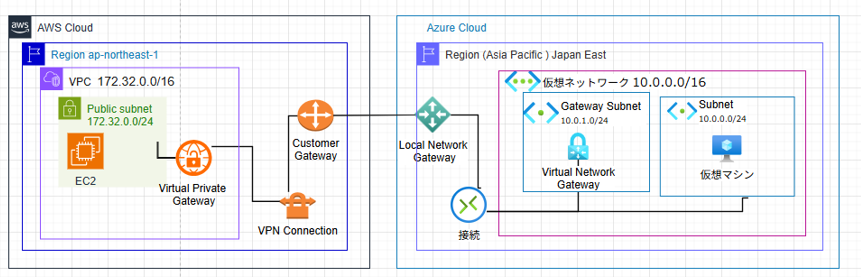

# AWSとAzure接続検証

AWSのVirtual Private Gateway(仮想プライベートゲートウェイ)とAzureのVirtual Network Gateway(仮想ネットワークゲートウェイ)をVPN接続(IPsec)し、仮想マシン同士で通信が行えることを検証する。

イメージ図： 

#	AWS設定

VPC、EC2、インターネットゲートウェイ、ルートテーブルの作成後の手順を下記に記載する。

##	Virtual Private Gateway

(1)	Virtual Private Gateway(仮想プライベートゲートウェイ) の作成を行う

下記コマンドを実行する。
aws ec2 create-vpn-gateway --type ipsec.1 --tag-specifications 'ResourceType=vpn-gateway,Tags=[{Key=Name,Value=MyVGW}]'

補足：
--type ipsec.1 は Site-to-Site VPN 用のタイプ
 

(2)	Virtual Private Gateway をVPC にアタッチする

下記コマンドを実行する。

aws ec2 attach-vpn-gateway --vpn-gateway-id vgw-xxxxxxxxxxxxxxxxx --vpc-id vpc-xxxxxxxxxxxxxxxxx

 

 

(3)	カスタマーゲートウェイの作成を行う（Azure の Public IP を使用）

※カスタマーゲートウェイとは、VPCとオンプレミス環境orクラウド環境をVPN経由で接続する時にAWSアカウントに設置する出入口である。

作成時にSite-to-Site VPNの接続先となるゲートウェイのIPアドレス、ASN、証明書などの情報が必要となる。

下記コマンドを実行する。

aws ec2 create-customer-gateway --type ipsec.1 --public-ip <Azure VPN Gateway の Public IP> --bgp-asn 65000

例：

aws ec2 create-customer-gateway --type ipsec.1 --public-ip 20.18.8.140 --bgp-asn 65000
 

 

 

 
##	VPN Connection

(1)	VPN Connection の作成を行う

下記コマンドを実行する。

aws ec2 create-vpn-connection --type ipsec.1 --customer-gateway-id cgw-xxxx --vpn-gateway-id vgw-xxxx --options StaticRoutesOnly=<true or false>

補足：

StaticRoutesOnly　　　　true → BGPを無効　false → BGPを有効

※Azure側と設定を合わせる必要有。 

 

 

(2)	静的ルートの開放を行う 

下記コマンドを実行する。

aws ec2 create-vpn-connection-route --vpn-connection-id vpn-xxxx --destination-cidr-block <Azure VNet CIDR>
 

 

(3)	VPN Connection の確認を行う　（構成ファイルの取得）

下記コマンドを実行する。

aws ec2 describe-vpn-connections --vpn-connection-id vpn-xxxx
 
##	ルートテーブルの設定

(1)	ルートテーブルをAzureの仮想ネットワークと関連付ける。

下記コマンドを実行する。

aws ec2 create-route --route-table-id rtb-xxxxxxxx --destination-cidr-block <Azure VNet CIDR> --gateway-id vgw-xxxxxxxx

例：

aws ec2 create-route --route-table-id rtb-00dae7de4de44cbf4 --destination-cidr-block 10.0.0.0/16 --gateway-id vgw-0f5677bcf566174f5 

 
#	Azure設定 

仮想マシンや仮想ネットワーク ゲートウェイの設定完了後の手順を下記に記載する。

##	ローカルネットワークゲートウェイ

 
ローカルネットワークゲートウェイは、Azure以外のネットワーク（オンプレミスや別のクラウド環境）のゲートウェイを表す。

対抗側のIPを設定する。

(1)	ローカルネットワークゲートウェイを作成する。

下記コマンドを実行する。

az network local-gateway create --resource-group <リソースグループ名> --name <ローカルゲートウェイ名> --gateway-ip-address <対抗側のVPNデバイスのパブリックIP> --local-address-prefixes <オンプレミス側のネットワークプレフィックス>

例：
az network local-gateway create --resource-group test-group --name test-lgy --gateway-ip-address 13.231.59.159 --local-address-prefixes 172.32.0.0/16 --location japaneast
 

 

※AWSは、Tunnel 1とTunnel 2が存在するため、2つ分設定する。

補足：Tunnel 1のみでも可の可能性有。
 

 
 
##	接続(Connection)　　
 
接続は、仮想ネットワークゲートウェイとローカルネットワークゲートウェイ、または他のAzureリソース間で接続を確立するための設定である。

•	役割:

o	VPNトンネルの確立を行う。

o	ExpressRoute等の接続の管理を行う。

•	種類:

o	VPN接続: インターネットを介した安全な接続を可能とする。

o	ExpressRoute接続: プライベートネットワーク経由での接続を可能とする。

(1)	接続(Connection) を作成する。（Virtual network Gateway と Local Network Gateway を接続）

下記コマンドを実行する。

az network vpn-connection create --resource-group <リソースグループ名>--name <接続名> --vnet-gateway1 <仮想ネットワークゲートウェイ名> --local-gateway2 <ローカルネットワークゲートウェイ名> --shared-key "<事前共有鍵(AWS)>" --location japaneast

例：

az network vpn-connection create --resource-group test-group --name test-Connection --vnet-gateway1 test-VnetGateway --local-gateway2 test-lgy --shared-key "m3m26hxBmqpUILyrwX6ge_A4wdXit76G" --location japaneast  

※AWSは、Tunnel 1とTunnel 2が存在するため、2つ分設定する。

補足：Tunnel 1のみでも可の可能性有。

az network vpn-connection create --resource-group test-group --name test-Connection02 --vnet-gateway1 test-VnetGateway --local-gateway2 test-lgy02 --shared-key "BqgpCL6MDbGMXVOZF51sIsjICyBl_aXs" --location japaneast 

 

 
##	ルートテーブルの設定　　

(1)	ルートテーブルを作成する。

下記コマンドを実行する。

az network route-table create --resource-group <リソースグループ名> --name <ルートテーブル名> --location japaneast
 

(2)	ルートテーブルをAWSのVPCと関連付ける。

下記コマンドを実行する。

az network route-table route create --resource-group <リソースグループ名> --route-table-name <ルートテーブル名> --name <関連名> --address-prefix <AWS VPC CIDR> --next-hop-type VirtualNetworkGateway

例:
az network route-table route create --resource-group test-group --route-table-name test-route-table --name aws-connection --address-prefix 172.32.0.0/16 --next-hop-type VirtualNetworkGateway
 

(3)	サブネットにルートテーブルを関連付ける

下記コマンドを実行する。

az network vnet subnet update --resource-group test-group --vnet-name test-vnet --name GatewaySubnet --route-table test-route-table
 

追加

test-subnet にtest-route-table を関連付ける

az network vnet subnet update --resource-group test-group --vnet-name test-vnet --name test-subnet --route-table test-route-table
 

 

 
 
##	NSGの設定　　

それぞれのポートの開放を行う。

※実行しなくても、良かった可能性有。

az network nsg rule create --resource-group test-group --nsg-name test-nsg --name AllowIPSec500 --priority 100 --direction Inbound --access Allow --protocol Udp --source-address-prefix '*' --source-port-range '*' --destination-address-prefix '*' --destination-port-range 500
 

az network nsg rule create --resource-group test-group --nsg-name test-nsg --name AllowIPSec4500 --priority 110 --direction Inbound --access Allow --protocol Udp --source-address-prefix '*' --source-port-range '*' --destination-address-prefix '*' --destination-port-range 4500
 

az network nsg rule create --resource-group test-group --nsg-name test-nsg --name Allow-ICMP-From-AWS --priority 120 --direction Inbound --access Allow --protocol ICMP --source-address-prefixes 172.32.0.0/16 --destination-address-prefixes '*' --source-port-ranges '*' --destination-port-ranges '*'
 

 

 
#	接続確認

(1)	AWSで作成したEC2と、Azureで作成した仮想マシンのファイアウォールでICMPの許可を行う。 

下記コマンドを実行する。

New-NetFirewallRule -DisplayName "Allow ICMPv4-In" -Protocol ICMPv4 -Direction Inbound -Action Allow
 

(2)	AWSで作成したEC2から、Azure仮想マシンのプライベートIPアドレス「10.0.1.4」にPingで疎通確認を行う。 

 

 

(3)	azureで作成した仮想マシンから、AWSで作成したEC2のプライベートIPアドレス「172.32.0.191」にPingで疎通確認を行う。 
 

