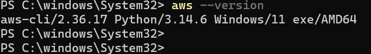

# AWS CLI

AWSを操作するための、AWS CLIのコマンドラインについて記載する。

前提条件として、AWS CLIがインストール済の状態で、各コマンドラインを起動していること。

(1)	AWS CLIログイン

「aws configure」を実行し、アクセスキー、シークレットアクセスキー情報を入力する。
 

●Configファイルの場所
「C:\Users\ USERNAME \.aws\」に格納される。

(2)	新しいユーザーを設定する場合
「aws configure `--profile` other-account」を実行する。

 

(3)	AWS CLIのバージョンを表示する
「aws `--version`」を実行する。
 

(4)	AWS CLIにログインしているユーザーを確認する。
「aws sts get-caller-identity」を実行する。

 

(5)	現在の認証情報の確認
「cat ~/.aws/credentials」を実行する。

