# EC2  

## EC2関連確認

EC2に関連するシステムの確認を行うコマンドについて記載する。

前提条件として、AWS CLIにログインした状態であること。

(1)	AMI IDを検索する。

「aws ec2 describe-images `--owners` amazon `--filters` "Name=name,Values= キーワード `--query` 'Images[*].[ImageId,Name]' `--output` table」を実行する。

例：aws ec2 describe-images `--owners` amazon `--filters` "Name=name,Values=RHEL-8*" `--query` 'Images[*].[ImageId,Name]' `--output` table

(2)	セキュリティグループを表示する。

「aws ec2 describe-security-groups `--query` "SecurityGroups[*].{Name:GroupName,ID:GroupId,VPC:VpcId}" `--output` table」を実行する。

 

(3)	キーペアを表示する。

「aws ec2 describe-key-pairs `--query` "KeyPairs[*].[KeyName,KeyFingerprint]" `--output` text」を実行する。
 

(4)	EC２を表示する。

「aws ec2 describe-instances」を実行する。

 

(5)	EC２の主要な内容のみ出力する。

「aws ec2 describe-instances `--query` "Reservations[*].Instances[*].{ID:InstanceId,Type:InstanceType,State:State.Name,PublicIP:PublicIpAddress,PrivateIP:PrivateIpAddress,Name:Tags[?Key=='Name']&#124;[0].Value}" `--output` table」 を実行する。

##	EC2関連作成

EC2に関連するシステムを作成するコマンドについて記載する。

(1)	セキュリティグループを作成する。

「aws ec2 create-security-group v--group-name` セキュリティグループ名 `--description` "説明文" `--vpc-id` vpc-xxxxxxxxxxxxxxxxx」を実行する。
 
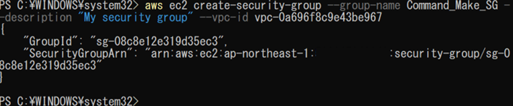

(2)	セキュリティグループの詳細情報を表示する。
「aws ec2 describe-security-groups `--group-ids` sg-xxxxxxxx」を実行する。 
 
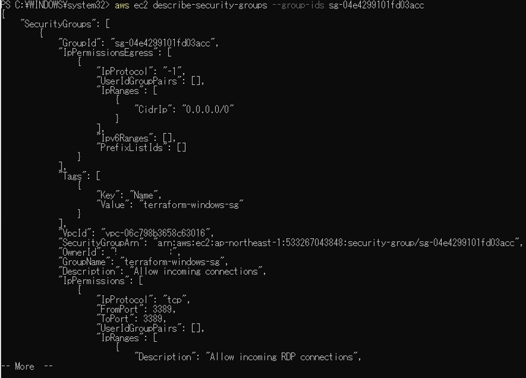

(3)	インバウンドルールを追加する。（例: SSHを許可）
「aws ec2 authorize-security-group-ingress `--group-id` sg-08c8e12e319d35ec3 `--protocol` tcp `--port` 22 --cidr 0.0.0.0/0」を実行する。
 
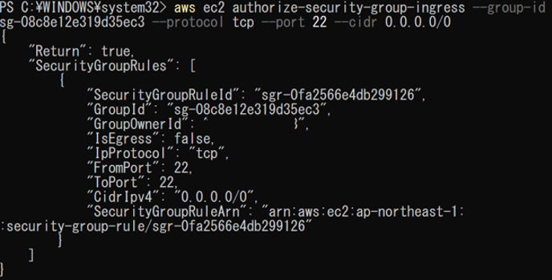
 
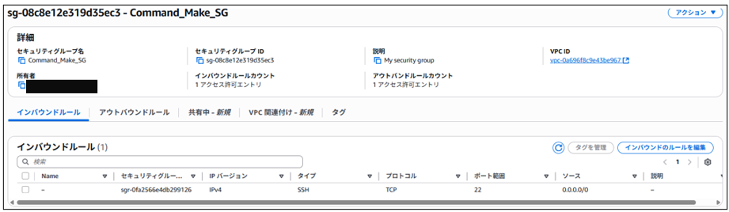

(4)	キーペアを作成する。
「aws ec2 create-key-pair `--key-name` キーペアの名前 `--query` 'KeyMaterial'  `--output` text > MyKeyPair.pem」を実行する。

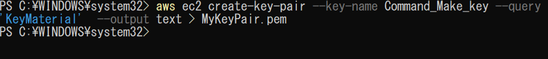 

 

(5)	EC2インスタンスを作成する。
「aws ec2 run-instances `--image-id` ami-XXXXXX `--count` 起動するインスタンスの数 `--instance-type` XXXXXX `--key-name` MyKeyPair `--security-group-ids` sg-XXXXXX `--subnet-id` subnet-0abcdXXXXXX」を実行する。
 
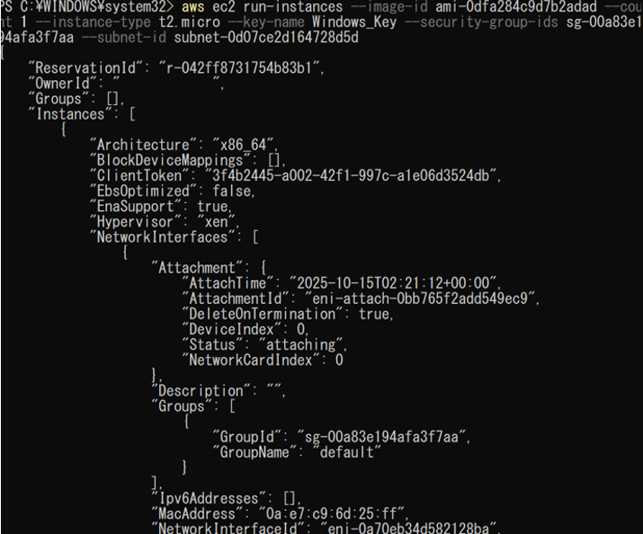 

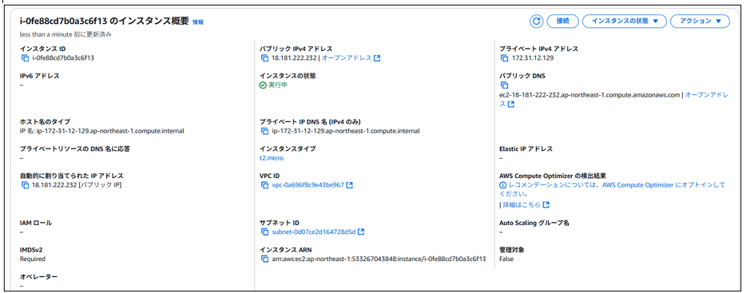  

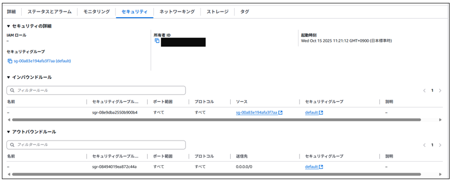 

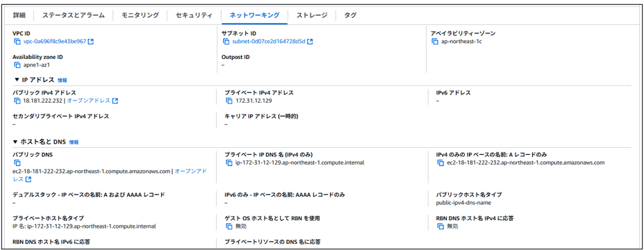 

 
2.4.3	EC2関連削除

EC2に関連するシステムを削除するコマンドについて記載する。

(1)	セキュリティグループを削除する。

「aws ec2 delete-security-group `--group-id` sg-xxxxxxxxxxxxxxxxx」もしくは

「aws ec2 delete-security-group `--group-name` セキュリティグループ名」を実行する。

※どちらでも可

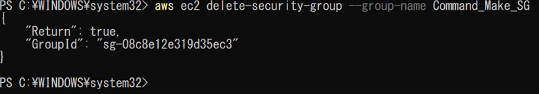 

(2)	EC2 インスタンスを削除する。

「aws ec2 terminate-instances `--instance-ids` i-xxxxxxxxxxxxxxxxx」を実行する。

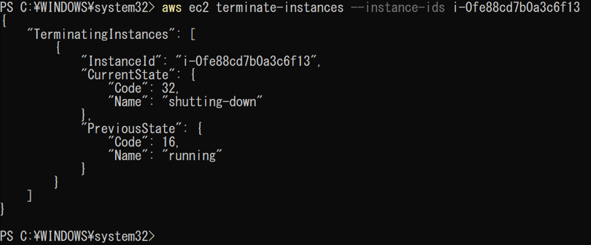
 
(3)	キーペアを削除する。

「aws ec2 delete-key-pair `--key-name` キーペア名」を実行する。
 
 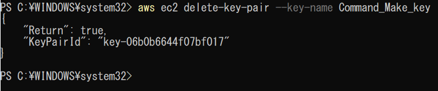

