# EFS  
 
EFSは、複数のEC2インスタンスからアクセス可能な共有ファイルストレージである。

EC2インスタンスからマウントターゲットを介して、AZ内にあるEFSにアクセスできる仕組みである。

EFSは主にLinux環境向けに設計されており、NFS（Network File System）プロトコルを使用して接続する。

そのため、WindowsのEC2インスタンスに直接アタッチすることはできない。

##	EFS作成 

(1)	EFSを作成する。

下記コマンドを実行する。

aws efs create-file-system `--creation-token` トークン名 `--performance-mode` generalPurpose `--throughput-mode` bursting --encrypted `--tags` Key=Name,Value=EFS名 `--region ap-northeast-1`

備考

`--performance-mode`: generalPurpose（汎用）または maxIO（高スループット）を指定。

`--throughput-mode`: bursting（バースト）または provisioned（プロビジョンド）を指定。

`--encrypted`：暗号化を有効化
 
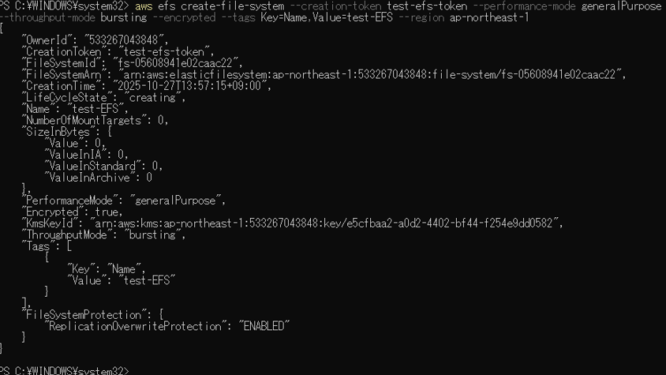 

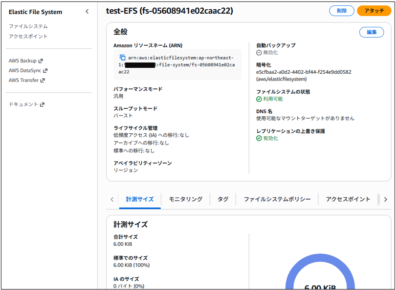

(2)	自動バックアップを有効化する。

※自動バックアップは、EFS作成時に何故かエラーとなってしまうため、別途実行する。

下記コマンドを実行する。

aws efs put-backup-policy `--file-system-id` <ファイルシステムID> `--backup-policy` Status="ENABLED"

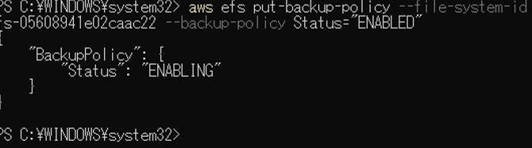

(3)	自動バックアップを確認する。

下記のコマンドを実行する。

aws efs describe-backup-policy `--file-system-id` <ファイルシステムID>
 
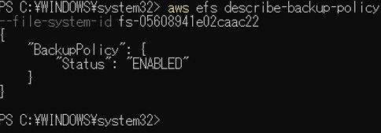

(4)	ライフサイクル管理設定を確認する。

下記コマンドを実行する。

aws efs describe-lifecycle-configuration `--file-system-id` <ファイルシステムID>
 
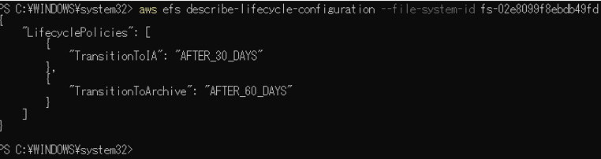

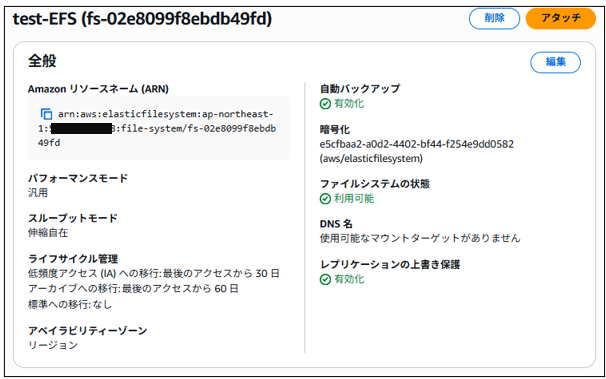

(5)	EFSを確認する。

下記コマンドを実行する。

aws efs describe-file-systems

もしくは

aws efs describe-file-systems `--file-system-id`　<ファイルシステムID>

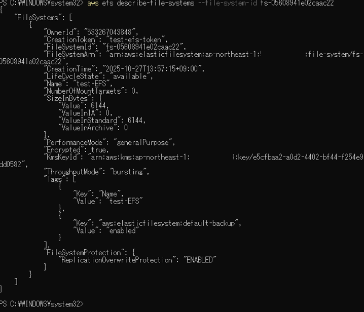

(6)	EFSの主要な情報のみ確認する。

下記コマンドを実行する。

aws efs describe-file-systems `--query` "FileSystems[*].{ID:FileSystemId,Created:CreationTime,Performance:PerformanceMode,Size:SizeInBytes.Value}" `--output` table

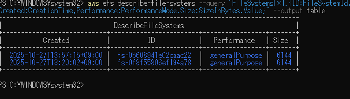 

(7)	マウントターゲットを作成する。

下記コマンドを実行する。

aws efs create-mount-target `--file-system-id` <ファイルシステムID> `--subnet-id` <サブネットID> `--security-groups` <セキュリティグループ>

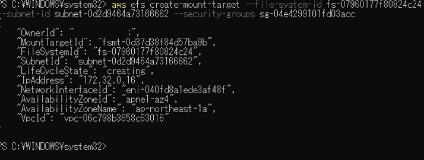

(8)	マウントターゲットを確認する。

下記コマンドを実行する。

aws efs describe-mount-targets `--file-system-id` <ファイルシステムID>

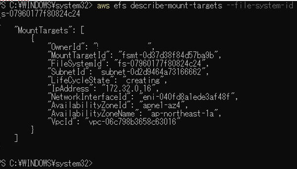

(9)	マウントターゲットの主要情報の確認

下記コマンドを実行する。

aws efs describe-mount-targets `--file-system-id` <ファイルシステムID> --query "MountTargets[*].{ID:MountTargetId,Subnet:SubnetId,AZ:AvailabilityZoneId,IP:IpAddress}" `--output` table

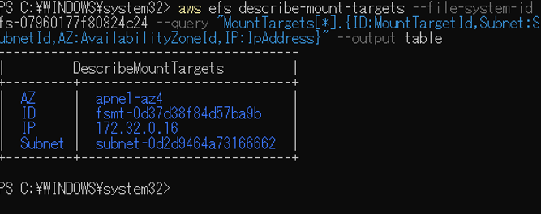

##	EFSアクセス確認

(1)	セキュリティグループにインバウンドルール(TCP 2049)を追加する。

下記コマンドを実行する。

aws ec2 authorize-security-group-ingress `--group-id` <セキュリティグループID> `--protocol` tcp `--port` 2049 `--cidr` xxx.xxx.xxx.xxx/xx

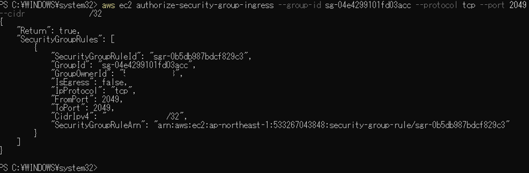

(2)	セキュリティグループの確認を行う。

※ポート2049（TCP）**がWindows VMのIPまたはセキュリティグループから許可されていることを確認

下記コマンドを実行する。

aws ec2 describe-security-groups `--query` "SecurityGroups[*].{ID:GroupId,Name:GroupName,Inbound:IpPermissions[*].{Protocol:IpProtocol,Port:FromPort,CIDR:IpRanges[*].CidrIp}}" `--output` json

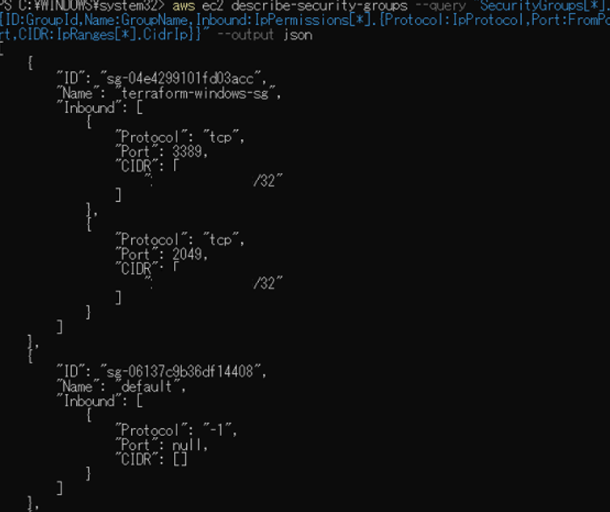

(3)	LinuxにNFSクライアントをインストールする。

「sudo yum install -y nfs-utils」を実行する。

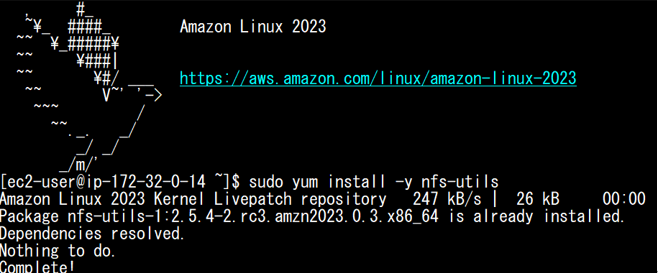

(4)	マウントポイントを作成する。

「sudo mkdir -p /mnt/efs」を実行する。

 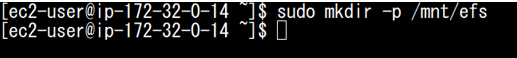

(5)	EFSをマウントする。

「sudo mount -t nfs4 -o nfsvers=4.1 <ファイルシステムID>.efs.ap-northeast-1.amazonaws.com:/ /mnt/efs」を実行する。

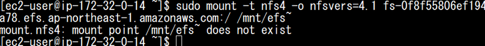

(6)	マウント確認を行う。

「df -h /mnt/efs」を実行する。

 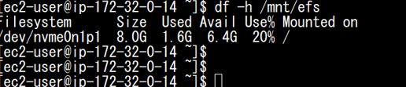

(7)	ファイルとフォルダーのアップロード確認を行う。
 
 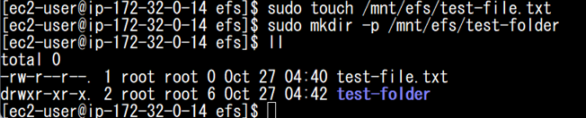
 
##	EFS削除

(1)	マウントターゲットの削除

下記コマンドを実行する。

aws efs delete-mount-target `--mount-target-id` <マウントターゲットID>

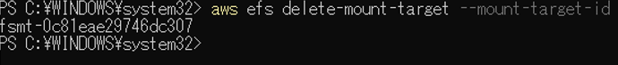

(2)	EFSの削除

下記コマンドを実行する。

aws efs delete-file-system --file-system-id <ファイルシステムID>

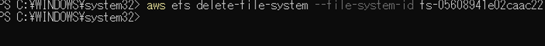
 

