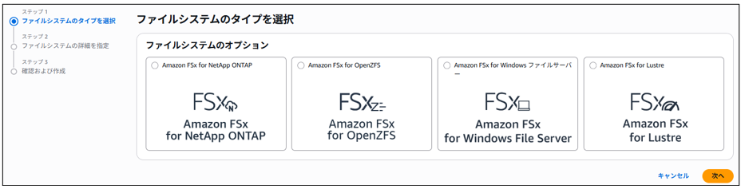
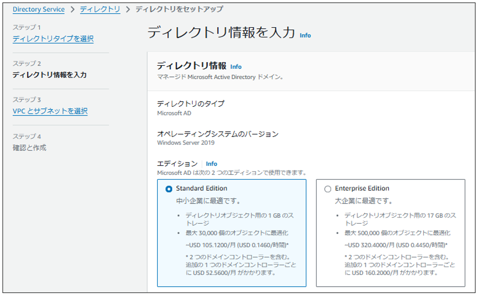

#	FSX

 
Amazon FSxは、完全マネージド型のファイルストレージサービスで、特定の用途や環境に最適化されたファイルシステムを提供する。

FSXについての備考を下記に記載する。

●AWS FSxには、用途に応じた4つのファイルシステムタイプが構築可能である。

※設定完了までにかかる時間は約30分以上である。

サーバーにマウントするため更に時間がかかることもある。

ファイルシステムタイプは下記の4つから選択する。

Amazon FSx for NetApp ONTAP

•	概要: NetAppのONTAP技術をベースとしたファイルシステムである。

•	用途: 高度なデータ管理やストレージ効率化が必要なワークロードである。

•	特徴: スナップショット、クローン作成、データの効率的なバックアップが可能である。

Amazon FSx for OpenZFS

•	概要: ZFSファイルシステムを利用したLinux向けの高速ストレージである。

•	用途: DevOps、アプリケーション開発環境で使用する。

•	特徴: 高スループット、低レイテンシのストレージを提供する。

Amazon FSx for Windows File Server

•	概要: Windowsアプリケーション向けに設計されたファイルシステム。

•	用途: ファイル共有、Active Directoryとの統合、Windows ACL（アクセス制御リスト）の活用を行う。

•	特徴: SMBプロトコルをサポートする。

Amazon FSx for Lustre

•	概要: 高性能な並列ファイルシステムで、大規模データ処理や機械学習に最適である。

•	用途: ビッグデータ分析、ハイパフォーマンスコンピューティング（HPC）である。

•	特徴: Amazon S3との連携機能を要する。

