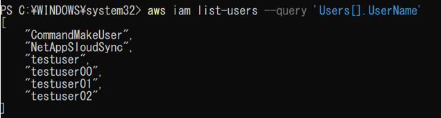

# IAM  

IAMに関連するシステムの確認を行うコマンドについて記載する。

前提条件として、AWS CLIにログインした状態であること。

## IAM ユーザー

IAMユーザーに関連するコマンドを記載する。

(1)	AWSユーザー一覧を表示する。

「aws iam list-users」を実行する。
 

(2)	ユーザー名だけ出力する。

「aws iam list-users `--query` 'Users[].UserName'」を実行する。

(3)	ユーザーを作成する。
「aws iam create-user --user-name <ユーザー名>」を実行する。
 

 

(4)	アクセスキーを作成する。
「aws iam create-access-key --user-name <ユーザー名>」を実行する。
 

(5)	パスワードを設定する。
「aws iam create-login-profile --user-name <ユーザー名> --password '<パスワード>' --password-reset-required」を実行する。
 

(6)	「パスワードのリセットが必要」設定の反映をする。
「aws iam attach-user-policy --user-name <ユーザー名> --policy-arn arn:aws:iam::aws:policy/IAMUserChangePassword」を実行する。

## IAM グループ

## IAM ポリシー

## IAM ロール

## AWS Organizations
