# IAM  

IAMに関連するシステムの確認を行うコマンドについて記載する。

前提条件として、AWS CLIにログインした状態であること。

## IAM ユーザー

IAMユーザーに関連するコマンドを記載する。

(1)	AWSユーザー一覧を表示する。

「aws iam list-users」を実行する。
 

(2)	ユーザー名だけ出力する。

「aws iam list-users `--query` 'Users[].UserName'」を実行する。

(3)	ユーザーを作成する。
「aws iam create-user --user-name <ユーザー名>」を実行する。
 
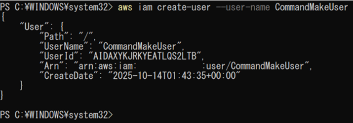

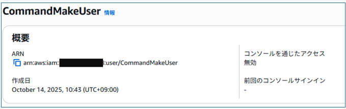

(4)	アクセスキーを作成する。

「aws iam create-access-key --user-name <ユーザー名>」を実行する。

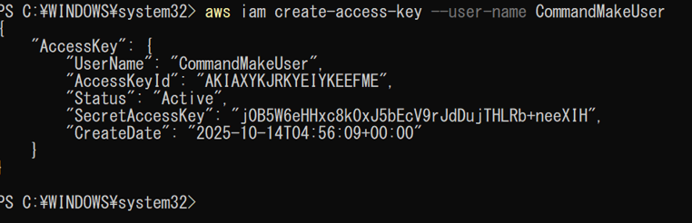

(5)	パスワードを設定する。

「aws iam create-login-profile --user-name <ユーザー名> --password '<パスワード>' --password-reset-required」を実行する。

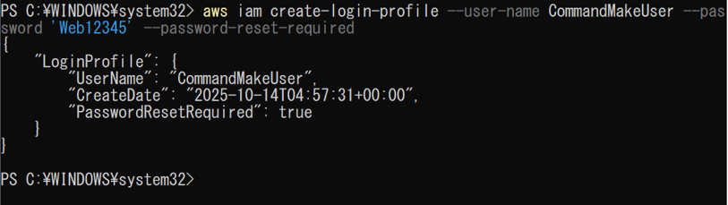

(6)	「パスワードのリセットが必要」設定の反映をする。

「aws iam attach-user-policy --user-name <ユーザー名> --policy-arn arn:aws:iam::aws:policy/IAMUserChangePassword」を実行する。

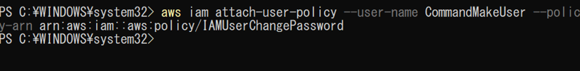

## IAM グループ

IAMグループに関連するコマンドを記載する。

(1)	グループの一覧を表示する。

「aws iam list-groups」を実行する。

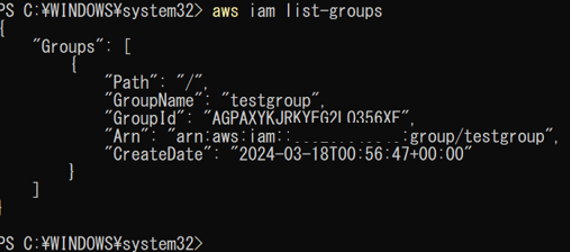

(2)	グループ名だけ出力する。

「aws iam list-groups --query 'Groups[].GroupName'」を実行する。

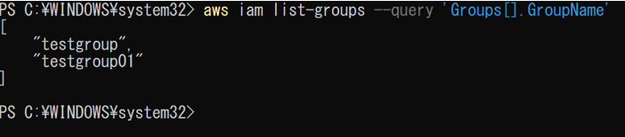

(3)	グループを作成する。

「aws iam create-group --group-name <グループ名>」を実行する。

 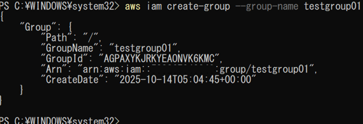

(4)	ユーザーをグループに追加する。

「aws iam add-user-to-group --user-name <ユーザー名> --group-name <グループ名>」を実行する。

 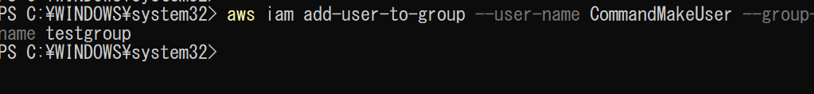 

(5)	ユーザーが所属しているグループを表示する。

「aws iam list-groups-for-user --user-name<ユーザー名>」を実行する。

 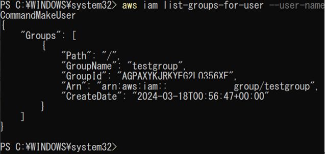 

## IAM ポリシー

IAMポリシーに関連するコマンドを記載する。

(1)	カスタムポリシーのみを一覧表示する。

「aws iam list-policies --scope Local」を実行する。

 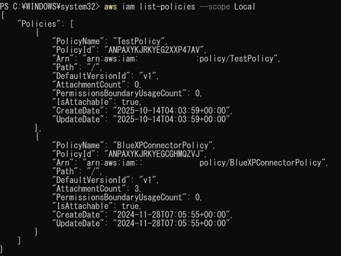 

(2)	ユーザーにポリシーを付与する
「aws iam attach-user-policy --user-name <ユーザー名>  --policy-arn arn:aws:iam::aws:policy/<ポリシー名>」を実行する。
 
 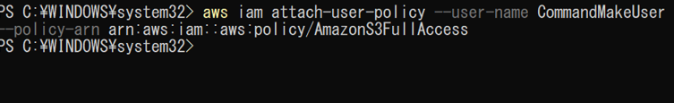 
 
 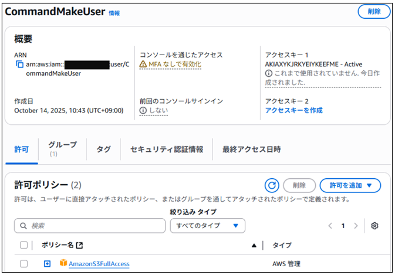 

(3)	ユーザーにアタッチされているポリシーを表示する。
「aws iam list-attached-user-policies --user-name <ユーザー名>」を実行する。

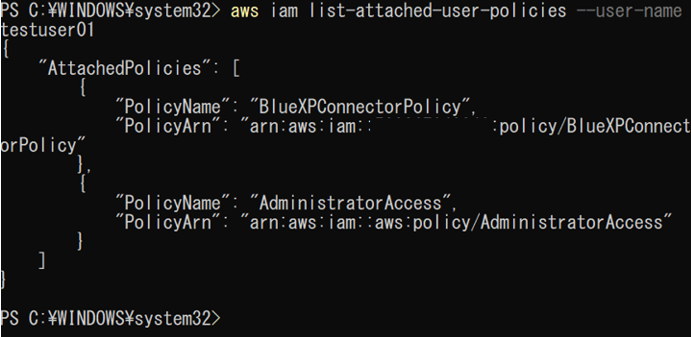 

(4)	グループにアタッチされているポリシーを表示する。
「aws iam list-attached-group-policies --group-name <グループ名> 」を実行する。
 
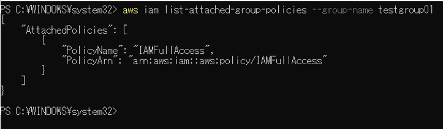 

(5)	ポリシーを作成するための内容を定義する。

Jsonファイルを作成する。（例）

EC2のフルアクセス権限

(6)	ポリシーを作成する。
「aws iam create-policy --policy-name <ポリシー名> --policy-document file://<ファイルパス>」を実行する。
 
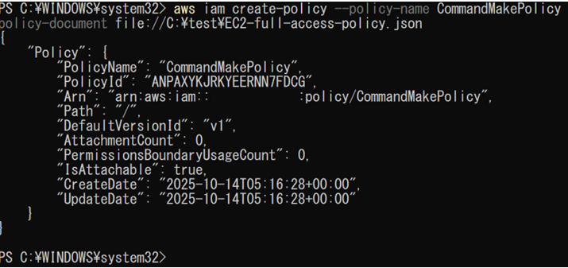 

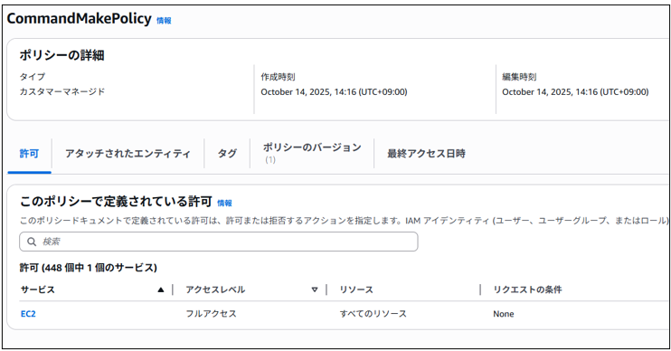 

(7)	ポリシーの内容を表示する。
「aws iam get-policy-version --policy-arn <arn> --version-id v1」を実行する。

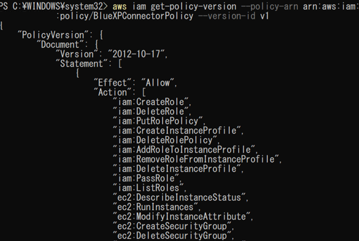 

※JSON形式のポリシー一例は以下である。

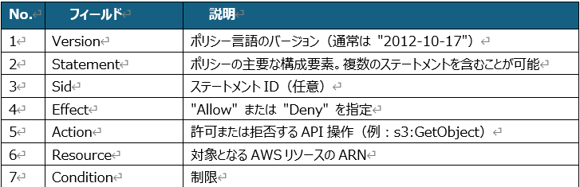 

IAMポリシーの基本構造（JSON）　一例  ※細かく設定する場合

## IAM ロール

## AWS Organizations
