# S3

## S3コマンド操作

主に使用する汎用バケットについてのコマンド操作を下記に記載する。

(1)	汎用バケットを作成する。

「aws s3api create-bucket --bucket <バケット名> --region ap-northeast-1 --create-bucket-configuration LocationConstraint=ap-northeast-1」を実行する。

※その他のオプション例：

--acl：アクセス制御（例：private, public-read） 

--object-lock-enabled-for-bucket：オブジェクトロックの有効化

 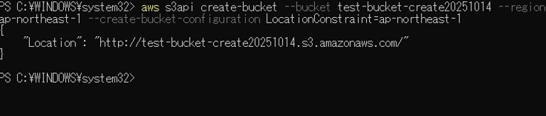

(2)	汎用バケットを一覧表示する。
「aws s3api list-buckets --query "Buckets[*].Name" --output text」を実行する。
 
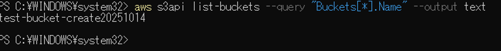

(3)	汎用バケットを削除する。
「aws s3api delete-bucket --bucket  <バケット名>」を実行する。
 
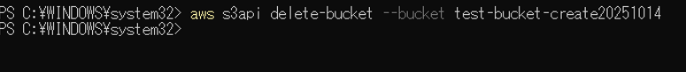

(4)	汎用バケット内にファイルをアップロードする。
「aws s3 cp <ローカルのファイル名> s3://<バケット名>/<ファイル名>」を実行する。
 
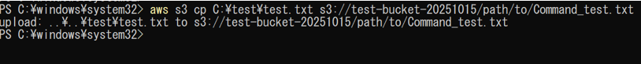

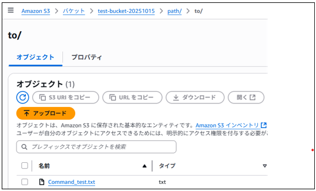

(5)	パブリックアクセスブロックの解除を設定する。
「aws s3api delete-public-access-block --bucket <バケット名>」を実行する。

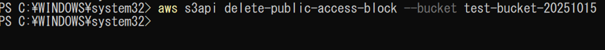
 
実行結果：

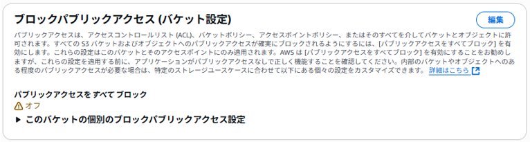

(6)	バケットポリシーの設定をJsonファイルから作成する。

[`全員に読み取り許可設定 ダウンロード`](./S3-public-read-polisy.json)

[`IP制限ポリシー ダウンロード`](./S3-public-Restrict policy.json)

次に、以下のコマンドを実行してポリシーを適用する。

aws s3api put-bucket-policy --bucket <バケット名> --policy file://< JSONファイルパス>

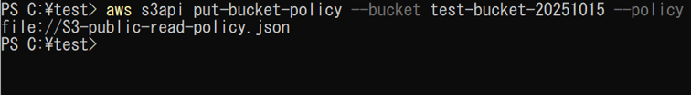

実行結果：

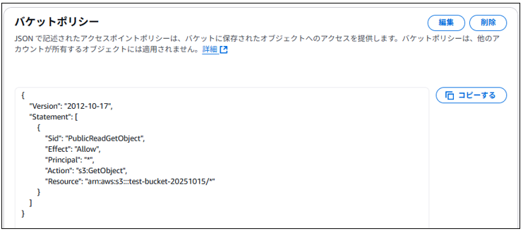

(7)	バージョニングを有効化する

「aws s3api put-bucket-versioning --bucket <バケット名> --versioning-configuration Status=Enabled」を実行する。

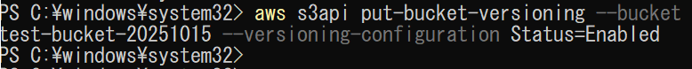
 
実行前：

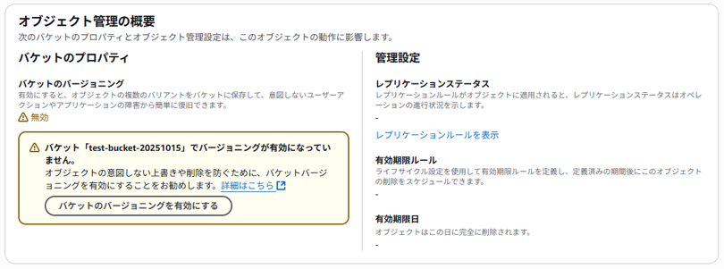

実行後：

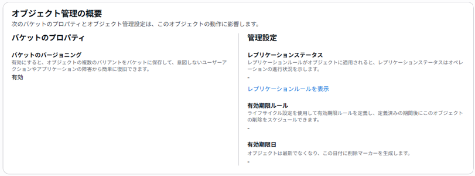

(8)	ライフサイクル設定を行う。（例：30日後に削除）

[`ライフサイクルポリシー ダウンロード`](./S3_lifecycle.json)

次に、以下のコマンドを実行してポリシーを適用する。

aws s3api put-bucket-lifecycle-configuration --bucket <バケット名> --lifecycle-configuration file:// < JSONファイルパス>

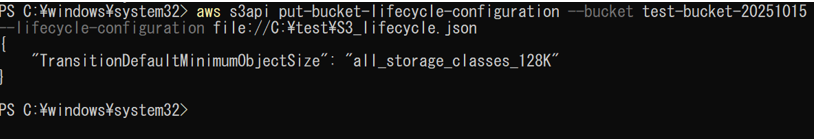

実行前：

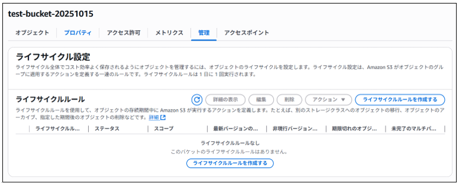

実行後：

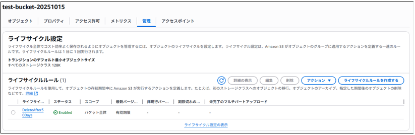

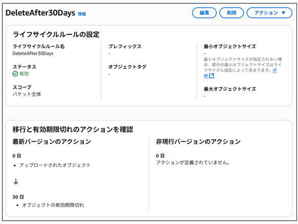

(9)静的ウェブサイトホスティングを有効化する。
「aws s3 website s3://<バケット名>/ --index-document index.html --error-document error.html」を実行する。
 
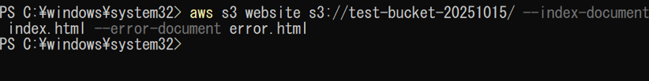

実行結果：

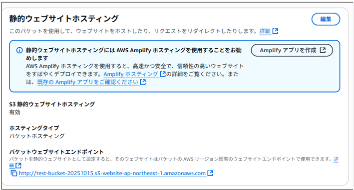

Webページ閲覧結果：

※Index.htmlは適当に編集しています。

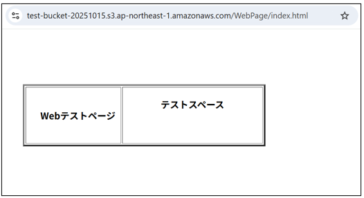
