# S3

## S3コマンド操作

主に使用する汎用バケットについてのコマンド操作を下記に記載する。

(1)	汎用バケットを作成する。

「aws s3api create-bucket --bucket <バケット名> --region ap-northeast-1 --create-bucket-configuration LocationConstraint=ap-northeast-1」を実行する。

※その他のオプション例：

--acl：アクセス制御（例：private, public-read） 

--object-lock-enabled-for-bucket：オブジェクトロックの有効化

 

(2)	汎用バケットを一覧表示する。
「aws s3api list-buckets --query "Buckets[*].Name" --output text」を実行する。
 

(3)	汎用バケットを削除する。
「aws s3api delete-bucket --bucket  <バケット名>」を実行する。
 

(4)	汎用バケット内にファイルをアップロードする。
「aws s3 cp <ローカルのファイル名> s3://<バケット名>/<ファイル名>」を実行する。
 

(5)	パブリックアクセスブロックの解除を設定する。
「aws s3api delete-public-access-block --bucket <バケット名>」を実行する。

 
実行結果：

(6)	バケットポリシーの設定をJsonファイルから作成する。

[`全員に読み取り許可設定 ダウンロード`](./S3-public-read-polisy.json)

[`IP制限ポリシー ダウンロード`](./S3-public-Restrict policy.json)

次に、以下のコマンドを実行してポリシーを適用する。

aws s3api put-bucket-policy --bucket <バケット名> --policy file://< JSONファイルパス>

実行結果：

(7)	バージョニングを有効化する

「aws s3api put-bucket-versioning --bucket <バケット名> --versioning-configuration Status=Enabled」を実行する。

 
実行前：

実行後：

(8)	ライフサイクル設定を行う。（例：30日後に削除）

[`ライフサイクルポリシー ダウンロード`](./S3_lifecycle.json)

次に、以下のコマンドを実行してポリシーを適用する。

aws s3api put-bucket-lifecycle-configuration --bucket <バケット名> --lifecycle-configuration file:// < JSONファイルパス>

実行前：

実行後：

(9)静的ウェブサイトホスティングを有効化する。
「aws s3 website s3://<バケット名>/ --index-document index.html --error-document error.html」を実行する。
 

実行結果：

Webページ閲覧結果：

※Index.htmlは適当に編集しています。

##	S3バケットアクセス

S3のバケットに、アクセスする方法、一例について記載する。

(1)	WinSCPを起動し、転送プロトコルで「Amazon S3」を選択し、アクセスキーIDとシークレットキーを入力し、ログインをクリックする。

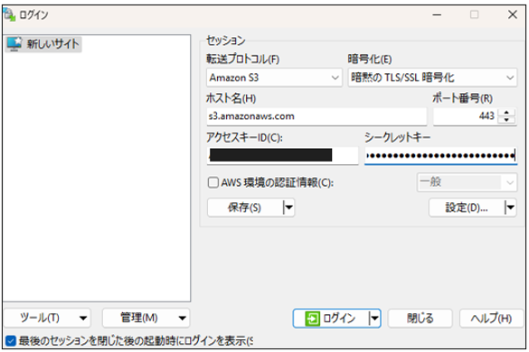 

(2)	S3にアクセス完了する。

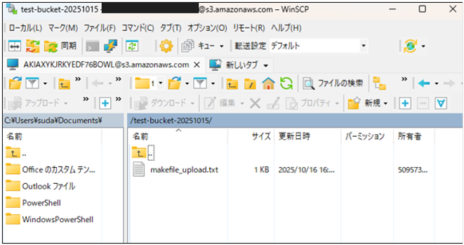

##	CloudTrailログ保存

(1)	S3にバケットを作成する。

 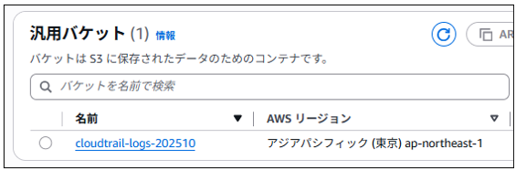

(2)	S3バケットにポリシーを追加する。

[`CloudTrail追加ポリシー ダウンロード`](./CloudTrail追加ポリシー.txt)

(3)	 CloudTrailの証跡を作成する。

下記コマンドを実行する。

aws cloudtrail create-trail --name <Trail名> --s3-bucket-name <S3バケット名> --region ap-northeast-1 --include-global-service-events

※--is-multi-region-trailを実行すると、すべてのリージョンになる

※　IncludeManagementEvents　管理イベントを含めるかどうか（falseでデータイベントのみ）
 
 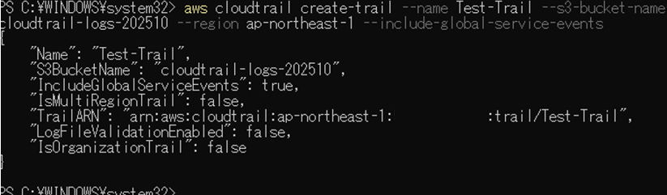

(4)	証跡ログを有効化する

下記コマンドを実行する。

aws cloudtrail start-logging --name <Trail名>
 
 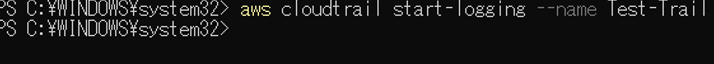

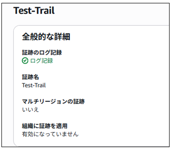

(5)	証跡ログを無効化する

下記コマンドを実行する。

aws cloudtrail stop-logging --name <Trail名>

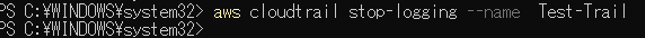

(6)	証跡ログの状態確認を行う。

下記コマンドを実行する。

aws cloudtrail get-trail-status --name <Trail名>

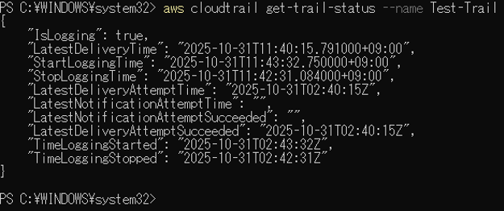

(7)	CloudTrailログファイルの一覧を表示する

下記コマンドを実行する。

aws s3 ls s3:// <S3バケット名>/AWSLogs/<テナントID>/CloudTrail/ --recursive

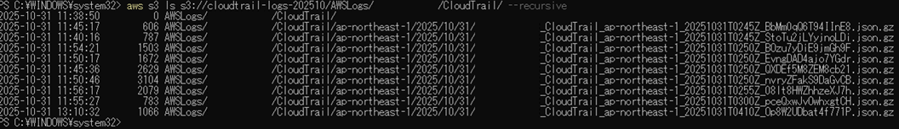

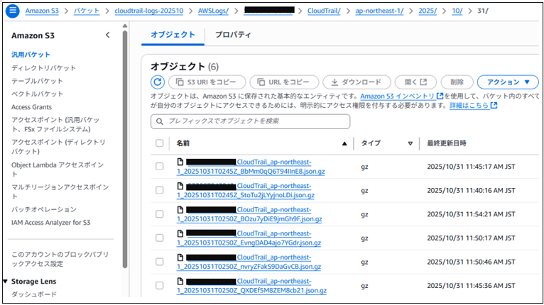

(8)	ファイルをローカルにダウンロードする。（Windows）

下記コマンドを実行する。

aws s3 cp "s3://S3の保存先とファイル名.json.gz" "Windows端末の保存先とファイル名.json.gz"
 
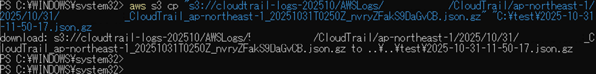

(9)	ファイルの中身を確認する。

メモ：VScodeでShift + Alt + Fで整形

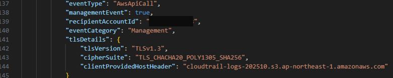

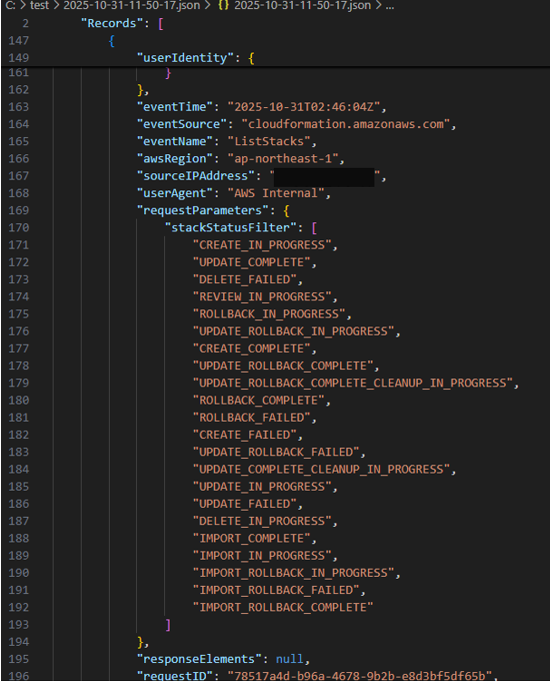

