# VPC  

VPCに関連するシステムの確認を行うコマンドについて記載する。

前提条件として、AWS CLIにログインした状態であること。

## VPC関連確認(主要情報のみ)

VPCに関連するシステムの確認を行うコマンドについて、主要情報のみ出力させるコマンドを記載する。

(1)	VPCの主要な内容のみ出力する。

「aws ec2 describe-vpcs `--query` "Vpcs[*].[VpcId,CidrBlock,IsDefault]" `--output` text」を実行する。

(2)	サブネットの主要な内容のみ出力する。

「aws ec2 describe-subnets  `--query` "Subnets[*].[SubnetId,AvailabilityZone,CidrBlock,VpcId]"  `--output` text」を実行する。

(3)	ルートテーブルの主要な内容のみ出力する。

「aws ec2 describe-route-tables `--query` "RouteTables[*].[RouteTableId,VpcId]" `--output` text」を実行する。

(4)	インターネットゲートウェイの主要な内容のみ出力する。

「aws ec2 describe-internet-gateways `--query` "InternetGateways[*].[InternetGatewayId,Attachments[0].VpcId]" `--output` text」を実行する。

(5)	Elastic IP の主要な内容のみ出力する。

「aws ec2 describe-addresses `--query` "Addresses[*].{PublicIP:PublicIp,AllocationId:AllocationId,InstanceId:InstanceId}" `--output` table」を実行する。

(6)	NAT ゲートウェイの主要な内容のみ出力する。

「aws ec2 describe-nat-gateways `--query` "NatGateways[*].{ID:NatGatewayId,State:State,Subnet:SubnetId,PublicIP:NatGatewayAddresses[0].PublicIp}" -`-output` table」を実行する。

## VPC関連確認

VPCに関連するシステムの確認を行うコマンドについて記載する。

(1)	作成されているVPCを確認する。

「aws ec2 describe-vpcs」を実行する。

(2)	作成されているサブネットを確認する。

「aws ec2 describe-subnets」を実行する。
 

(3)	作成されているルートテーブルを確認する。

「aws ec2 describe-route-tables」を実行する。

 

(4)	作成されているインターネットゲートウェイを確認する。

「aws ec2 describe-internet-gateways」を実行する。

 

(5)	Elastic IP を確認する。

「aws ec2 describe-addresses」を実行する。

 

(6)	NAT ゲートウェイを確認する。

「aws ec2 describe-nat-gateways」を実行する。

## VPC関連作成

VPCに関連するシステムを作成するコマンドについて記載する。

(1)	VPCを作成する。

「aws ec2 create-vpc `--cidr-block` xxx.xxx.xxx.xxx/xx」を実行する。

例：aws ec2 create-vpc `--cidr-block` 10.0.0.0/16

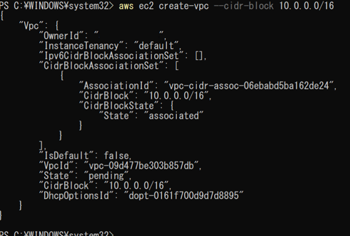

(2)	サブネットを作成する。

「aws ec2 create-subnet `--vpc-id` vpc-xxxxxx `--cidr-block` xxx.xxx.xxxx.xxx/xx `--availability-zone` ap-northeast-1x」を実行する。

 

(3)	インターネットゲートウェイを作成する。
「aws ec2 create-internet-gateway」を実行する。

 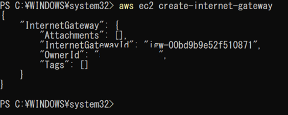 

(4)	インターネットゲートウェイを関連付けする。

「aws ec2 attach-internet-gateway  `--internet-gateway-id` igw-XXXXX `--vpc-id` vpc-XXXXX」を実行する。

  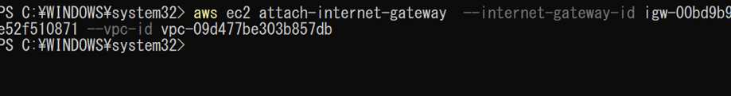 

(5)	ルートテーブルにインターネットゲートウェイを設定する。

「aws ec2 create-route `--route-table-id` rtb-XXXXXX `--destination-cidr-block` 0.0.0.0/0  `--gateway-id` igw-XXXX」を実行する。

※ルートテーブルは、VPC 作成時に自動で作成される。

 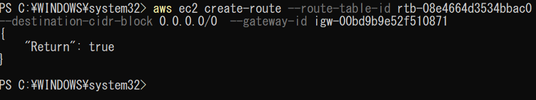 
 
 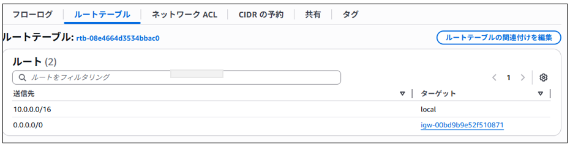 

 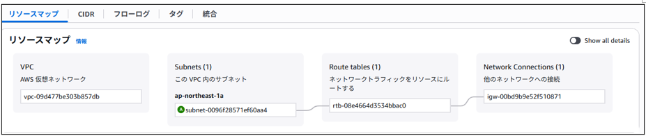  

(6)	Elastic IP を作成する。
「aws ec2 allocate-address `--domain` vp」を実行する。

 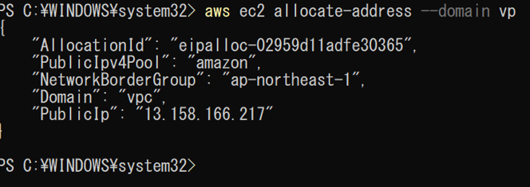  

(7)	NAT ゲートウェイを作成する。

「aws ec2 create-nat-gateway 
  `--subnet-id` subnet-xxxxxxxx 
  `--allocation-id` eipalloc-1234567890abcdef0 
  `--tag-specifications` 'ResourceType=natgateway,Tags=[{Key=Name,Value=MyNATGateway}]'」を実行する。

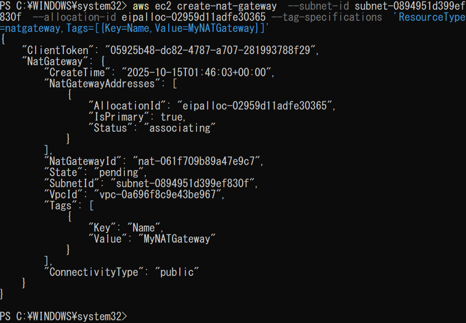   
 
##	VPC関連削除

VPCに関連するシステムを削除するコマンドについて記載する。

(1)	インターネットゲートウェイをデタッチする。
「aws ec2 detach-internet-gateway `--internet-gateway-id` igw-xxxxxxxx `--vpc-id` vpc-xxxxxxx」を実行する。

 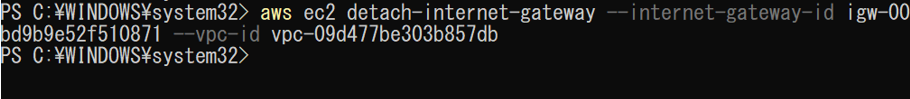   

(2)	インターネットゲートウェイを削除する。
「aws ec2 delete-internet-gateway `--internet-gateway-id` igw-xxxxxxx」を実行する。

  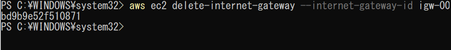   

(3)	ルートテーブルを削除する。

「aws ec2 delete-route-table `--route-table-id` rtb-xxxxxxxx」を実行する。

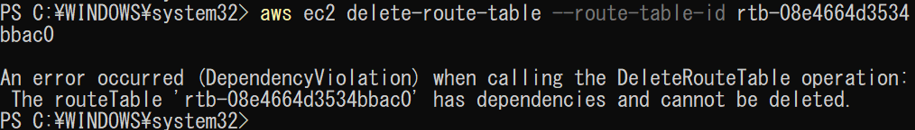   
 
※依存関係があるため削除不可。VPCを削除したら同時に削除される。

(4)	サブネットを削除する。
「aws ec2 delete-subnet `--subnet-id` subnet-xxxxxxxx」を実行する。

 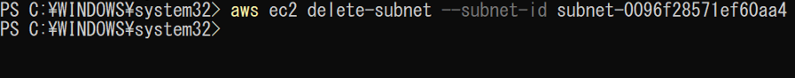   

(5)	VPCを削除する。
「aws ec2 delete-vpc `--vpc-id` vpc-xxxxxxxx」を実行する。

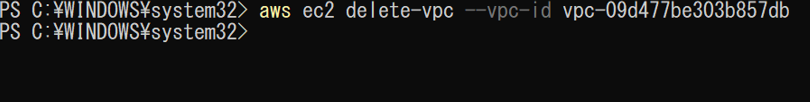  

(6)	NAT ゲートウェイを削除する。
「aws ec2 delete-nat-gateway `--nat-gateway-id` nat-xxxxxxxxxxxxxxxxx」を実行する。

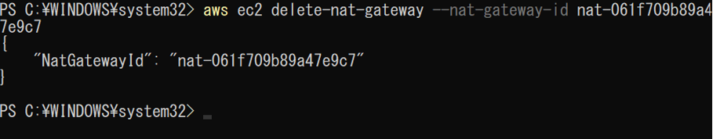 
 
※削除には数分かかる

(7)	Elastic IP を解放する。（Release）
「aws ec2 release-address `--allocation-id` eipalloc-xxxxxxxxxxxxxxxxx」を実行する。
 
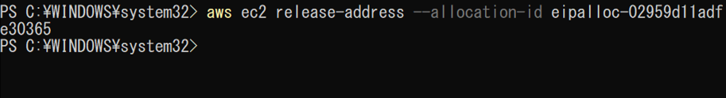 
 

## VPC関連備考
