#	Azure Files (ストレージ アカウント)
 
Azure File(ストレージ アカウント)の設定方法について、ファイル構造、コマンドとGUIでの操作方法を下記に記載する。

##	ファイル構造

ストレージアカウントには、下記の4種類が存在するが、下記にその構造と特徴を記載する。

ストレージアカウント
└── コンテナ（Container）
│  ├── Blob（ファイル）1
│  ├── Blob（ファイル）2
└── ファイル共有（File Share）
│   ├── フォルダ1
│   │   ├── ファイルA
│   │   └── ファイルB
│   └── フォルダ2
└── Queue
└── Table

(1)	Blob コンテナの構成（Blob Storage）

Blob ストレージは、オブジェクトストレージであり、画像、動画、ドキュメントなどを保存する。

(2)	ファイル共有の構成（Azure Files）

Azure Files は、Windowsの共有フォルダのような階層型ファイルシステムであり、ネットワークドライブとしてSMBプロトコルでマウント可能である。(Azure File Sync)

（WindowsやLinuxから \\storageaccount.file.core.windows.net\<sharename> でアクセス可能となる。）

(3)	Queue

メッセージの一時保存と処理に利用され、メッセージはFIFO（先入れ先出し）で処理される。

(4)	Table

NoSQL型のキーバリューストアである。高速な読み書きが可能であり、ログや監査情報の保存に使用され、クエリで柔軟に検索が可能である。
 
3.4.1.2	コマンド操作

(1)	ストレージアカウントを作成する。

下記コマンドを実行する。

az storage account create --name <ストレージアカウント名> --resource-group <リソースグループ名> --location <リージョン> --sku <SKUタイプ> --kind <ストレージアカウントの種類>

※<ストレージアカウント名>は、一意の名前である必要有

※--skuは、下記から選択する。

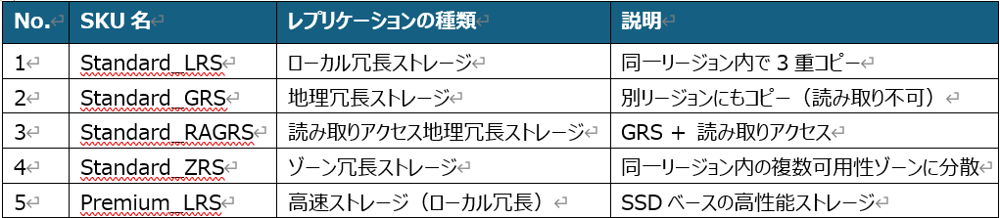

※--kindは、下記から選択する。

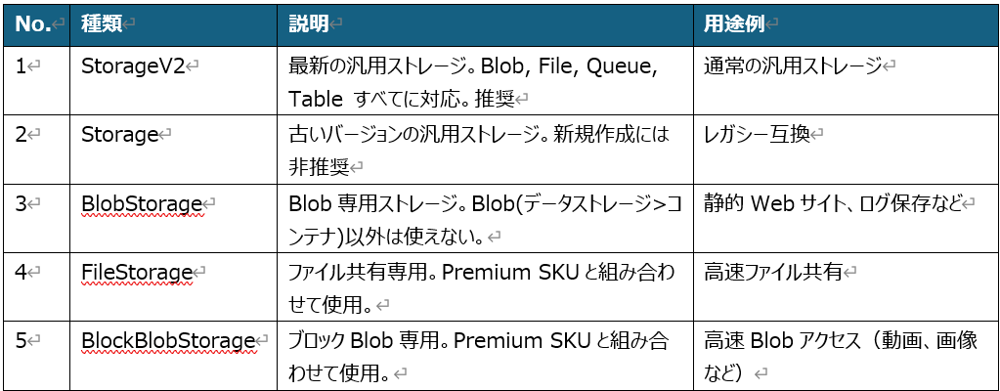

例①：

az storage account create --name teststorage20251020 --resource-group testResourceGroup_02 --location japaneast --sku Standard_LRS --kind StorageV2

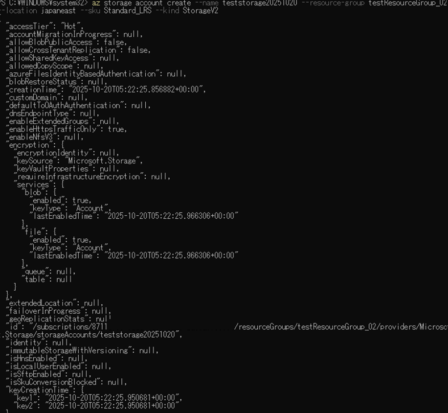

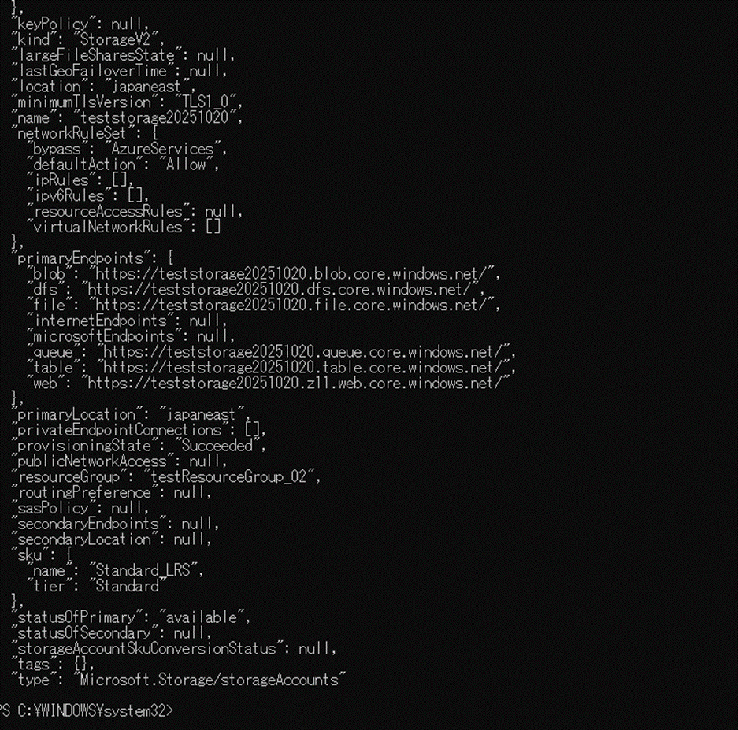

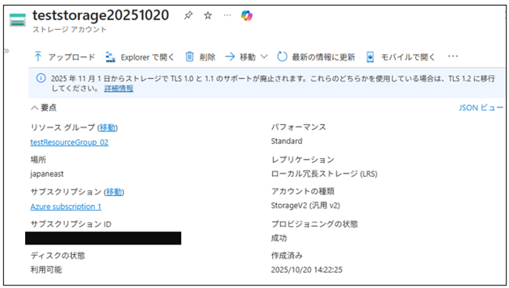

例②：

az storage account create --name teststorage20251021 --resource-group testResourceGroup_02 --location japaneast --sku Standard_LRS --kind BlobStorage --access-tier Hot

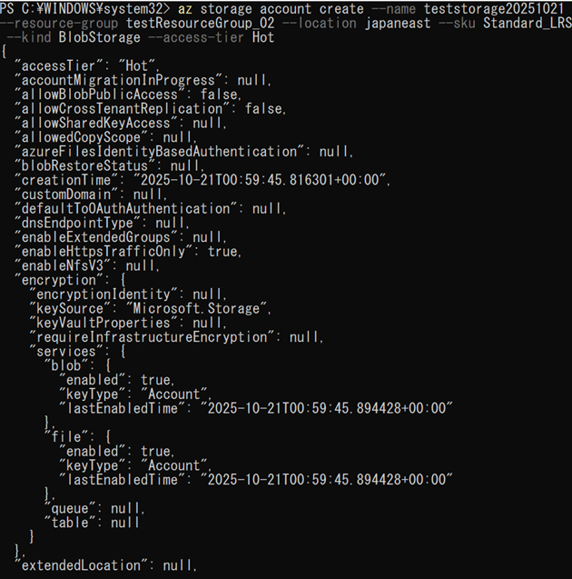
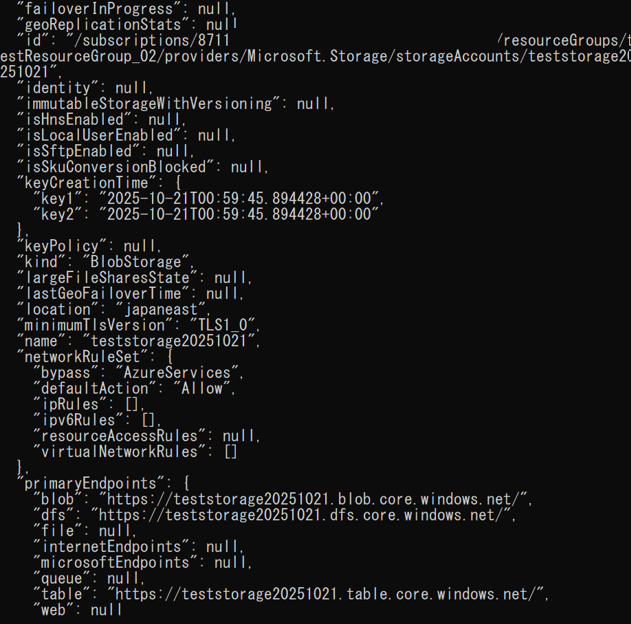
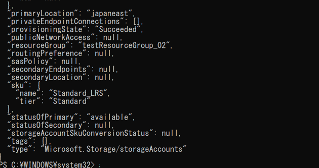

(2)	ストレージアカウントを削除する。

下記コマンドを実行する。

az storage account delete --name <ストレージアカウント名> --resource-group <リソースグループ名>

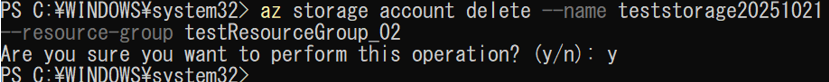

(3)	コンテナを作成する。（Blob Storage）
下記コマンドを実行する。
az storage container create --name <コンテナ名> --account-name <ストレージアカウント名> --auth-mode login
※--account-keyを使う方法もあるが、セキュリティ的には --auth-mode login が推奨

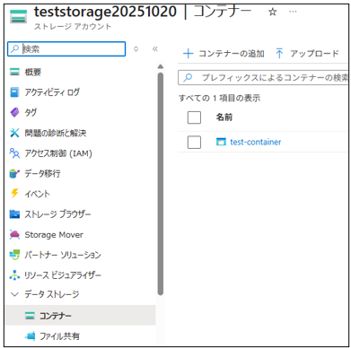

(4)	アカウントキーを取得する。

下記コマンドを実行する。

az storage account keys list --account-name <ストレージアカウント名> --resource-group <リソースグループ名> --query "[0].value" --output tsv

※Azure CLI に明示的な認証情報を指定する必要があるため実行する。

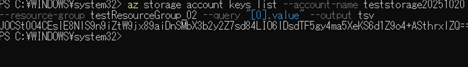

(5)	Blob Data Ownerロールを割り当てる。（Blob Storageを操作できる権限）

下記コマンドを実行する。

az role assignment create --assignee <ユーザーのObject IDまたはメールアドレス> --role "Storage Blob Data Owner" --scope /subscriptions/<サブスクリプションID>/resourceGroups/<リソースグループ名>/providers/Microsoft.Storage/storageAccounts/<ストレージアカウント名>

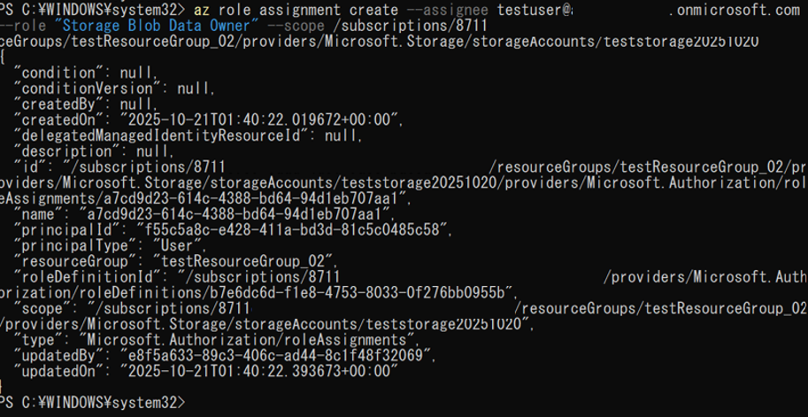

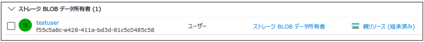

(6)	コンテナにファイルをアップロードする。

下記コマンドを実行する。

az storage blob upload --account-name <ストレージアカウント名> --container-name <コンテナ名> --name <Blob名（保存名）> --file <ローカルファイルのパス> --account-key　<取得したアカウントキー>
※Blob Data Ownerロールを割り当てたユーザーであれば、--auth-mode loginでも可

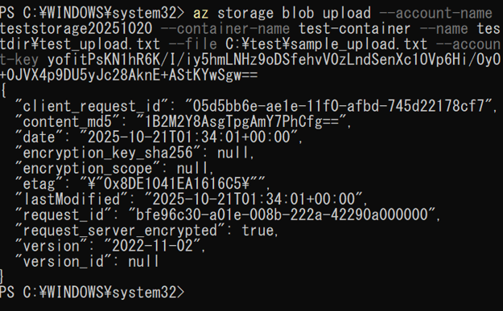

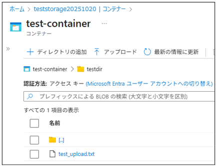

(7)	ファイル共有の作成を行う。（Azure Files）

下記コマンドを実行する。

az storage share create --name <ファイル共有名> --account-name <ストレージアカウント名> --account-key <取得したアカウントキー>

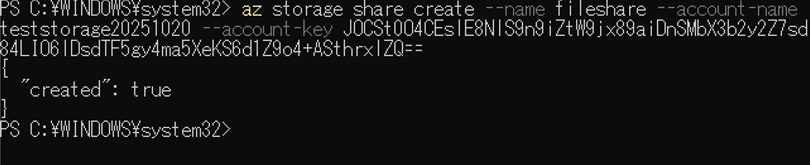

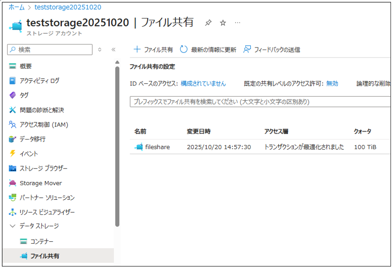

(8)	ファイル共有にファイルをアップロードする。

下記コマンドを実行する。

az storage file upload --account-name <ストレージアカウント名> --share-name <ファイル共有名> --path <保存先の指定> --source <ローカルファイルパス> --account-key <ストレージアカウントキー>

※--account-keyは、--connection-stringでも可

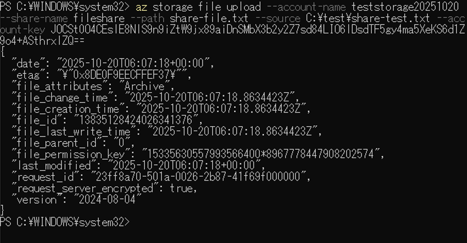

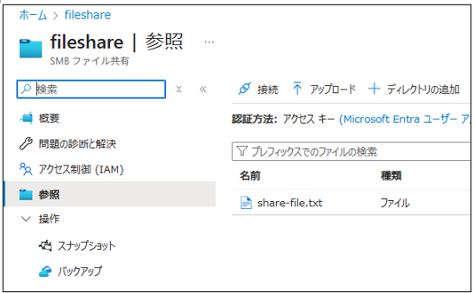

(9)	ファイル共有名へのアクセス権(読み取り・書き込み・削除)を設定する。

下記コマンドを実行する。

az role assignment create --assignee <ユーザーまたはグループのObject ID> --role "Storage File Data SMB Share Contributor" --scope "/subscriptions/<サブスクリプションID>/resourceGroups/<リソースグループ名>/providers/Microsoft.Storage/storageAccounts/<ストレージアカウント名> /shares/<ファイル共有名>"

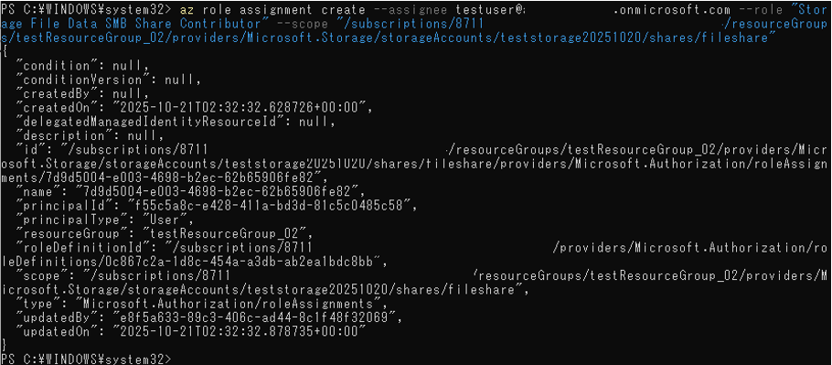

・Storage File Data SMB Share Contributor権限 

日本語ロール名：記憶域ファイル データの SMB共有の共同作成者

　 Azure Files（SMB経由）に対して 読み取り・書き込み・削除 が可能
  
Windows ACL（アクセス制御リスト）の変更は 不可

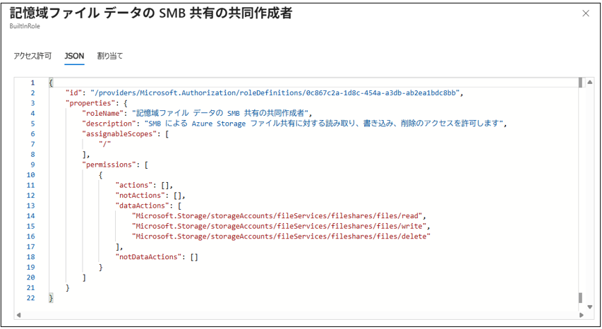

確認コマンド：

az role assignment list --scope /subscriptions/<サブスクリプションID>/resourceGroups/<リソースグループ名>/providers/Microsoft.Storage/storageAccounts/<ストレージアカウント名>/shares/<ファイル共有名> --output table

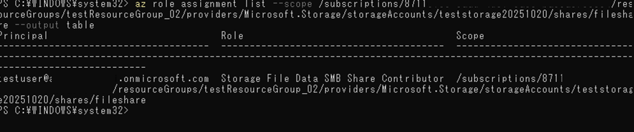

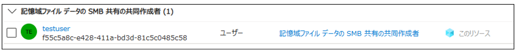

もしくは下記のロールを付与する。

・Storage File Data SMB Admin

　より高い権限を持ち、Windows ACLの変更や上書きが可能

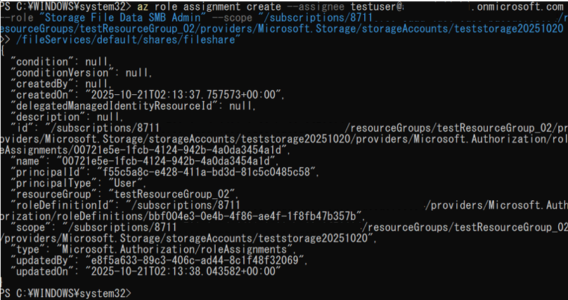

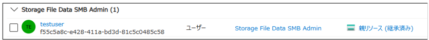

(10)ストレージアカウントを削除する。

下記コマンドを実行する。

az storage account delete --name <ストレージアカウント名> --resource-group <リソースグループ名>

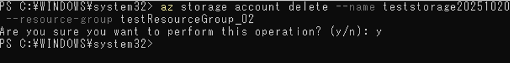

