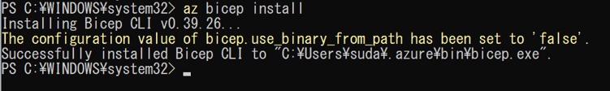
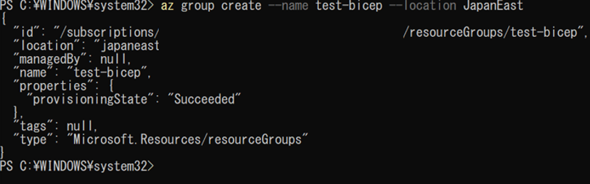
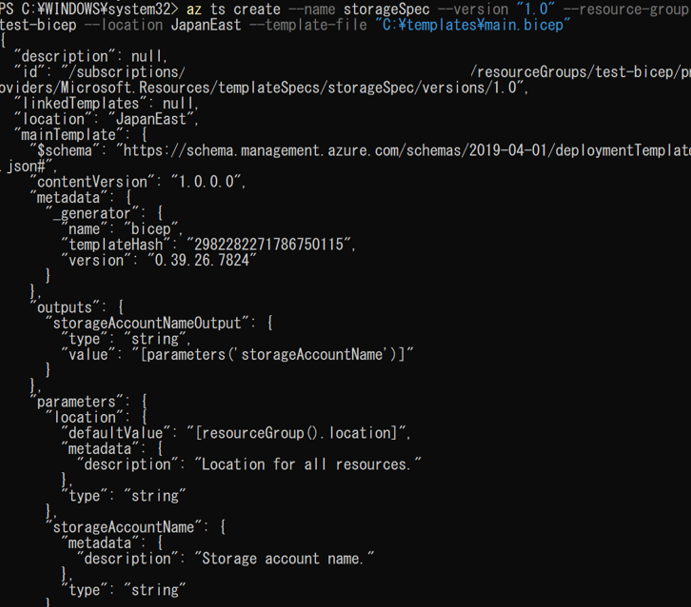
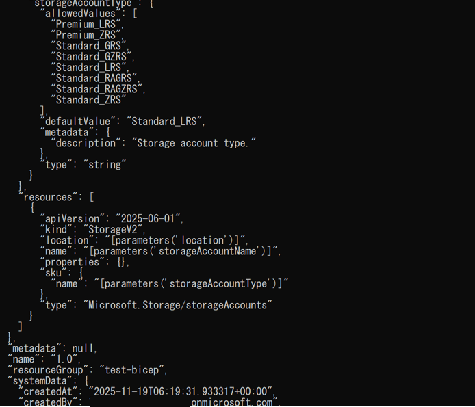
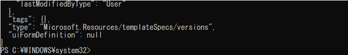
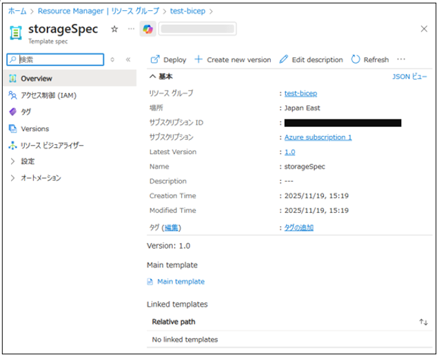
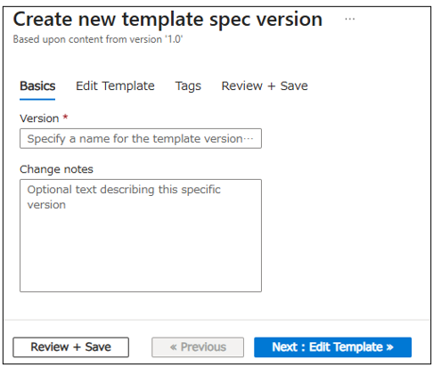
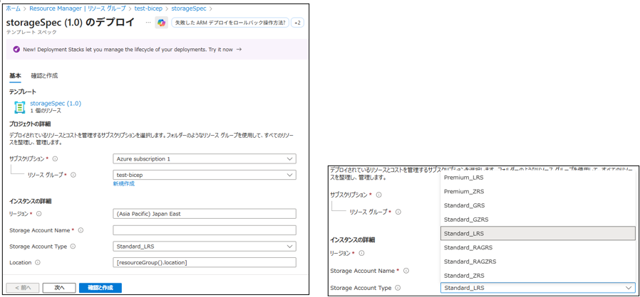
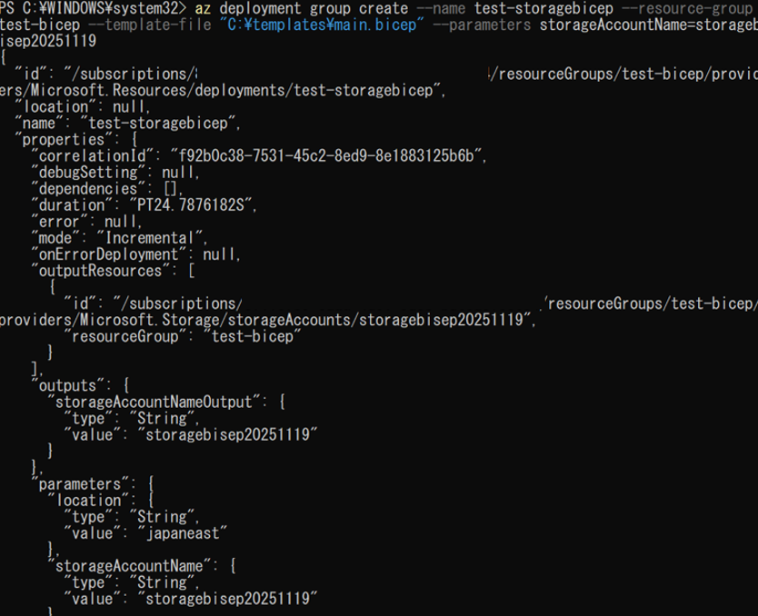

#	Azure Bicep実行検証

(1)	Bicep CLI をインストールする

「az bicep install」を実行する。

 

(2)	Bicep用のリソース グループを作成

「az group create --name test-bicep --location JapanEast」を実行する。

 

(3)	下記ファイルを作成する。

C:\templates\main.bicep

(4)	テンプレートスペックを作成する。

※テンプレートスペックとはデプロイはまだ行われず、テンプレートを保存する。

※バージョン管理も可能である。

「az ts create --name storageSpec --version "1.0" --resource-group templateSpecRG --location JapanEast --template-file "C:\templates\main.bicep"」を実行する。
 
 
 

 

 

 

 

(5)	Bicep ファイルをデプロイする。

下記コマンドを実行する。

az deployment group create --name test-storagebicep --resource-group test-bicep --template-file "C:\templates\main.bicep" --parameters storageAccountName=storagebisep20251119

 
下記コマンドを実行する。
az deployment group create --name test-storagebicep --resource-group test-bicep --template-file "C:\templates\main.bicep" --parameters storageAccountName=storagebisep20251119
