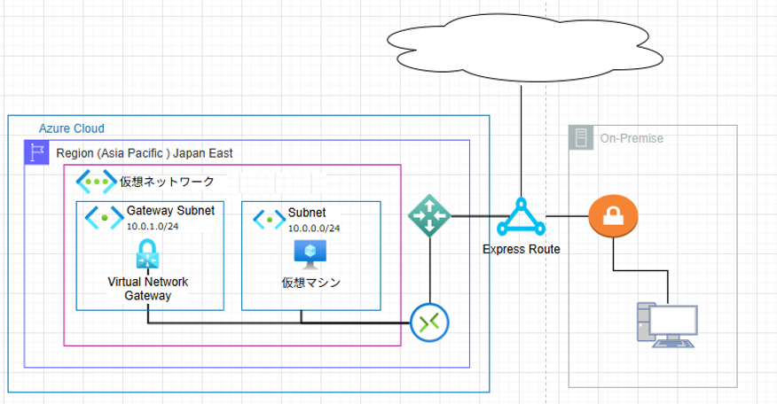

ExpressRouteは、Azureとオンプレミスネットワークを専用のプライベート回線で接続するサービスである。

下記に、ExpressRouteの特徴と用途について記載する。

•	特徴:

o	インターネットを介さないため、高速で信頼性が高い通信が可能である。

o	帯域幅の選択が可能（50 Mbps～10 Gbps）。

•	用途:

o	大規模なデータ転送が必要な場合。

o	高セキュリティが求められるアプリケーションの接続。

o	ハイブリッドクラウドの実現。

イメージ図：

