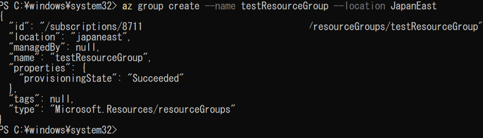
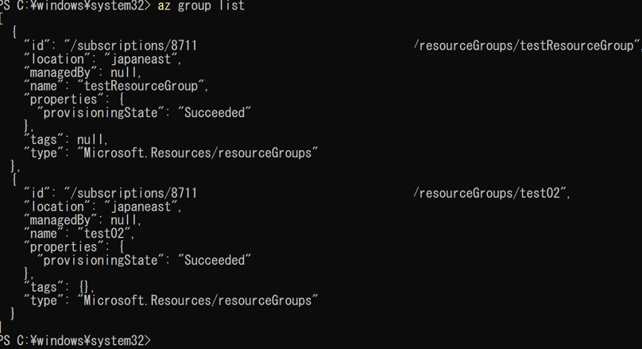
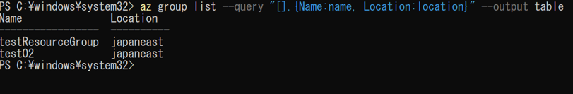
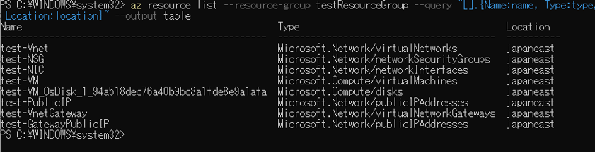
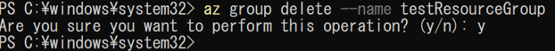

リソースグループの操作について、下記に記載する。

(1)	リソースグループを作成する。

「az group create --name <リソースグループ名> --location JapanEast」を実行する。

 

(2)	リソースグループを一覧表示する

「az group list」を実行する。

 

(3)	リソースグループの主要な情報のみ一覧表示する

「az group list --query "[].{Name:name, Location:location}" --output table」を実行する。

 

(4)	リソースグループ内のシステムを一覧表示する

「az resource list --resource-group <リソースグループ名> --query "[].{Name:name, Type:type, Location:location}" --output table」を実行する。

 

(5)	リソースグループを削除する

「az group delete --name <リソースグループ名>」を実行する。

※同時にリソースグループ内のものをすべて削除する。

 

 
