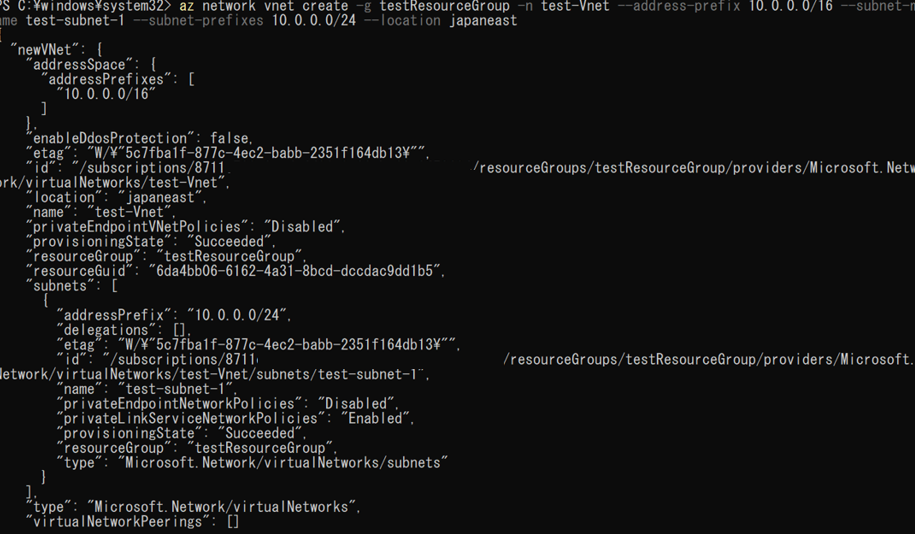
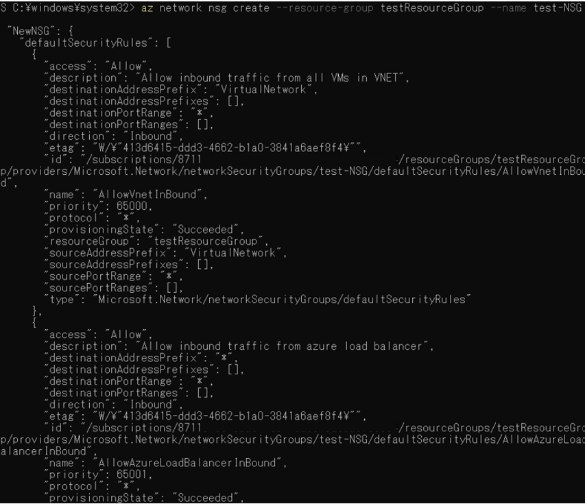
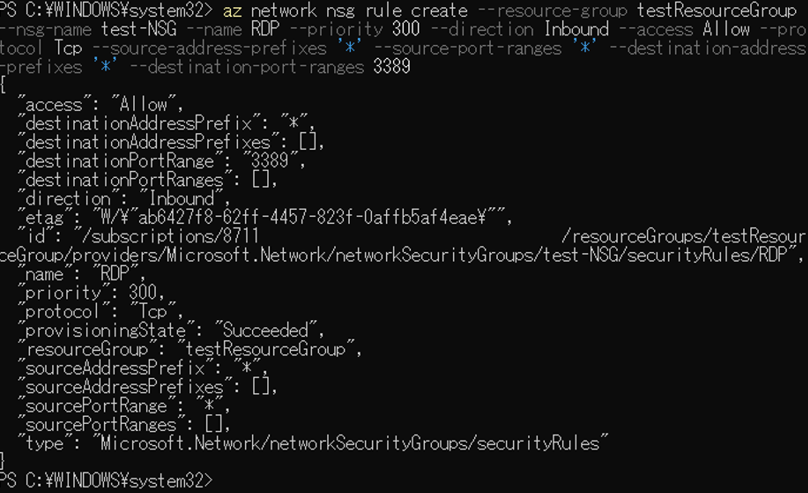
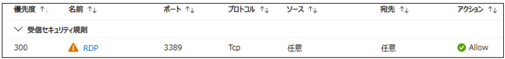
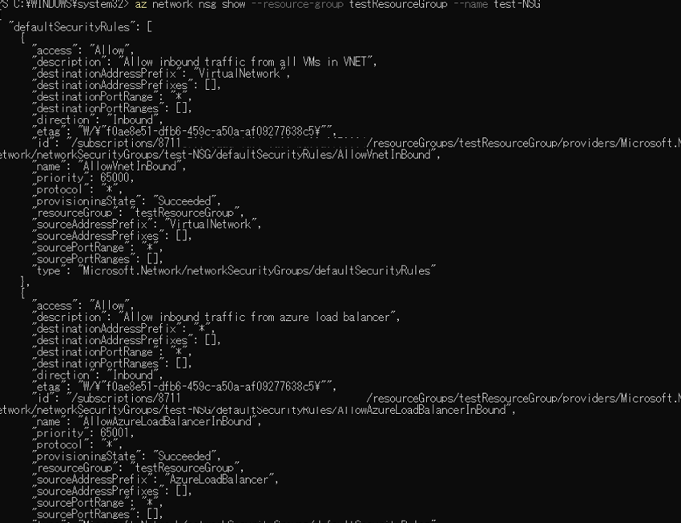
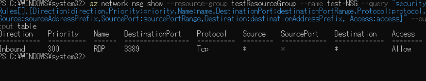
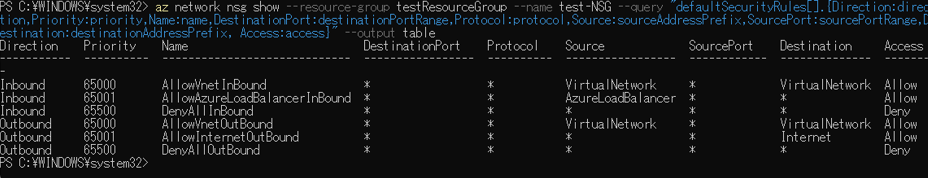
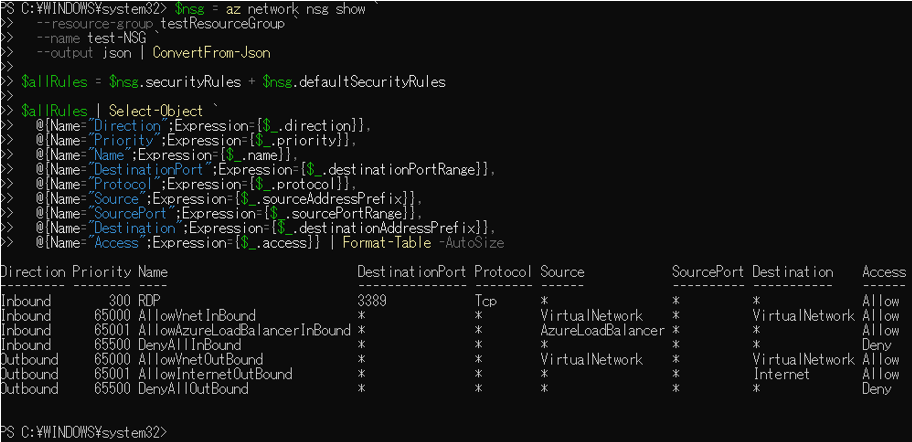
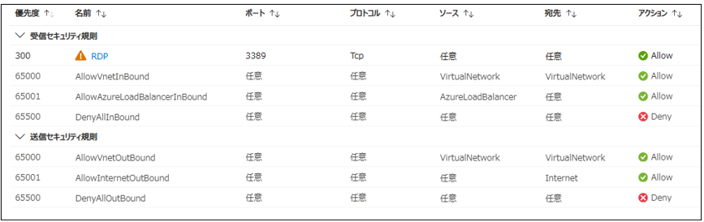

##	仮想ネットワーク(Vnet)　 
 

(1)	仮想ネットワークを作成する。

下記コマンドを実行する。

az network vnet create -g <リソースグループ名> -n <Vnet名> --address-prefix <プレフィックス> `--subnet-name` <サブネット名> `--subnet-prefixes` <サブネット> `--location` japaneast

例：az network vnet create -g testResourceGroup -n test-Vnet --address-prefix 10.0.0.0/16 `--subnet-name` test-subnet-1 `--subnet-prefixes` 10.0.0.0/24 `--location` japaneast
 
 

##	ネットワークセキュリティグループ (NSG)　 

(1)	ネットワークセキュリティグループ(NSG)を作成する。
 
下記コマンドを実行する。

az network nsg create `--resource-group` <リソースグループ名> `--name` <NSG名> `--location` japaneast
 
 
 
(2)	NSGに条件を追加する。

下記コマンドを実行する。

az network nsg rule create 
  `--resource-group` <リソースグループ名> 
  `--nsg-name` <NSG名> 
  `--name` <ルール名> 
  `--priority` <優先度（100〜4096）> 
  `--direction` <Inbound | Outbound> 
  `--access` <Allow | Deny> 
  `--protocol` <Tcp | Udp | * > 
  `--source-address-prefixes` <送信元IPまたはCIDR> 
  `--source-port-ranges` <送信元ポート> 
  `--destination-address-prefixes` <宛先IPまたはCIDR> 
  `--destination-port-ranges` <宛先ポート>

例：

az network nsg rule create --resource-group testResourceGroup --nsg-name test-NSG --name RDP --priority 300 --direction Inbound --access Allow --protocol Tcp --source-address-prefixes '*' --source-port-ranges '*' --destination-address-prefixes '*' --destination-port-ranges 3389
 
 

 

(3)	NSGの内容を出力する。

・すべてのルールと内容を出力する場合、下記を実行する。

az network nsg show --resource-group <リソースグループ名> --name <NSG名>

 

・カスタムルールを横並びに出力する場合、下記を実行する。

az network nsg show --resource-group <リソースグループ名> --name <NSG名> --query "securityRules[].{Direction:direction,Priority:priority,Name:name,DestinationPort:destinationPortRange,Protocol:protocol,Source:sourceAddressPrefix,SourcePort:sourcePortRange,Destination:destinationAddressPrefix, Access:access}" --output table  

 

・デフォルトルールを横並びに出力する場合、下記を実行する。

az network nsg show --resource-group <リソースグループ名> --name <NSG名> --query "defaultSecurityRules[].{Direction:direction,Priority:priority,Name:name,DestinationPort:destinationPortRange,Protocol:protocol, Source:sourceAddressPrefix,SourcePort:sourcePortRange, Destination:destinationAddressPrefix, Access:access}" --output table

  

・すべてのルールを横並びに出力する場合、下記を実行する。

$nsg = az network nsg show 
  `--resource-group` <リソースグループ名> 
  `--name` <NSG名> `
  `--output` json | ConvertFrom-Json

$allRules = $nsg.securityRules + $nsg.defaultSecurityRules

$allRules | Select-Object `
  @{Name="Direction";Expression={$_.direction}},
  @{Name="Priority";Expression={$_.priority}},
  @{Name="Name";Expression={$_.name}},
  @{Name="DestinationPort";Expression={$_.destinationPortRange}},
  @{Name="Protocol";Expression={$_.protocol}},
  @{Name="Source";Expression={$_.sourceAddressPrefix}},
  @{Name="SourcePort";Expression={$_.sourcePortRange}},
  @{Name="Destination";Expression={$_.destinationAddressPrefix}},
  @{Name="Access";Expression={$_.access}} | Format-Table -AutoSize

 
 
 
