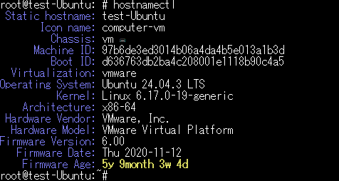
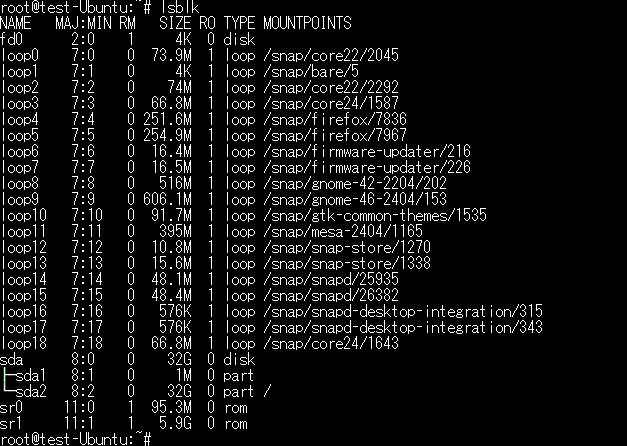
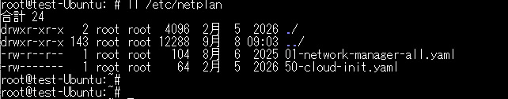
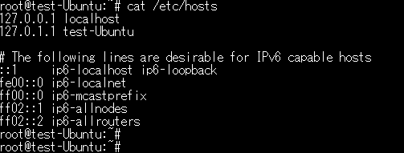
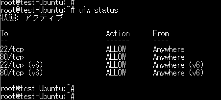
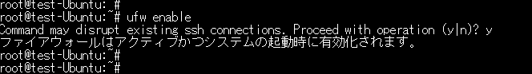
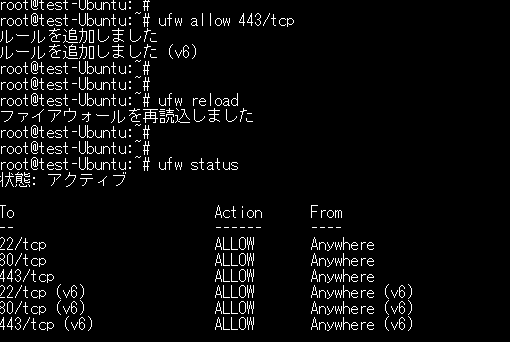
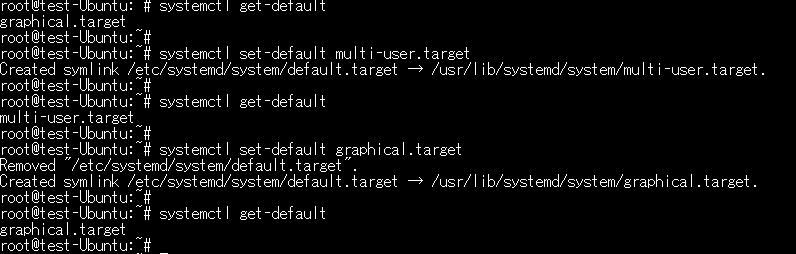
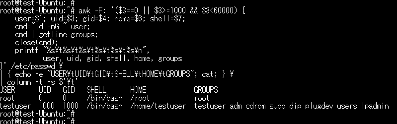
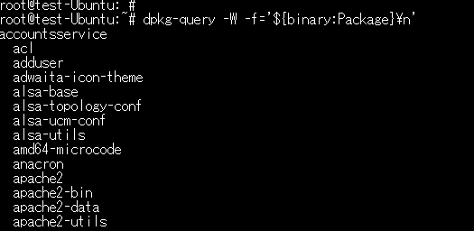

# Linux コマンド

※オペレーティングシステム(RHELや、Ubuntu)で違う可能性有

(1) オペレーティングシステムの確認

hostnamectl

(2) パーティションの確認

lsblk

(3) ネットワーク設定の確認

/etc/netplan

(4) hostsファイル情報の確認

/etc/hosts

(5) ファイアウォールの確認

ufw status

　# ファイアウォールの有効化

ufw enable

　# ファイアウォールの追加

(6) 起動ランレベルの確認 

systemctl get-default

　# ランレベルの変更

(7) アカウント設定（共通）の確認

awk -F: '($3==0 || $3>=1000 && $3<60000) {
    user=$1; uid=$3; gid=$4; home=$6; shell=$7;
    cmd="id -nG " user;
    cmd | getline groups;
    close(cmd);
    printf "%s\t%s\t%s\t%s\t%s\t%s\n",
           user, uid, gid, shell, home, groups
}' /etc/passwd \
| { echo -e "USER\tUID\tGID\tSHELL\tHOME\tGROUPS"; cat; } \
| column -t -s $'\t'

(8) パッケージ一覧(共通)の確認 (Ubuntu) #バージョンを表示しない形式での出力

dpkg-query -W -f='${binary:Package}\n'　

