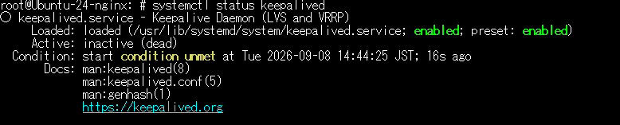
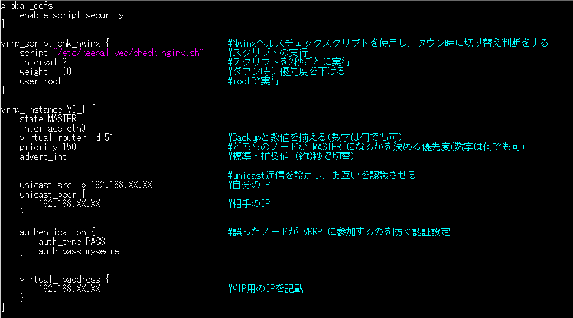
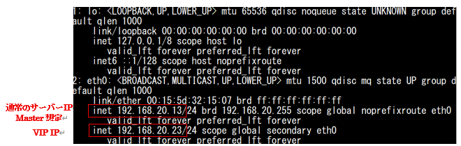
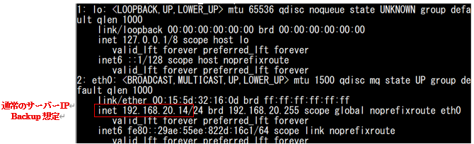
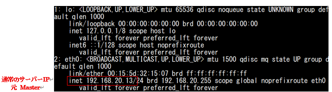
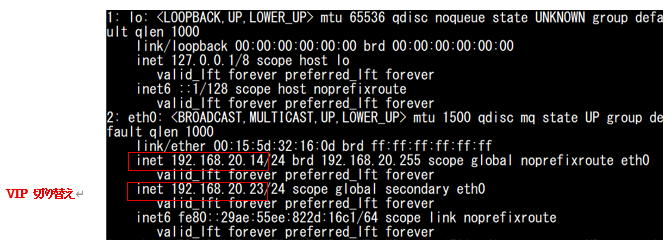

#	keepalived

keepalivedとは、Webサーバーのアクセス先となる仮想IP（VIP）を設定し、複数台のサーバーでActive/Standby間で切り替えるのが代表的な使い方である。

##	keepalived 設定ファイル　etc

① keepalivedをインストールしただけでは、ステータスがactiveにならない。

自動でファイルも生成されないため、下記設定ファイルに設定を行う。

設定ファイル：/etc/keepalived/keepalived.conf

※設定の主なポイント　※要件によって違うため、あくまで設定した方が良いと思われる主要な重要部分のみ記載

②クラスター設定のため、 Masterサーバー、Backupサーバーでそれぞれ設定する。

起動時点で優先度が高いサーバーがマスターとなる。

③ マスター確認

ip a 等でサーバーのIPを確認する。

サーバーダウンや、「systemctl stop keepalived」等で、マスターサーバーがダウンした後

優先度の高いサーバーのkeepalivedが復旧した際は、通常に戻る。

