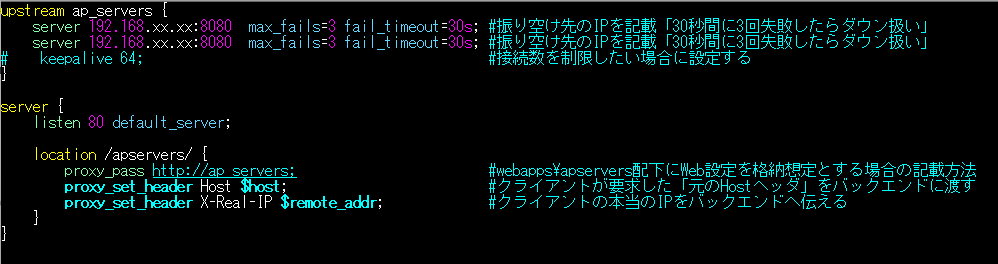
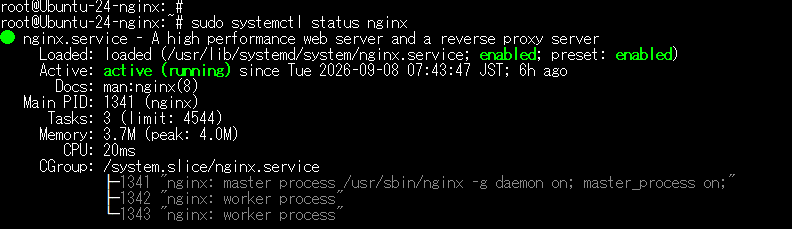

#	nginx (ロードバランサー用途)

##	nginx 設定ファイル　etc

通常のnginxの設定ファイルは「/etc/nginx/nginx.conf」であるが、ロードバランサー用途でnginxを使用する際は、設定方法が異なる。

「/etc/nginx/nginx.conf」を使用しても良いが、今回はロードバランサ用途のため、独自に server 定義を行う。

  #default_server 重複を防止するため、/etc/nginx/sites-enabled/のシンボリックリンクを無効化する。

  #リンク先の/etc/nginx/sites-available/defaultはデフォルト状態とする。

  #設定ファイルは下記を使用するものとする。

設定ファイル：/etc/nginx/conf.d/loadbalancer.conf

※設定の主なポイント　※要件によって違うため、主要な重要部分のみ解説

下記は設定の参考例である。

メモ：ロードバランスの方法は主に下記が存在する。調整は設定ファイルで行う。

・ラウンドロビン（デフォルト）順番に均等に振り分ける　#今回の設定値

・Least-Connected（最小接続数）接続数が一番少ないサーバーへ優先的に振る

・Weight（重み付けラウンドロビン）重みを設定して負荷を調整

 ip_hash（セッション維持）同じクライアントIP からのアクセスを同じサーバーへ固定する
 
※公式ドキュメント（ngx_http_upstream_module）にも記載有

##	nginx コマンド操作　etc

(1)	nginxのバージョン確認

 nginx -v

(2)	nginxのステータス確認

sudo systemctl status nginx

