## Web前提条件

Webサイトは、Windows server上に、Apache ＋ Tomcatをインストールした状態とする。

Webサーバーとして機能するために、追加でJAVAをインストールする。

## JAVAインストール

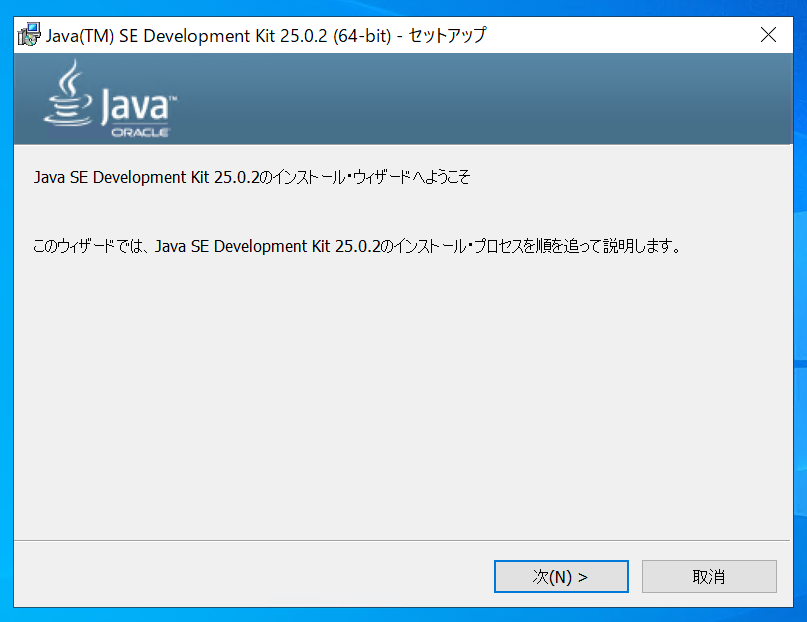

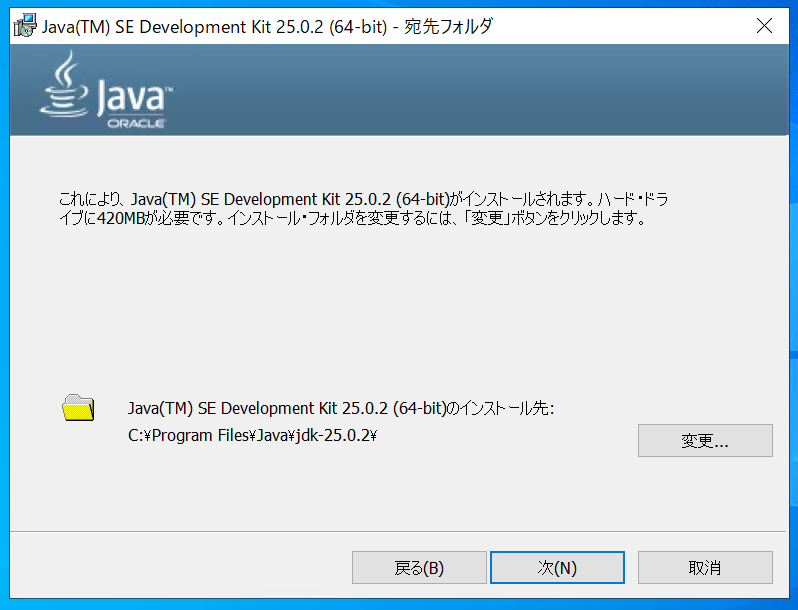

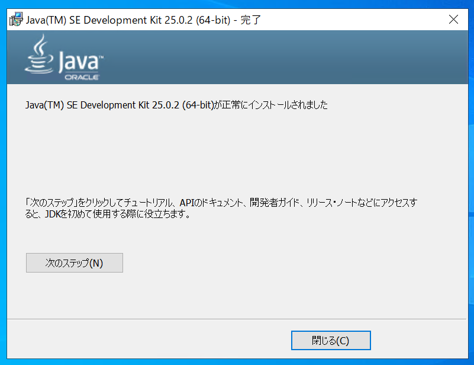

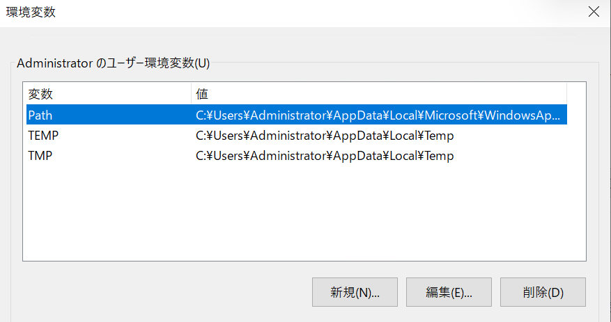

環境変数の設定を追加する。　「JAVA_HOME」

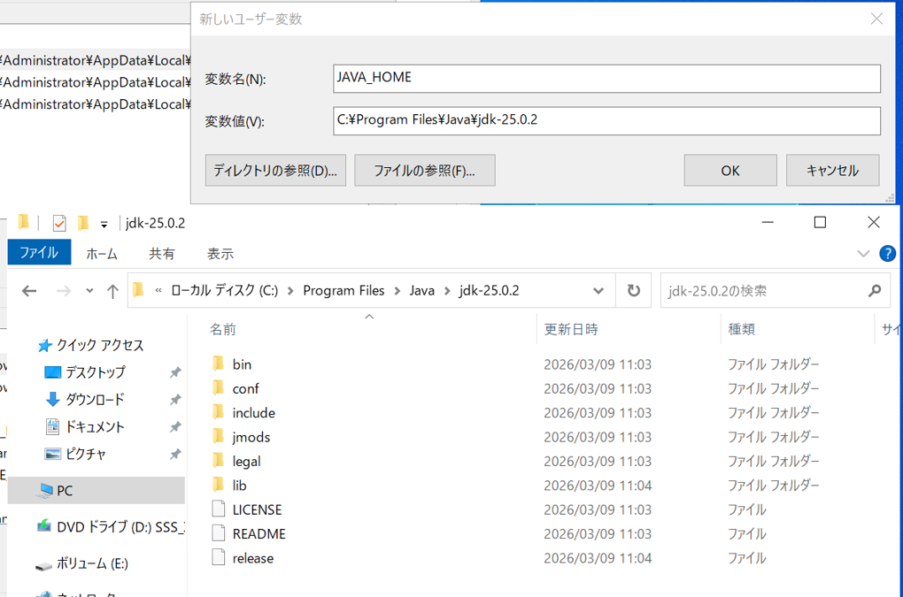

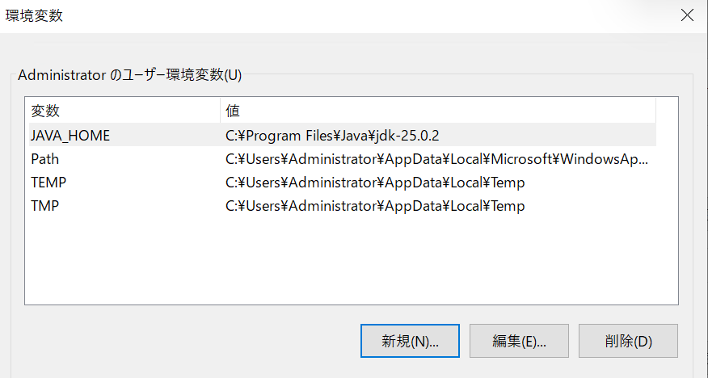

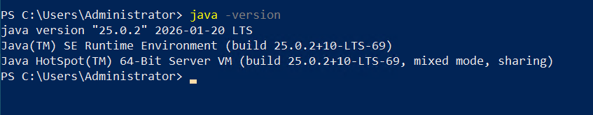

## Apache ＋ Tomcatインストール

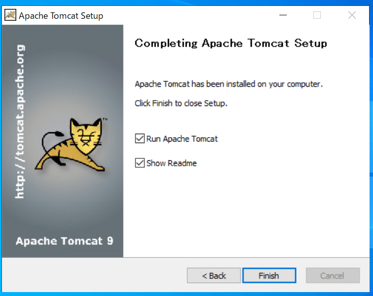

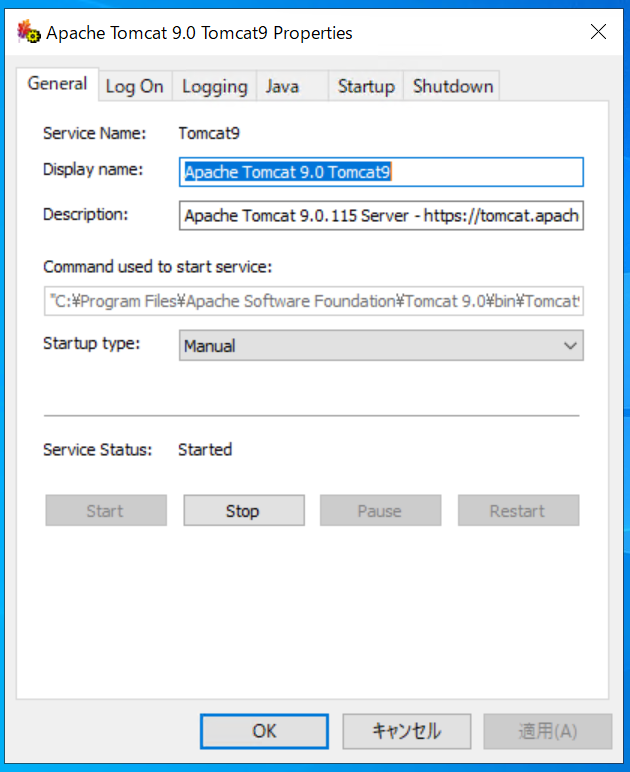

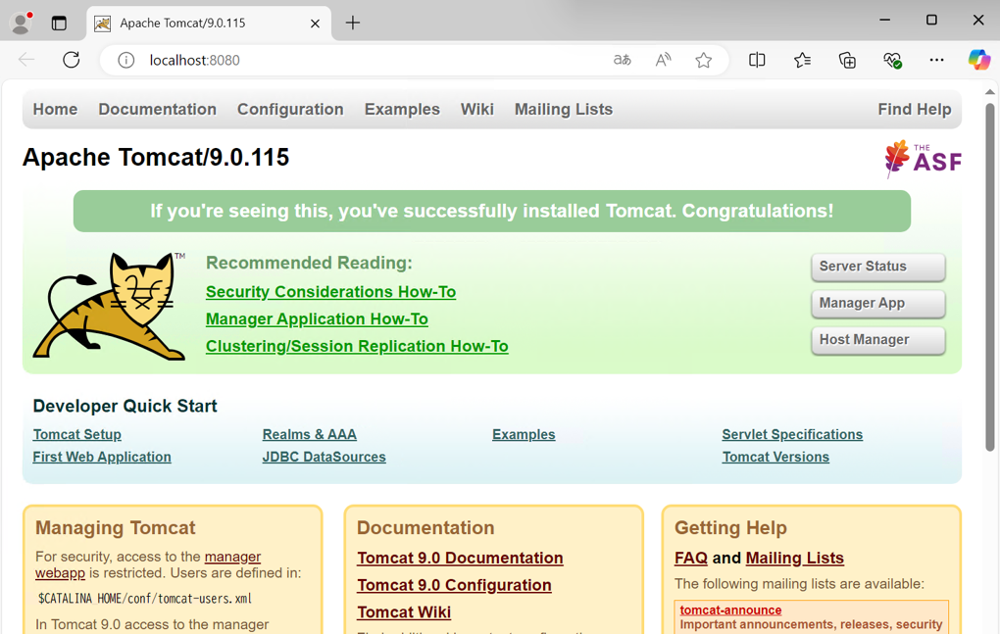

「services.msc」でサービスを起動し、Apache Tomcatを自動起動に切り替え

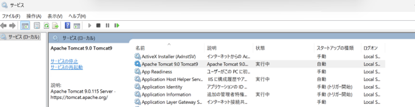

下記コマンドでFirewall（ファイアウォール）の設定を行う

New-NetFirewallRule -DisplayName "Tomcat8080" -Direction Inbound -Protocol TCP -LocalPort 8080 -Action Allow

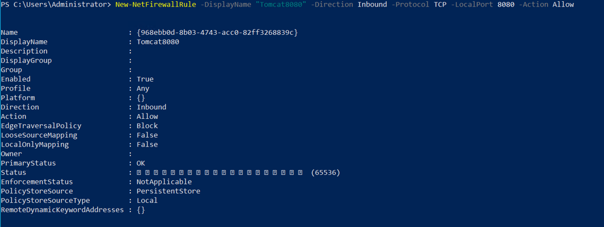

## Webサーバー構成

Webサーバーに必要な設定は下記とする

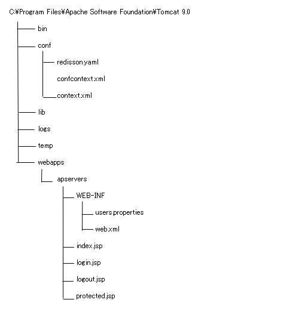

redisson.yaml

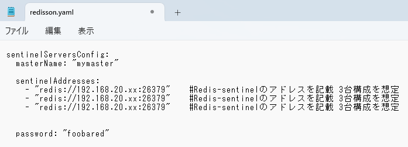

confcontext.xml

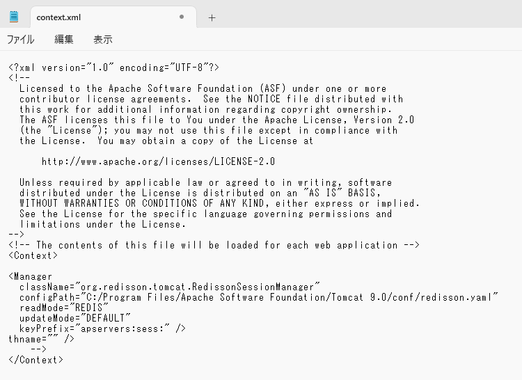

context.xml

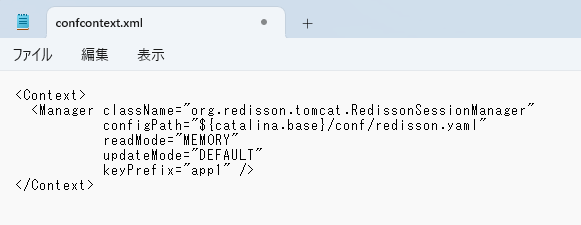

lib配下には、下記ファイルをインストールしてきて配置する。

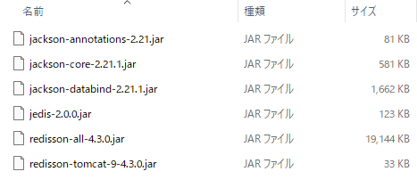

webapps配下にWebの設定ファイルを配置する

