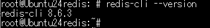
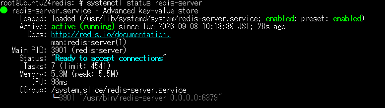
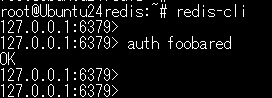
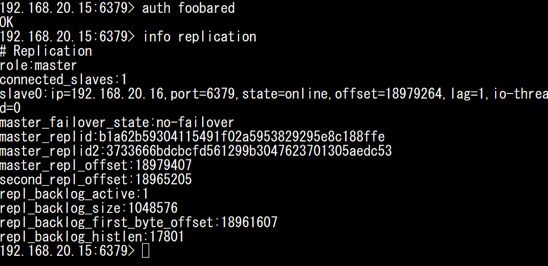
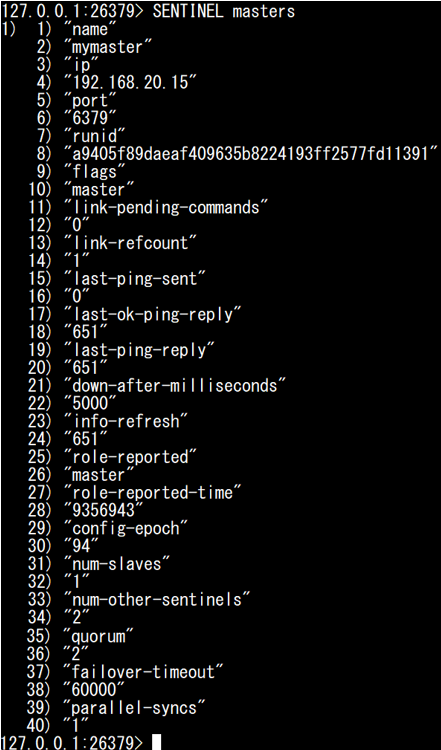
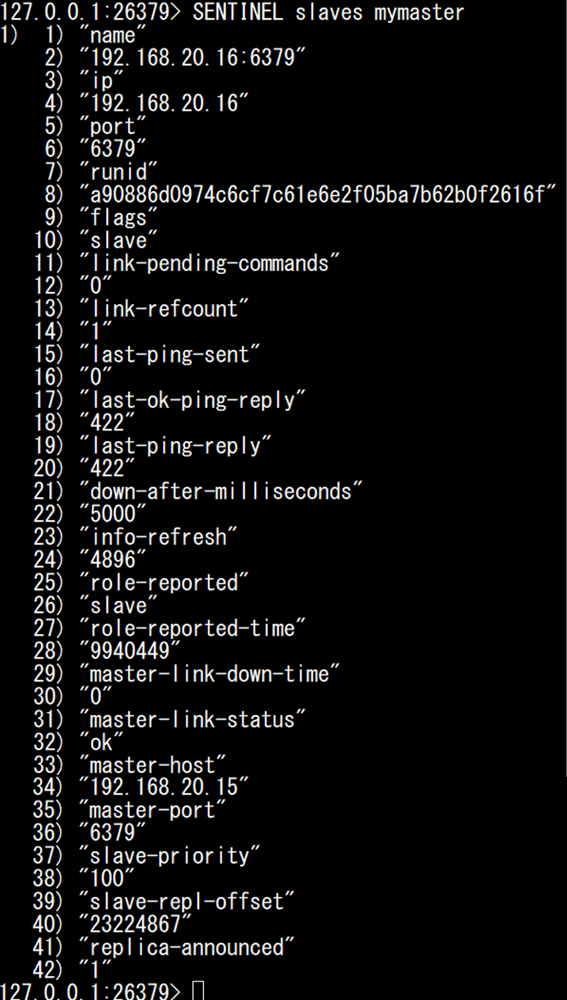
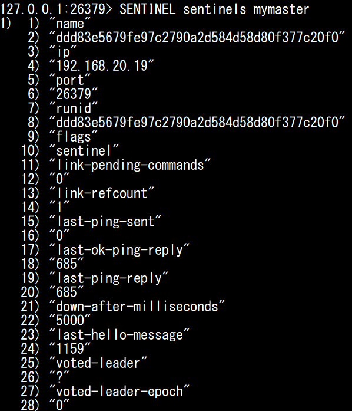
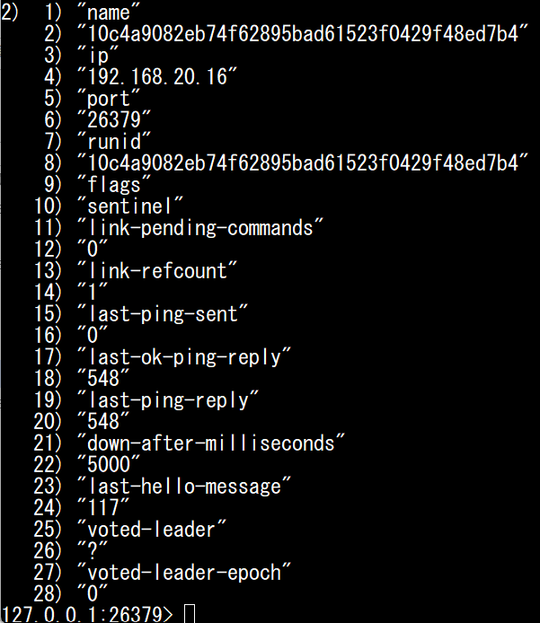
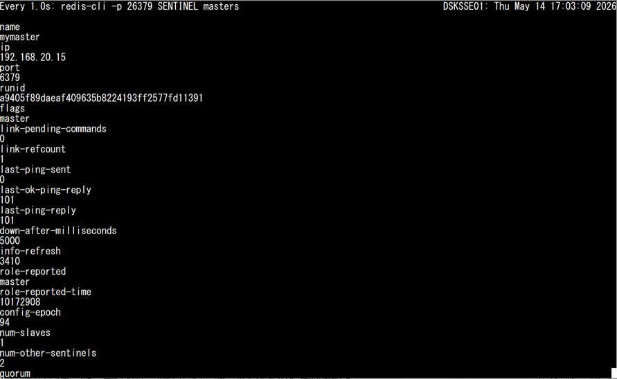

#	redis

##	redis 設定ファイル　etc

設定ファイル：/etc/redis/redis.conf

※設定の主なポイント　※要件によって違うため、主要な重要部分のみ解説

①bind設定は、既存の「bind 127.0.0.1 -::1」をコメントアウトし、「bind 0.0.0.0」等を追加する。

セキュリティを気にする場合は、「bind 127.0.0.1 192.168.xx.xx」のように、localhostと、自IPのみ接続許可する

②「masterauth "foobared"」のコメントアウトを外す

③「requirepass "foobared"」のコメントアウトを外す

④redisサーバーを冗長化した際のslave(Replica)には、以下を設定する。  例：「replicaof 192.168.xx.xx 6379」

##	redis コマンド操作　etc

(1)	Redisのバージョン確認

 redis-cli --version

(2)	Redisのステータス確認

systemctl status redis-server

(3)	Redisに接続する。

redis-cli   ※「auth foobared」を設定している場合は、ログイン後に実行する。

もしくは、redisのIPを指定して接続することも可能。「redis-cli -h xxx.xxx.xx.xx」

(4)	redisサーバーを冗長化した際の冗長性の確認

info replication

#	redis-sentinel

Redis-Sentinelは、Redisの可用性を高めるための監視・フェイルオーバー機能である。

複数のRedis-SentinelがRedisを監視し、Master障害時にはSlaveを新しいMasterへ自動的に昇格させる。

Sentinelは障害判定やフェイルオーバーに過半数の合意が必要となるため、一般的に3台等の奇数構成で構築する。

##	redis-sentinel 設定ファイル　etc

(1)	Redis-Sentinelに接続する。

redis-cli -p 26379

(2)	Redis-Sentinel上で、RedisのMasterを確認する。

SENTINEL masters

※Redis Sentinel の出力は、奇数番目が Key（ステータス名）、その直後の偶数番目が Value（値） という Key–Value の並びで出力される。

※下記は、ステータス打ち分け

No.	ステータス名	用途

1	name	基本識別情報（どのMasterか）

2	ip	IPアドレス

3	port	Port番号

4	runid	Redis起動時に生成される一意のID

5	flags	状態フラグ.。

    master：正常なMasterとして認識されている状態
  
    s_down：このSentinelから見て異常
  
    o_down：クォーラム成立＝障害確定
  
    failover-in-progress：切替中
  
6	link-pending-commands	未処理コマンド数。（通常0）

7	link-refcount	接続参照数（通常1）

8	last-ping-sent	最後にPINGを送ってからの経過時間(ms)

9	last-ok-ping-reply	最後に正常応答が返ってきた時間（ms前）

10	last-ping-reply	最後に正常応答が返ってきた時間（ms前）

11	down-after-milliseconds	5秒応答がなければ s_down と判定(デフォルト設定)

12	info-refresh	状態再取得するまでの時間(ms)

13	role-reported	Redis自身が報告している役割

14	role-reported-time	Sentinelがrole-reportedを最後に確認してからの経過時間

15	config-epoch	フェイルオーバーの世代番号。切替のたびに増える。

16	num-slaves	Slave（Replica）の台数。

17	num-other-sentinels	自分以外のSentinelの台数。

18	quorum	2台以上がダウン判定したらMaster切り替え

19	failover-timeout	フェイルオーバー最大許容時間（60秒）

20	parallel-syncs	同時に再同期できるReplica台数。

(3)	Redis Sentinel上で、RedisのSlave(Replica)を確認する。

SENTINEL slaves mymaster

※下記は、ステータス打ち分け

※1～14はMasterのステータスと共通のため省略。

FlagsはSlaveとなる。

No.	ステータス名	用途

15	master-link-down-time	切断してからの経過時間

16	master-link-status	Masterと正常に接続しているかの判定

17	master-host	MasterのIPアドレス

18	master-port	Masterのポート番号

19	slave-priority	フェイルオーバー時の昇格優先度(デフォルト設定)

20	slave-repl-offset	レプリケーション進捗量

21	replica-announced	Sentinelへの存在通知

(4)	自分以外のRedis-Sentinelを確認する

SENTINEL sentinels mymaster

※下記は、ステータス打ち分け

※1～11はMasterのステータスと共通のため省略。

FlagsはSentinelとなる。

No.	ステータス名	用途

12	last-hello-message	他のSentinelから最後にHELLOメッセージを受信してからの経過時間（ms）

13	voted-leader	フェイルオーバー実行中。平常時は?表示。（未定義）

14	voted-leader-epoch	最後にleader投票を行ったフェイルオーバー世代番号

## Redis-Sentinel手動切り替え

(1)	リアルタイムステータス確認

watch -n 1 "redis-cli -p 26379 SENTINEL masters"

(2)	RedisのMasterの手動切り替え

redis-cli -p 26379 SENTINEL failover mymaster

※もしくは、redis-cli -p 26379でRedis Sentinelに接続後にSENTINEL failover mymasterを実行するも可。
  
