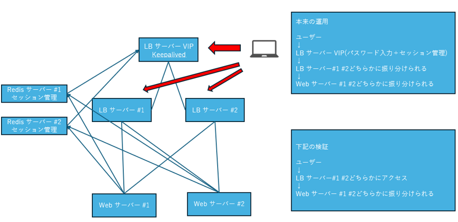
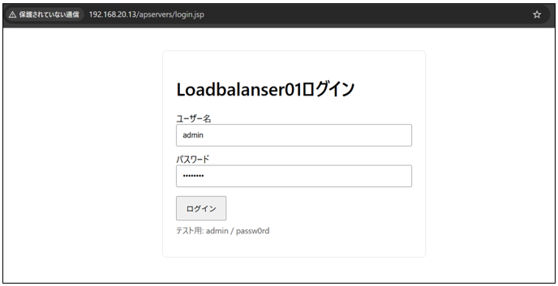
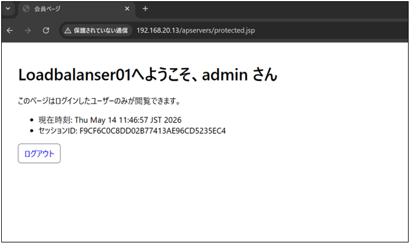
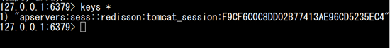
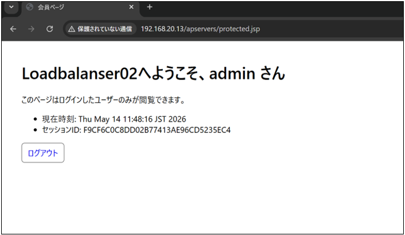
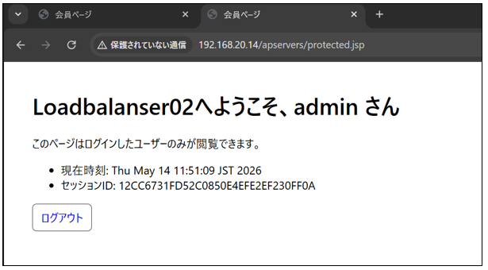
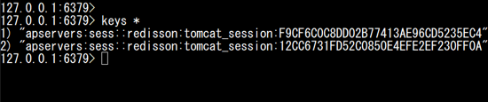
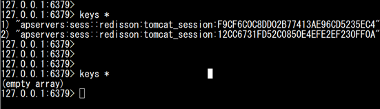

## Webサーバーログイン確認

### イメージ図

(1) ブラウザーでLBサーバー#1にアクセスし、ユーザー名とパスワードを入力してログインする。

※自動的にWebサーバー#1か#2にアクセスされ、Redisのセッション管理によりセッションを維持する。

※今回は自動的にWebサーバー#1にアクセス。

(2) redisのデータベースでログイン情報が表示される。

※ブラウザーの再読み込みを行い、Webサーバー#2にアクセスされてもセッションは失われない。

(3) ブラウザーでLBサーバー#2にアクセスし、ユーザー名とパスワードを入力してログインする。

※VIP IPにアクセスした際は、ランダムで#1か#2にアクセスする。

(4) 30分以上過ぎた後に再度redisのデータベースを確認する。

※30分でログイン情報が削除する設定のため、自動的に削除される。
