# Zabbix 画面

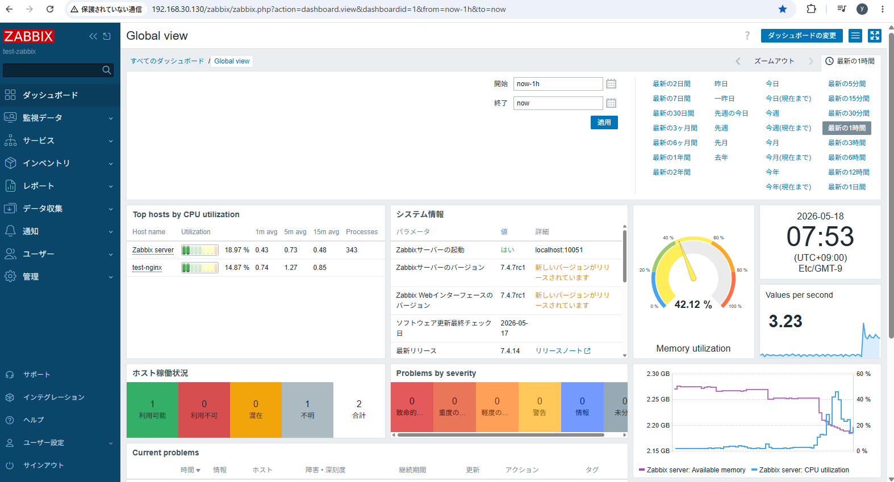

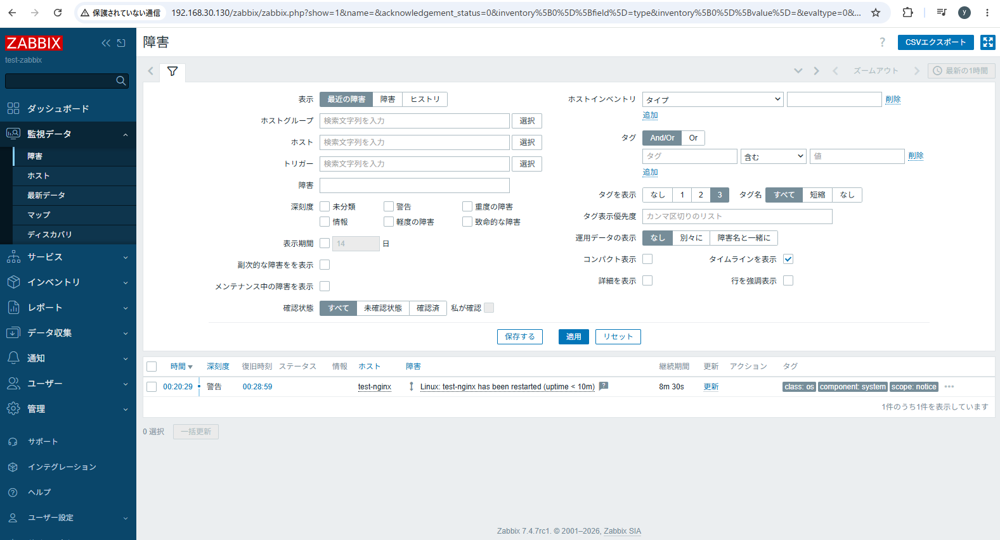

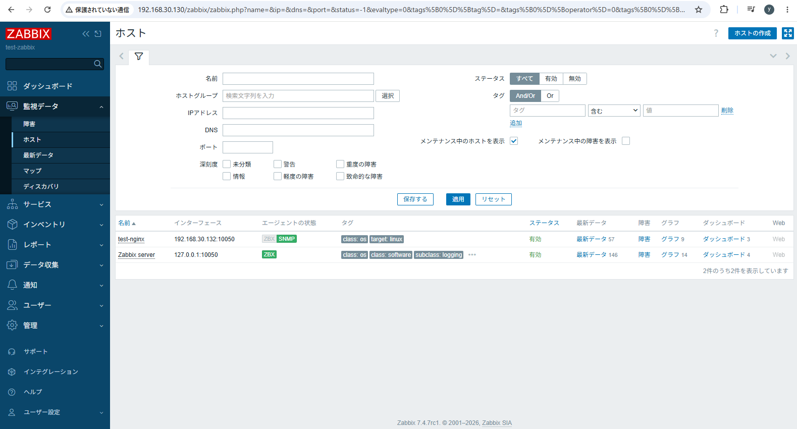

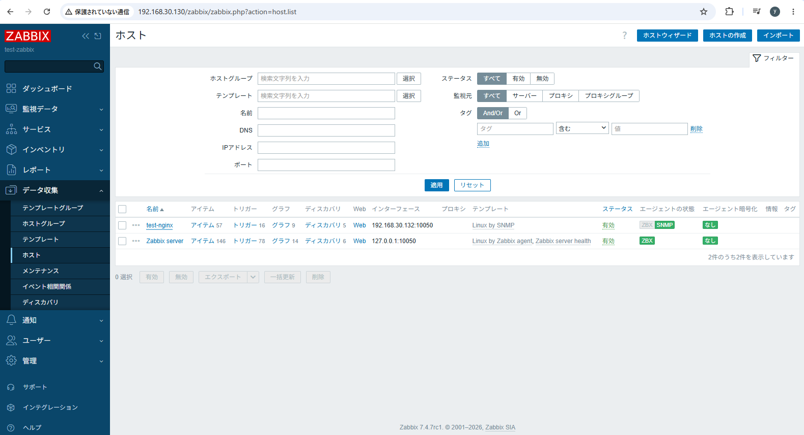

##	Zabbix 設定ファイル　etc

設定ファイル：/etc/zabbix/zabbix_server.conf

※設定の主なポイント　※要件によって違うため、主要な重要部分のみ解説

① MySQLへの接続設定を追加する。「DBPassword=password」

② SNMPTrapperFileのログを設定する場合に記載する。　例：「SNMPTrapperFile=」

③ SNMP Trap を取り込む機能を有効化する。「StartSNMPTrapper=1」

④ スクリプト実行権限を有効化する際に設定する。「EnableGlobalScripts=1」

※スクリプト参考例

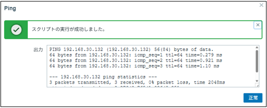

##	snmptrapd 設定ファイル　etc

設定ファイル：/etc/snmp/snmptrapd.conf

  

##	snmptrapdログ設定

EDITOR=vi systemctl edit snmptrapdで編集する

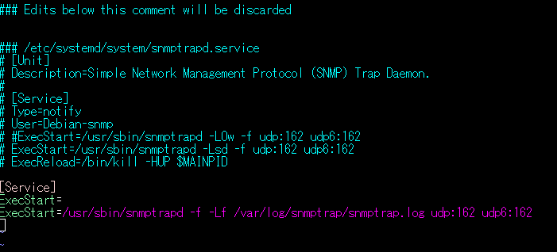  

##	Zabbix レプリケーション設定　

Zabbixを2台構成とし、データベースをmaster Replica構成にする際の設定

設定ファイル：/etc/mysql/mysql.conf.d/mysqld.cnf

Master設定

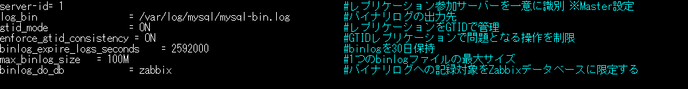  

Replica設定

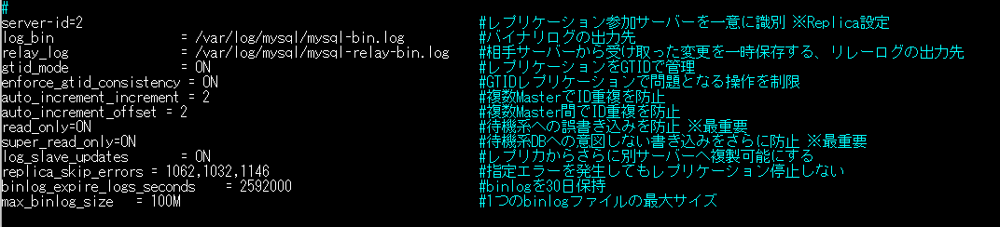  

##	Zabbix レプリケーション正常性確認

(1) 「mysql -u root -p」でmysqlにアクセスし、以下のコマンドを実行する。

SHOW REPLICA STATUS\G

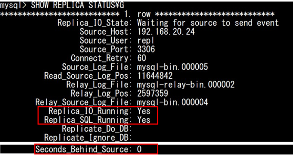  

(2) 下記3つのステータスを基準に、レプリケーションが正常に動作しているか確認する。

Replica_IO_Running        マスター(DSKSZA01)から更新情報を受信できているかを示します。

Replica_SQL_Running	      受信した更新情報を正常に反映できているかを示します。

Seconds_Behind_Source	    レプリケーション遅延時間（秒数）を示します。0でない場合、時間が過ぎるごとに値が減少します。

※Zabbix#1がダウンした際は「Replica_IO_Running」と「Replica_SQL_Running」がNOという表示に変わり、自動的にレプリケーションがOFFとなる

※補足：Zabbix#1(マスター)でmysqlにアクセス後、「SHOW MASTER STATUS;」を実行することで、マスターの状態を確認できる。

マスターのFileは、レプリカ(Zabbix#2)の「Source_Log_File」と共通し、

マスターのPositionは、レプリカの「Read_Source_Log_Pos」と共通する。※値は常に増加する。

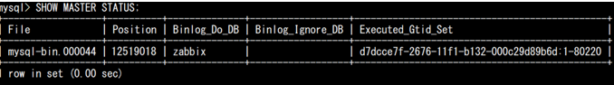  

## レプリケーション修正手順

(1) teraTermで、レプリカ(Zabbix#2)に接続し、mysqlにアクセスする

(2)	以下のコマンドを実行する。

SET GLOBAL super_read_only=OFF;

SET GLOBAL read_only=OFF;

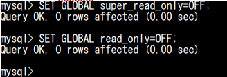  

(3)	以下のコマンドを実行し、両方のステータスがOFFになっていることを確認する。

SHOW GLOBAL VARIABLES WHERE Variable_name IN ('read_only','super_read_only')

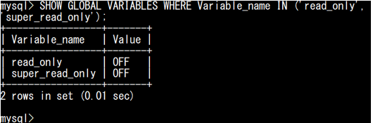  

(4)	以下のコマンドを実行する。

STOP REPLICA;

RESET REPLICA ALL;

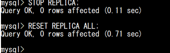  

(5)	teraTermで、マスター(Zabbix#1)に接続し、以下のコマンドを実行する。

mysqldump -u root -p zabbix --single-transaction --routines --triggers --events --source-data=2 --set-gtid-purged=OFF > zabbix.sql

※入力後、Zabbixユーザーのパスワードを入力する。

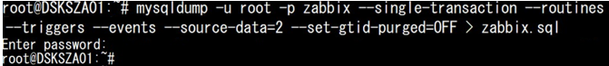  

(6)	以下のコマンドを実行し、#1でダンプしたファイルを#2にコピーする。

scp /root/zabbix.sql レプリカIP:/root

※入力後、rootユーザーのパスワードを入力する

(7)	以下のコマンドを実行し、データベース(Zabbix)にデータを反映する。

mysql -u root -p zabbix < /root/zabbix.sql

※入力後、Zabbixユーザーのパスワードを入力する。

(8)	#2でmysqlにアクセスし、以下のコマンドを実行する。

CHANGE REPLICATION SOURCE TO

SOURCE_HOST='#1のIP',

SOURCE_PORT=3306,

SOURCE_USER='レプリケーションユーザー',	

SOURCE_PASSWORD='レプリケーションパスワード',	
SOURCE_AUTO_POSITION=1;

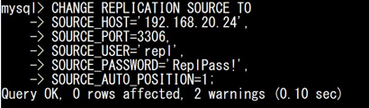  

(9)	#2で以下のコマンドを実行する。

SET GLOBAL read_only=ON;

SET GLOBAL super_read_only=ON;

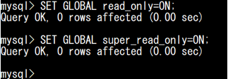  

(10)	以下のコマンドを実行し、両方のステータスがONになっていることを確認する。

SHOW GLOBAL VARIABLES WHERE Variable_name IN ('read_only','super_read_only');

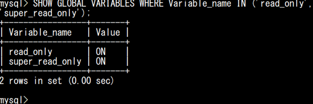  

(14)	以下のコマンドを実行し、レプリケーションを再開する。

START REPLICA;

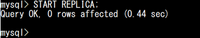  

(15)	以下のコマンドを実行し、対象のステータスに異常がないことを確認する。

SHOW REPLICA STATUS\G

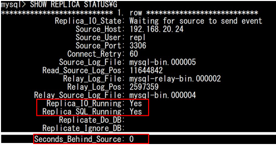  
