# Entra ID

##	コマンド操作

Entra IDで使用するコマンド操作について記載する。

＜実施手順＞

(1)	モジュールのインストールを行う。

「Install-Module -name AzureAD」を実行する。

(2)	モジュールのインポートを行う。

「Import-Module AzureAD」を実行する。

(3)	AzureADにログインする。

「Connect-AzureAD」を実行する。

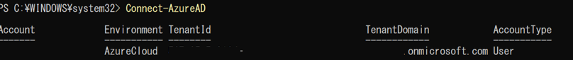 

(4)	グループ一覧の取得を行う。

「Get-AzureADGroup -All 1」を実行する。

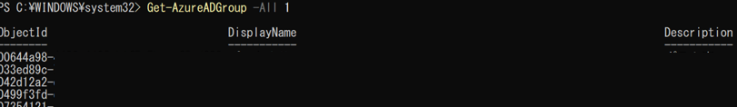 

(5)	グループ一覧をcsv出力する。

下記コマンドを実行する。

```powershell
Get-AzureADGroup -All $true |
    Select-Object DisplayName, Mail, MailEnabled, SecurityEnabled |
    Export-Csv -Encoding Default C:\EntraID_Group.csv

※補足

MailEnabledメール機能が有効か（True/False）

SecurityEnabledセキュリティグループかどうか（True/False）
 
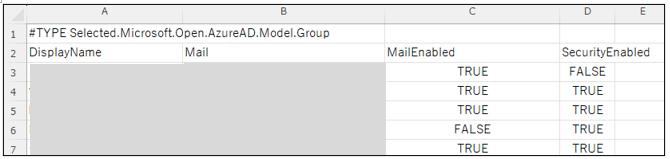 

(6)	メールが有効なセキュリティグループの、ユーザーが所属しているグループのみcsvで出力する。

下記コマンドを実行する。

$groups = Get-AzureADGroup -All $true | Where-Object {
    $_.MailEnabled -eq $true -and $_.SecurityEnabled -eq $true
}

$results = @()

foreach ($group in $groups) {
    $members = Get-AzureADGroupMember -ObjectId $group.ObjectId
    foreach ($member in $members) {
        $results += [PSCustomObject]@{
            GroupName   = $group.DisplayName
            GroupEmail  = $group.Mail
            MemberName  = $member.DisplayName
            MemberUPN   = $member.UserPrincipalName
        }
    }
}

### CSVに出力
$results | Export-Csv -Path "MailEnabledSecurityGroups_Members.csv" -Encoding UTF8 -NoTypeInformation

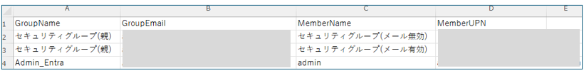  


(7)	ユーザーの一覧と、所属しているグループをcsvで出力する。

下記コマンドを実行する。

### ユーザーと所属グループを取得
$users = Get-AzureADUser -All $true
$result = @()

foreach ($user in $users) {
    $groups = Get-AzureADUserMembership -ObjectId $user.ObjectId | Select-Object DisplayName
    $groupNames = ($groups.DisplayName -join ", ")
    $result += [PSCustomObject]@{
        UserPrincipalName = $user.UserPrincipalName
        DisplayName       = $user.DisplayName
        Groups            = $groupNames
    }
}

### CSVに出力
$result | Export-Csv "<ファイル名>.csv" -NoTypeInformation -Encoding UTF8

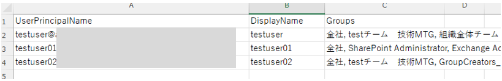   

(8)	ユーザーIDの取得を行う。

下記コマンドを実行する。

```markdown
```powershell
Get-AzureADUser |
    Select-Object ObjectId, UserPrincipalName
 
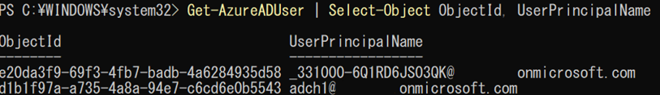   

(9)	デバイスの状態確認を行う。

「dsregcmd /status」を実行する。
 
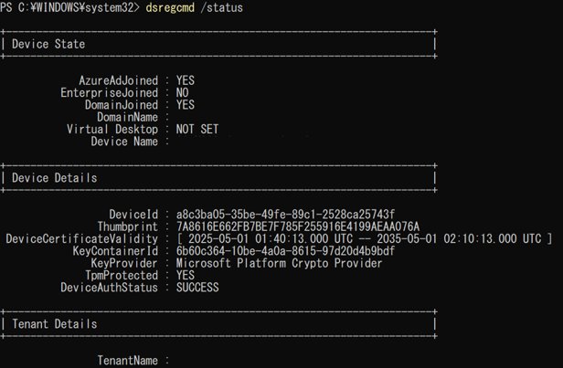    
 
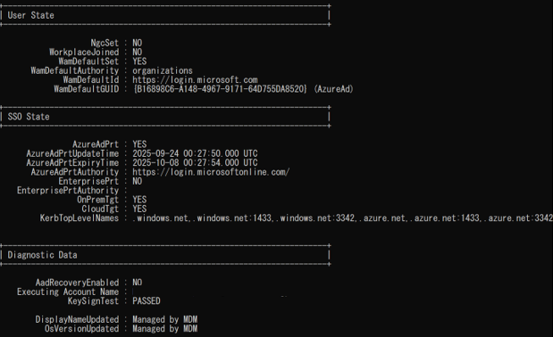   

(10)	セキュリティグループ一括登録を行う。

下記コマンドを実行する。

New-AzureADGroup -DisplayName "<表示名>" -MailEnabled $false -SecurityEnabled $true -MailNickName "NotSet"
 
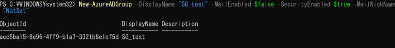   
 
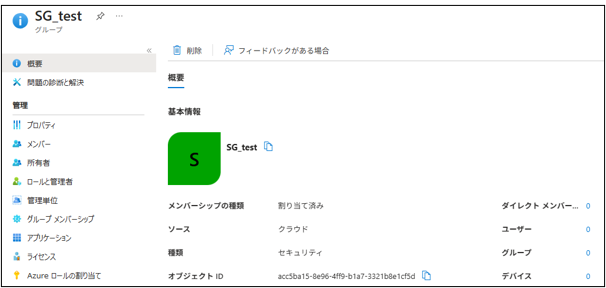   

(11)	M365動的グループ一括登録を行う。

下記コマンドを実行する。

New-AzureADMSGroup -DisplayName “<表示名>” -MailEnabled $false -MailNickname “<MailNickname>” -SecurityEnabled $true -GroupTypes “DynamicMembership” -MembershipRule ‘<ルール条件>’ -MembershipRuleProcessingState “On”

メモ：

DisplayName　セキュリティグループ名を入力する。

MailEnabled　メールが有効なグループを作成するかどうか。使用しない場合はfalse

MailNickName　MailEnabledをfalseにしている場合は、何入力しても良いはず。(ひらがな、カタカナ、漢字が使用できないため、NotSetで統一が無難)

SecurityEnabled　セキュリティが有効なグループを作成するかどうか。true  

※同じ名前でセキュリティグループを複数作成することが可能なので、注意が必要

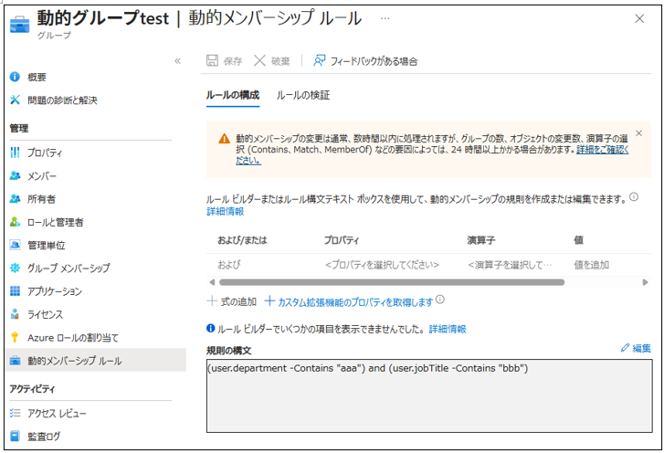   

※実行する前の注意点

通常の AzureAD モジュールでは MembershipRule パラメーターが使用できないため、

AzureADPreview モジュールへの入れ替えが必要

### 既存の AzureAD モジュールをアンインストール（必要に応じて）

Uninstall-Module AzureAD

### AzureADPreview モジュールをインストール

「Install-Module AzureADPreview」を実行する。

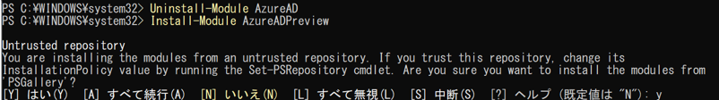   
 


(12)	グループの削除を行う。

下記コマンドを実行する。

Remove-AzureADMSGroup -ID <グループID>

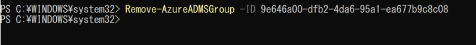   


