#	Exchange Online

##	基本コマンド操作

・Exchange Onlineで使用するコマンドについて記載する。

(1)	モジュールのインストールを行う。

「Install-Module -Name ExchangeOnlineManagement」を実行する。

(2)	モジュールのインポートを行う。

「Import-Module -Name ExchangeOnlineManagement」を実行する。

(3)	ExchangeOnlineにログインする。

「Connect-ExchangeOnline」を実行し、ユーザー情報を入力する。

 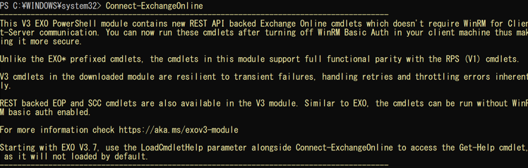 

(4)	ユーザー情報を取得する。　※ユーザー以外にも、メールボックス等が表示される。

「Get-User」を実行する。

 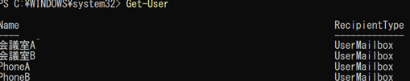 

(5)	メールボックスプランの一覧を表示する。

「Get-MailboxPlan |
Format-Table Name,DisplayName」を実行する。
 

(6)	メールボックスプランの詳細を表示する。

「Get-MailboxPlan　-Identity <DisplayName> |
FL Name,MaxSendSize,MaxReceiveSize,IssueWarningQuota,ProhibitSendQuota,ProhibitSendReceiveQuota,RetainDeletedItemsFor,RetentionPolicy,RoleAssignmentPolicy」を実行する。
 

(7)	メールボックスの、最大送受信サイズのみ表示する。

「Get-MailboxPlan -Identity <Name>b |
FL MaxSendSize,MaxReceiveSize」を実行する。
 

(8)	メールボックスの最大送受信サイズを変更する。

下記コマンドを実行する。

コマンド実行例：Set-MailboxPlan -Identity ExchangeOnlineEnterprise-xxxxxxxxxxxxxxxxxxxxxxxxx -MaxSendSize 20MB -MaxReceiveSize 50MB

(9)	メールボックスの容量警告通知メール用に制限を低くする。

（警告：5MB、送信禁止：10MB、受信禁止：15MB） 

下記コマンドを実行する。

Set-Mailbox -Identity mailbox01 -IssueWarningQuota 5mb -ProhibitSendQuota 10mb -ProhibitSendReceiveQuota 15mb -UseDatabaseQuotaDefaults $false
 
##	共有メールボックスコマンド操作

・Exchange Onlineで共有メールボックスを作成する際に使用するコマンドについて記載する。

また、設定の確認方法として、別紙の「業務内容まとめ2025付属_一括コマンド用 .xlsx」を使用しているため、詳細についてはそちらに記載する。

・「Connect-ExchangeOnline」実行後に下記コマンドを実行する。

(1)	共有メールボックスのみ表示する。

「Get-Mailbox -RecipientTypeDetails SharedMailbox」を実行する。

 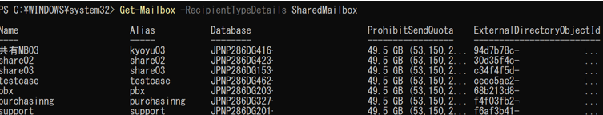  

(2)	共有メールボックスを作成する。

下記コマンドを実行する。

New-Mailbox -Name <共有メールボックス名> -DisplayName "<表示名>" -Alias <メールアドレスの @ 以前の部分> -PrimarySmtpAddress <メールアドレス> -Shared
 
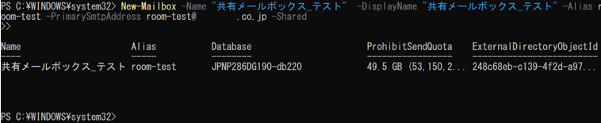 

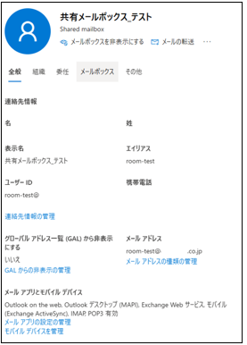  
 
(3)	共有メールボックスのアクセス権をユーザーまたはグループに付与する。

下記コマンドを実行する。

Add-MailboxPermission -Identity "<共有メールボックス名>" -User "<アクセス権を付与するユーザーもしくはグループ名>" -AccessRights FullAccess -InheritanceType All

※グループ名を指定する場合は、ADから同期したセキュリティグループである必要有。

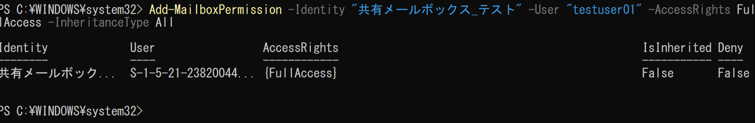  

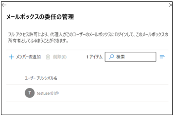   

##	リソースメールボックスコマンド操作

・Exchange Onlineでリソースールボックスを作成する際に使用するコマンドについて記載する。

・「Connect-ExchangeOnline」実行後に下記コマンドを実行する。

(1)	リソースメールボックスの一覧を表示する。

　「Get-Mailbox -RecipientTypeDetails EquipmentMailbox,RoomMailbox -ResultSize Unlimited」を実行する。

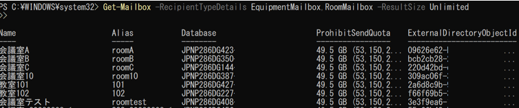  

(2)	リソースメールボックスを作成する。

下記コマンドを実行する。

New-Mailbox -PrimarySmtpAddress <リソースメールボックスのメールアドレス> -Name <リソースメールボックスの名前> -Alias  <リソースメールボックスのエイリアス>  -Room

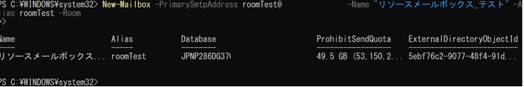  

 

(3)	リソースメールボックスのアクセス権をユーザーかグループに付与する。　※共有メールボックスと共有

下記コマンドを実行する。

Add-MailboxPermission -Identity "<共有メールボックス名>" -User "<アクセス権を付与するユーザー名>" -AccessRights FullAccess -InheritanceType All

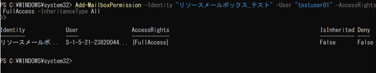 

(5)	リソースメールボックスのアクセス権を全て、csv形式で出力する。

下記コマンドを実行する。

$mailboxes = Get-Mailbox -RecipientTypeDetails RoomMailbox

$results = @()
foreach ($mbx in $mailboxes) {
    $permissions = Get-MailboxPermission -Identity $mbx.Identity |
        Where-Object { $_.User -ne "NT AUTHORITY\SELF" }
    foreach ($entry in $permissions) {
        $entry | Add-Member -MemberType NoteProperty -Name "Mailbox" -Value $mbx.Name -Force
        $results += $entry
    }
}
$results |
Export-Csv -Path "C:\setup\02_All_ResourceMailboxPermissions.csv" -NoTypeInformation -Encoding UTF8

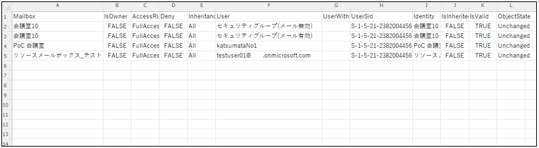 

##	DKIM、DMARC、SPFコマンド操作

・Exchange OnlineでDKIMを設定する際に使用するコマンドについて記載する。

Microsoft 365 Defender画面の、メールとコラボレーション > ポリシーとルール > 脅威ポリシー>　メールの認証の設定　より設定を行う。

DKIMが設定されているかの状態確認を行うコマンドは以下の通りである。

「Get-DkimSigningConfig | Format-List Name,Enabled,Status,Selector1CNAME,Selector2CNAME」を実行する。
 
DMARC登録確認

「nslookup -type=txt _dmarc. <ドメイン名>」を実行する。
 
SPFレコード登録確認

「Resolve-DnsName -Name <ドメイン名> -Type TXT」を実行する。
