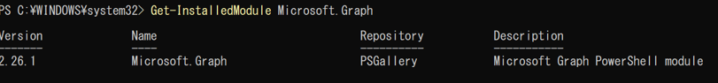
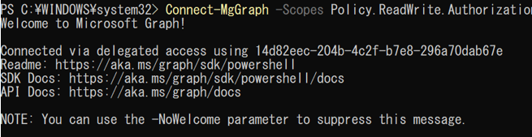
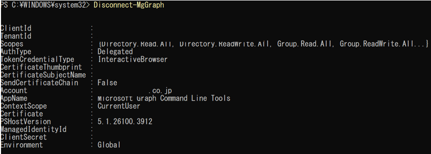
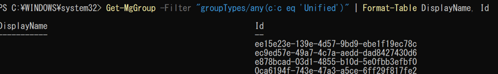
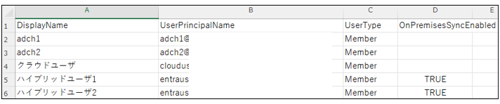

#	Microsoft Graph

##	コマンド操作

Microsoft Graphを使用したコマンド操作について記載する。

(1)	Microsoft Graph PowerShell SDK をインストールする

「Install-Module Microsoft.Graph」を実行する。

(2)	Microsoft Graph PowerShell SDK がインストールされているか確認する。

「Get-InstalledModule Microsoft.Graph」を実行する。

(3)	Microsoft Graph APIに接続する。

「Connect-MgGraph -Scopes Policy.ReadWrite.Authorization」を実行する。

 

(4)	Microsoft Graph APIからログアウトする。

「Disconnect-MgGraph」を実行する。

 

(5)	グループ一覧を取得する。

「Get-MgGroup -Filter "groupTypes/any(c:c eq 'Unified')" | Format-Table DisplayName, Id」を実行する。

  

(6)	ユーザー一覧をcsv出力する。

「Get-MgUser -Select "DisplayName,UserPrincipalName,UserType,OnPremisesSyncEnabled" -All |
Select-Object DisplayName, UserPrincipalName, UserType, OnPremisesSyncEnabled |
ConvertTo-Csv -NoTypeInformation | Out-File -FilePath "EntraID_Users.csv" -Encoding utf8」を実行する。

※補足

DisplayName：表示名

UserPrincipalName：ユーザープリンシパル名

UserType：Member または Guest

OnPremisesSyncEnabled：True（同期あり）

既定では 一部のプロパティ（特に同期関連など）を返さないため、明示的に -select パラメータを使う必要有。

文字化け対策として右記を追加する。 -Encoding utf8

  

  
