#	Terraform検証

Terraformを使用した、AWSとAzureの主要サービスの構築について記載する。

##	Terraform使用方法

TerraformはAWS、Azure、Google Cloudなど、多数のクラウドプロバイダーに対応しており、異なるクラウドのリソースを一元的に管理することができる。

また、Terraformはインフラをコード化し、テキストファイルで管理できるため、インフラ設定の自動化や再利用が容易である。

Terraformの使用方法は以下の通りである。

(1)	Terraformの初期化を行う。

.tfファイルを作成し、cmdで「terraform init」を実行する。

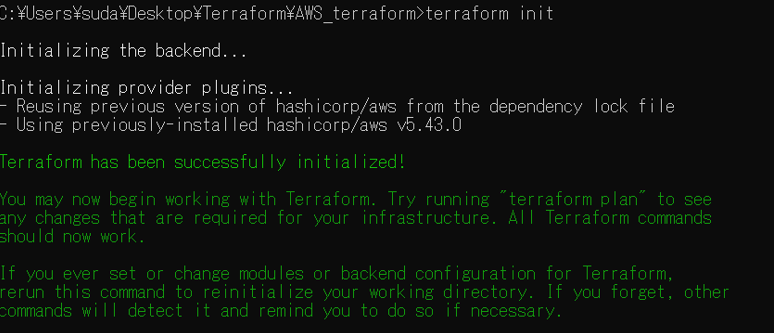

(2)	実行内容の確認を行う。

「terraform plan」を実行する。

(3)	実行内容の適用を行う。

「terraform apply」を実行する。

Enter a value:と表示されたら、「yes」を実行する。

※待ち時間約1分程度
 
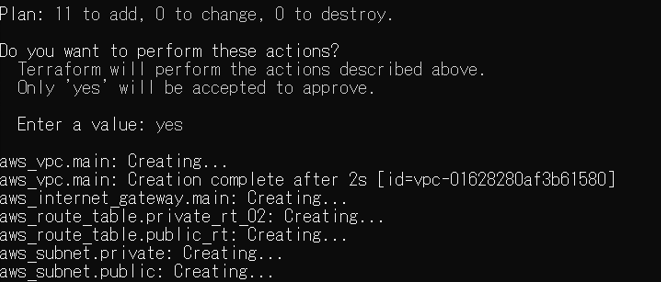

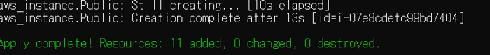

(4)	実行内容の表示を行う。

「terraform show」を実行する。

terraform が作成したオブジェクトの内容が出力される。

(5)	実行内容の削除を行う。

「terraform destroy」を実行する。

Enter a value:と表示されたら、「yes」を実行する。

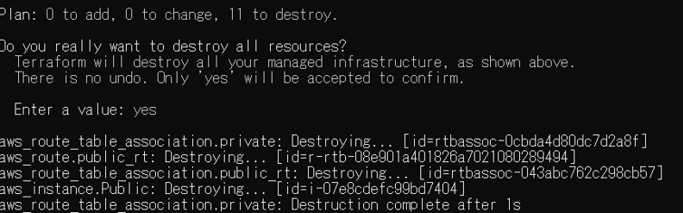 

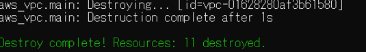

※Azureの際は「terraform init」を実行する前に「az login」を行う。

 
##	AWS 

AWSで作成する.ifファイルは「main.tf」「test_teraform_EC2.tf」「test_teraform_vpc.tf」を以下の通り作成し、Terraformで実行する。

イメージ図

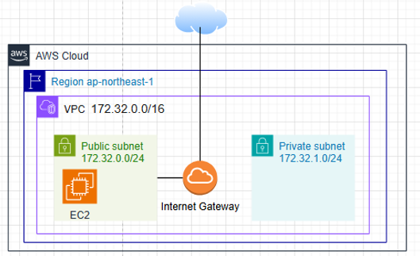

下記は、検証用のWindowsサーバーを構築する例文である。

ルートテーブルでパブリックとプライベート環境を作成している。

キーペアの作成だけうまくいかなかったため、あらかじめ作成したものをkeynameに入力する方式とする。

コメントアウトした部分では、Nat Gatewayを作成し、プライベートな検証環境を作成することも可能である。

※今回は実施しない。

main.tf
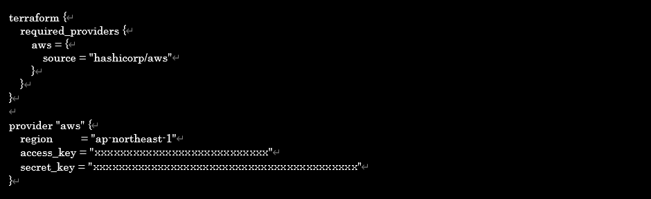

test_teraform_EC2.tf

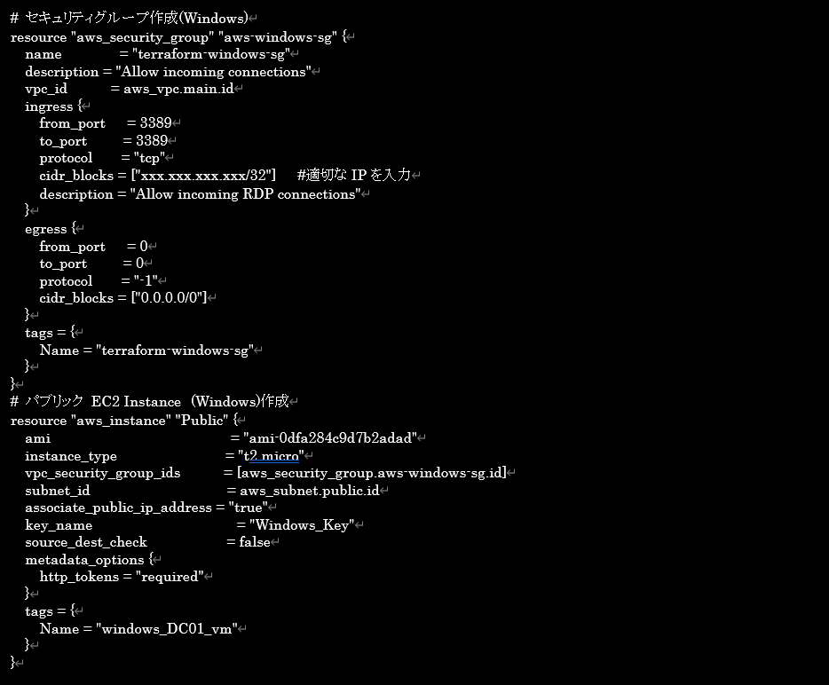

test_teraform_vpc.tf

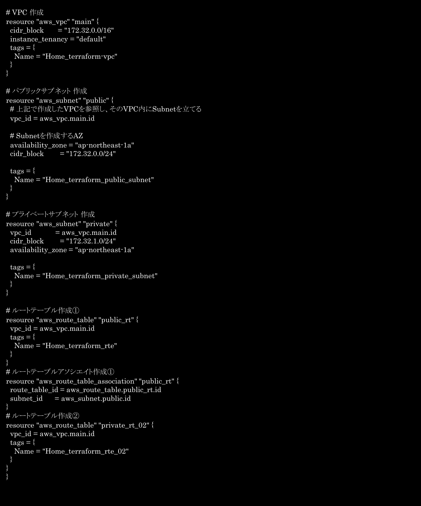

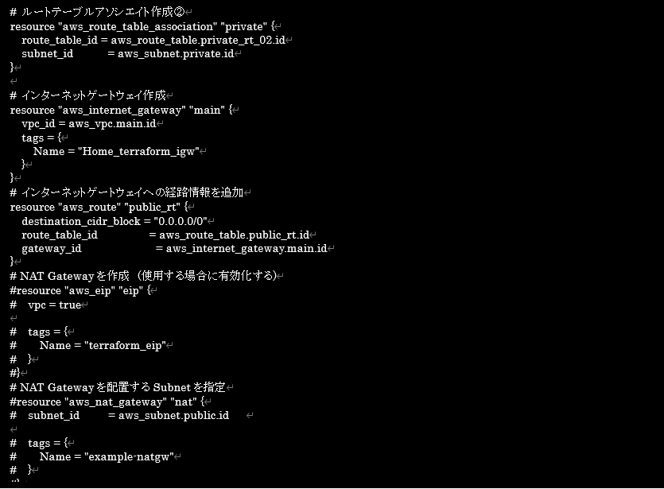

実行結果は下記の通りである。

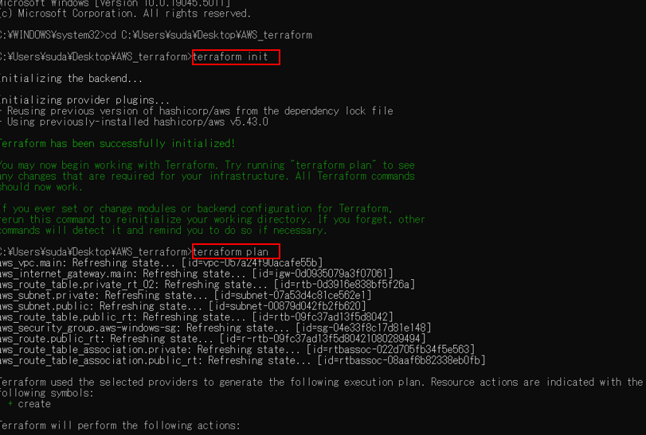

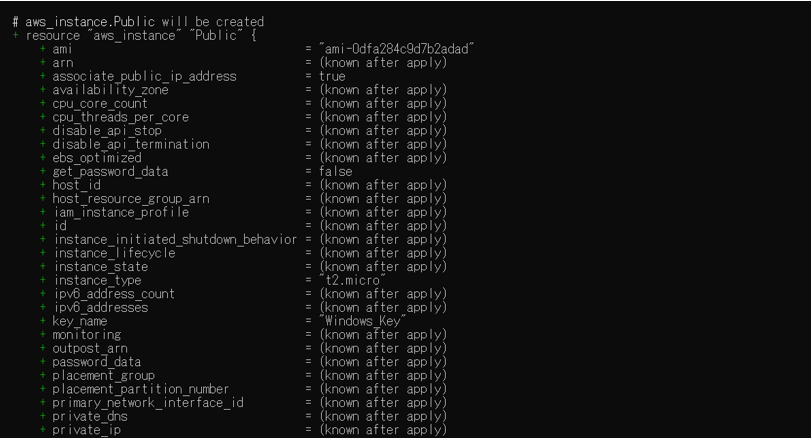

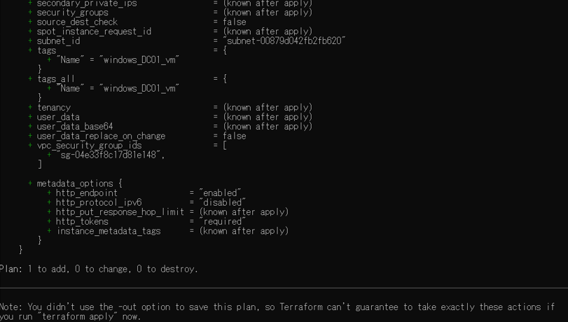

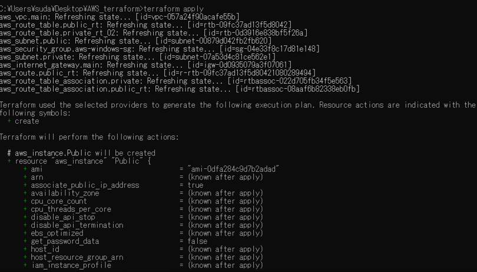

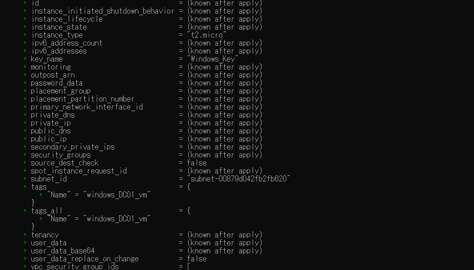

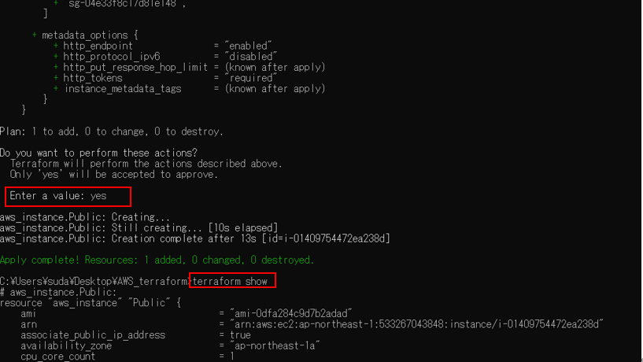

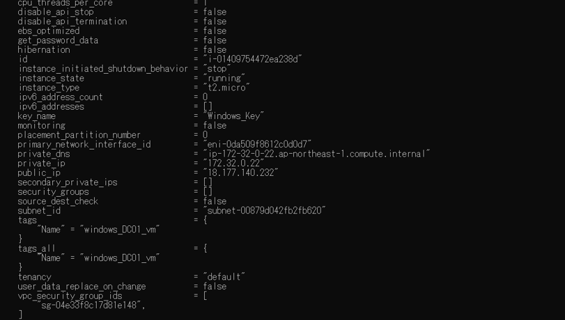

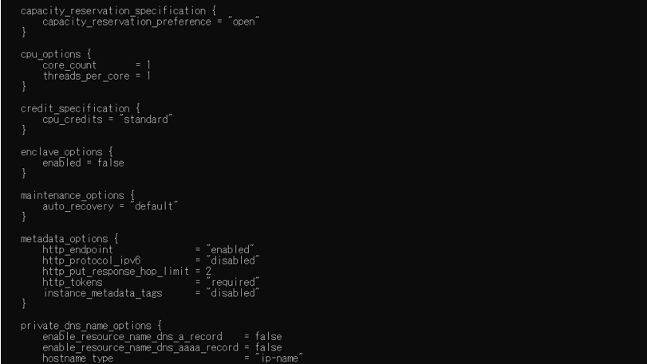

※　その後省略

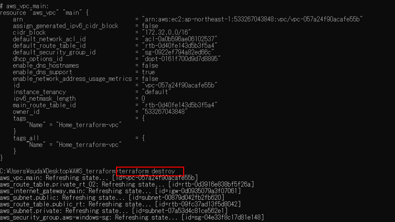

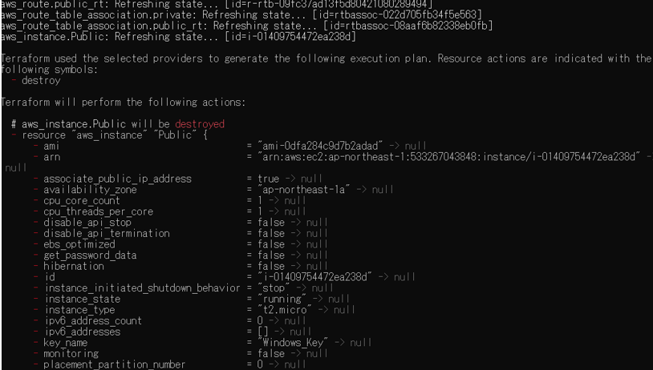

※　その後省略

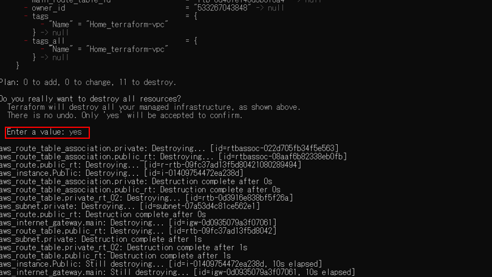

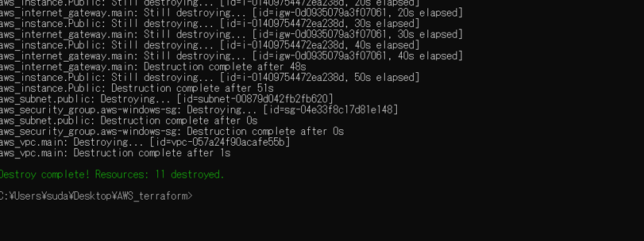
