Active Directory内で行われる作業、主に、ユーザー情報の確認や、グループポリシーの作成、切り替えで使用する手順について記載する。

※検証時期が2025年のため、Powershellのバージョンが古い状態での記載となる。

##	AD構築用確認コマンド

ADの切り替えや、ユーザー情報を取得するコマンドについて、以下に記載する。

(1)	ドメインコントローラー間のレプリケーション状況を表示する。

repadmin /showrepl

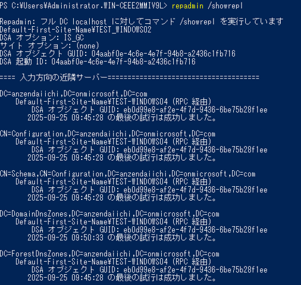

(2)	ドメインコントローラーの正常性を確認する。

dcdiag /v

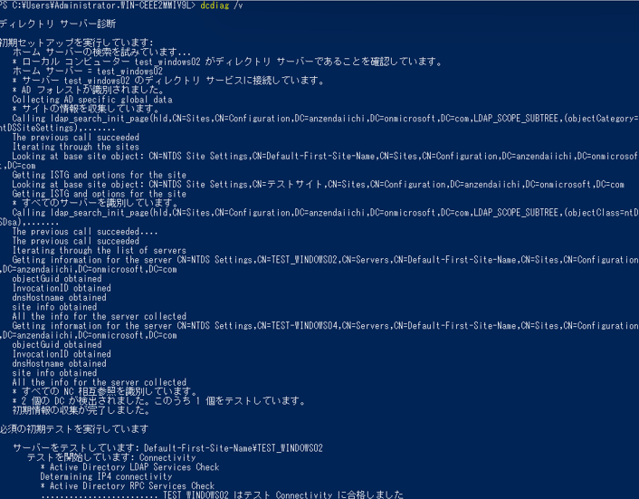

(3)	ADのFSMO（Flexible Single Master Operation）ロールの保有者を表示する

netdom query fsmo

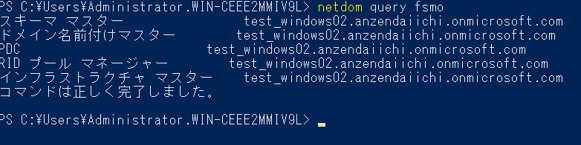 

(4)	OUの一覧を取得する。※主に必要な情報のみ取得する。

Get-ADOrganizationalUnit -Filter * -Properties CanonicalName |
Select-Object -Property CanonicalName |
Export-csv -NoTypeInformation -Encoding UTF8 ADOrganizationalUnit.csv
 
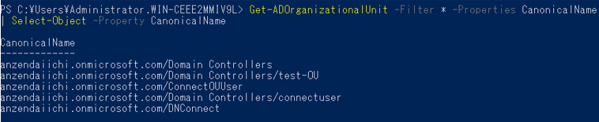 

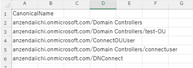 

(5)	ユーザーアカウントの一覧を取得する。※主に必要な情報のみ取得する。

Get-ADUser -Filter * -Properties * |
Select-Object SamAccountName,CN,Name,UserPrincipalName,DisplayName,GivenName,sn,Surname,Emailaddress,@{ E={$_.proxyAddresses}},mail,mailNickname,@{ E={$_.DepartmentMail}},Description,DistinguishedName,CanonicalName,@{ E={$_.MemberOf}},Company,Department,Division,EmployeeID,EmployeeNumber,Manager,Title,Country,PostalCode,City,StreetAddress,State,Office,OfficePhone,HomePhone,MobilePhone,FAX,HomePage,Organization,OtherName,Initials,ObjectCategory,ObjectClass,ObjectGUID,SID,ScriptPath,ProfilePath,SmartcardLogonRequired,CannotChangePassword,PasswordExpired,PasswordNeverExpires,PasswordLastSet,DoesNotRequirePreAuth,HomeDirectory,Deleted,LastLogonDate,Created,Modified,Enabled,LockedOut,extensionAttribute1,extensionAttribute2,extensionAttribute3,extensionAttribute4,extensionAttribute5,extensionAttribute6,extensionAttribute7,extensionAttribute8,extensionAttribute9,extensionAttribute10,extensionAttribute11,extensionAttribute12,extensionAttribute13,extensionAttribute14,extensionAttribute15 |
Export-csv -NoTypeInformation -Encoding UTF8 ADUser.csv

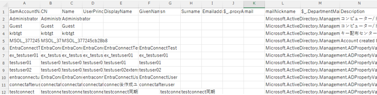  

(6)	グループの一覧を取得する。※主に必要な情報のみ取得する。

Get-ADGroup -Filter * -Properties * |
Select-Object SamAccountName,CN,Name,DisplayName,Description,GroupCategory,GroupScope,ManagedBy,@{ E={$_.MemberOf}},@{ E={$_.Members}},mail,DistinguishedName,CanonicalName,ObjectGUID,SID,Created,Modified |
Export-csv -NoTypeInformation -Encoding UTF8 ADGroup.csv

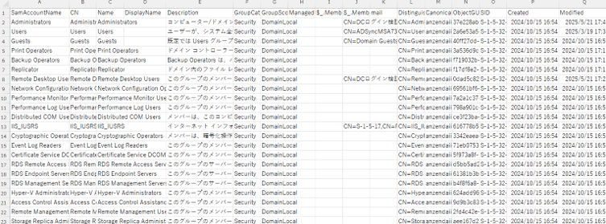  

(7)	グループのメンバーを取得する。※主に必要な情報のみ取得する。

Get-ADGroup -Filter *|
select Name, @{Label = "MemberNames"; Expression = {($_|
Get-ADGroupMember|
select -ExpandProperty Name) -join ","}}|
Export-csv -NoTypeInformation -Encoding UTF8 ADGroupMember.csv

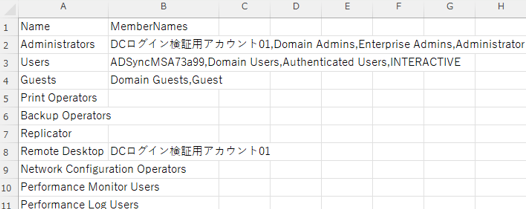  

(8)	コンピューターオブジェクトの一覧を取得する。※主に必要な情報のみ取得する。

Get-ADComputer -Filter * -Properties * |
Select-Object SamAccountName,CN,Name,UserPrincipalName,DisplayName,Description,DistinguishedName,IPv4Address,OperatingSystem,OperatingSystemVersion,ObjectCategory,ObjectClass,ObjectGUID,SID,objectSid,Deleted,LastLogonDate,Created,Modified,Enabled,LockedOut |
Export-csv -NoTypeInformation -Encoding UTF8 ADObject.csv

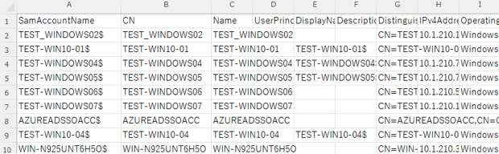  

(9)	連絡先の一覧を取得する。※主に必要な情報のみ取得する。

Get-ADObject -filter {objectClass -eq "contact"} -Properties * | Select-Object SamAccountName,CN,Name,UserPrincipalName,DisplayName,Description,DistinguishedName,ObjectCategory,ObjectClass,ObjectGUID,SID,Deleted,Created,Modified,Enabled | Export-csv -NoTypeInformation -Encoding UTF8 contact.csv
 
※画像なし

(10) OUがどの階層にあるか表示する。

「Get-ADObject -LDAPFilter "(objectClass=organizationalUnit)" -Properties * | Select-Object Name,CanonicalName」を実行する。

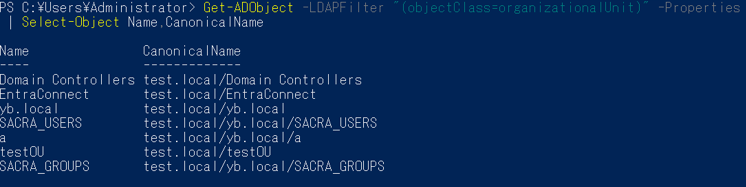  

(11) OU(組織単位)に依存しているグループポリシー名を全て取得する。

「Get-GPInheritance -Target "OU=ConnectOUUser,DC=anzendaiichi,DC=onmicrosoft,DC=com" | Select-Object Name,GpoLinks」を実行する。

※画像なし

(12) ドメイン内の全GPOのレポートを取得する。

「(Get-GPO -All).DisplayName | ForEach-Object {Get-GPOReport -Name $_ -ReportType Html -Path C:\GPOReport\$_.html}」を実行する。

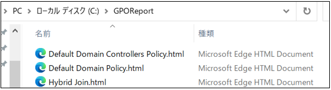   

(13) テストファイルを作成する。

・テストファイル1MBを作成する場合、下記コマンドを実行する

fsutil file createnew "テストファイル1MB" 1048576

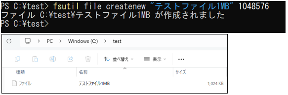   

 

(14) コマンド履歴をテキストに記録する。

下記コマンドを実行する。

Start-Transcript -Path "ファイルパス"
Stop-Transcript

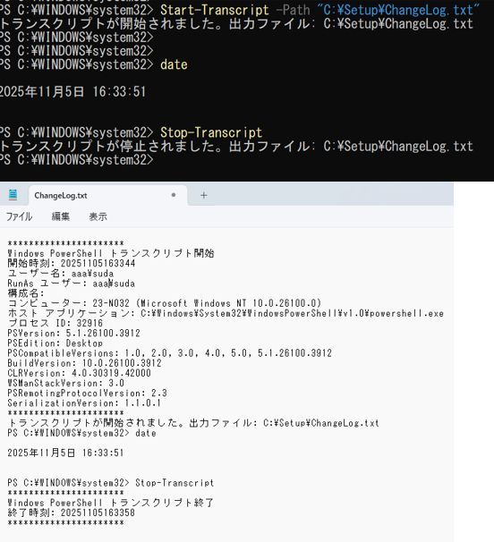   
