## サイト作成

(1)	サイトを作成する。

下記コマンドを実行する。

New-ADReplicationSite -Name "サイト名"

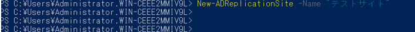  

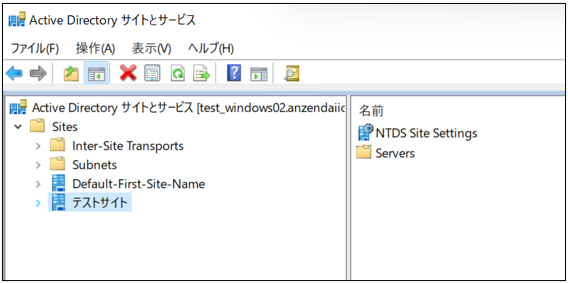   

(2)	現在作成されているサイトを表示する。

下記コマンドを実行する。

Get-ADReplicationSite -Filter * |
Select-Object Name,DistinguishedName

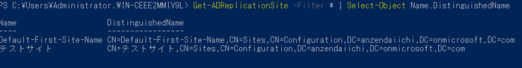  

(3)	現在作成されているサイトをcsv出力する。

下記コマンドを実行する。

CSV出力例：Get-ADReplicationSite -Filter * |
Select-Object Name,DistinguishedName |
export-csv -Encoding default C:\Setup\01_site_list.csv

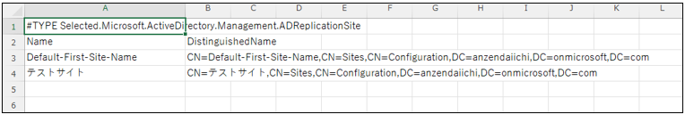 
 

(4)	サイトを削除する。

下記コマンドを実行する。

削除コマンド：Remove-ADReplicationSite -Identity "サイト名" -Confirm:$false

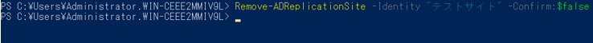  
 
## サブネット作成サイト紐付け

(1)	サブネットを作成する。

下記コマンドを実行する。

New-ADReplicationSubnet -Name "サブネット名" -Site "サイト名"

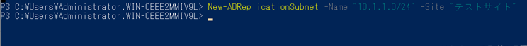  

(2)	現在作成されているサブネットを表示する。

下記コマンドを実行する。

Get-ADReplicationSubnet -Filter * |
Select-Object Name,Site
 
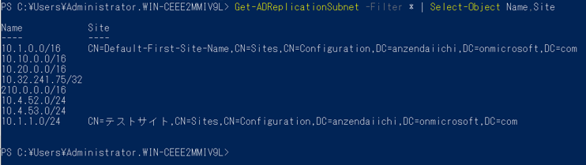  

(3)	現在作成されているサブネットをcsv出力する。

下記コマンドを実行する。

Get-ADReplicationSubnet -Filter * |
Select-Object Name,Site |
export-csv -Encoding default C:\Setup\02_subnet_list.csv

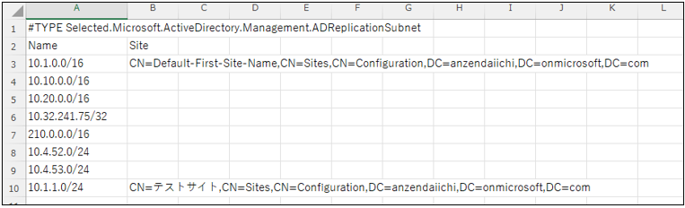   

(4)	現在作成されているサブネットを削除する。

下記コマンドを実行する。

Remove-ADReplicationSubnet -Identity "サブネット名" -Confirm:$false

 
## このサイト リンクにあるサイト追加

(1)	作成されたサブネットをDEFAULTIPSITELINKにリンクする。

下記コマンドを実行する。

基本コマンド：Set-ADObject -Identity 'CN=DEFAULTIPSITELINK,CN=IP,CN=Inter-Site Transports,CN=Sites,CN=Configuration,DC=ドメイン,DC=local' -Add @{siteList='CN=サイト名,CN=Sites,CN=Configuration,DC=test,DC=local'} -Partition 'CN=Configuration,DC=test,DC=local'

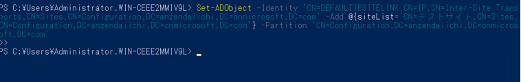 

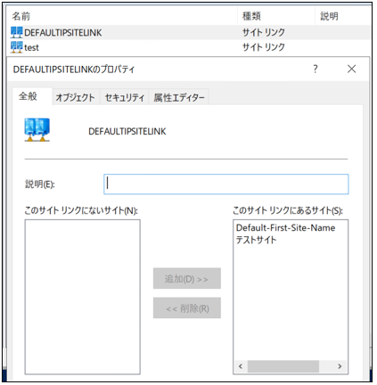  

(2)	DEFAULTIPSITELINKにリンクされているサブネットを一覧表示する。

下記コマンドを実行する。

Get-ADReplicationSiteLink -Identity DEFAULTIPSITELINK |
ForEach-Object {$_.SitesIncluded} |
ForEach-Object { $_ -replace ",CN=Sites,CN=Configuration,DC=test,DC=local", "" -replace "CN=", ""}

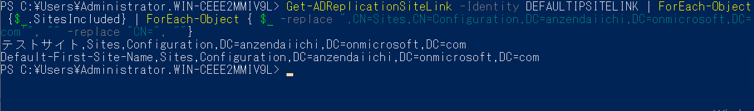 

(3)	DEFAULTIPSITELINKにリンクされているサブネットをtxt形式で出力する。

下記コマンドを実行する。

Get-ADReplicationSiteLink -Identity DEFAULTIPSITELINK |
ForEach-Object {$_.SitesIncluded} |
ForEach-Object { $_ -replace ",CN=Sites,CN=Configuration,DC=test,DC=local", "" -replace "CN=", ""} >C:\Setup\03_site_link.txt

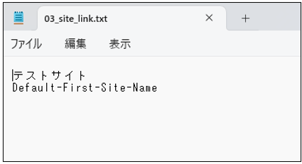  
 
##	GPO

(1)	GPOを一覧表示する。
下記コマンドを実行する。
Get-GPO -all | Select-Object DisplayName    ※すべてのグループポリシーが表示

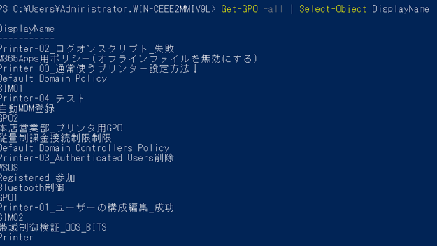   

(2)	特定の文字が入力されているGPOのみ表示する。
下記コマンドを実行する。
確認コマンド：Get-GPO -all | Select-Object DisplayName | Where-Object { $_.DisplayName -like "*特定文字" }　　

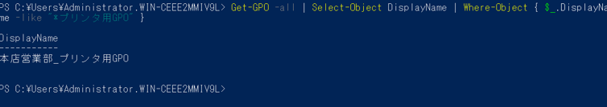   

(3)	GPOをcsv出力する。
下記コマンドを実行する。
Get-GPO -all | Select-Object DisplayName | Where-Object { $_.DisplayName -like "*プリンタ用GPO" } |export-csv -Encoding default C:\Setup\04_プリンタ用GPO.csv

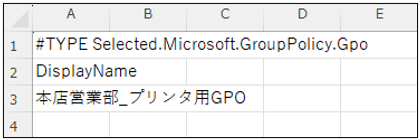  

 
##	グループポリシーをサイトへリンク

(1)	GPOを、サイトにリンクする。
下記コマンドを実行する。
New-GPLink -Name "グループポリシー名" -Target "CN=サイト,CN=Sites,CN=Configuration,DC=test,DC=local"

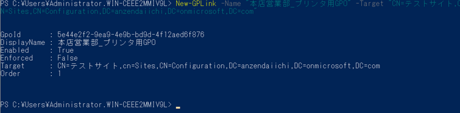  

(2)	サイトにリンクしたGPOを表示する。
下記コマンドを実行する。
Set-GPLink -Name "GPO名" -Target "CN=Default-First-Site-Name,CN=Sites,CN=Configuration,DC=test,DC=local" | Select-Object DisplayName,Enabled,Target,Enforcement,Order

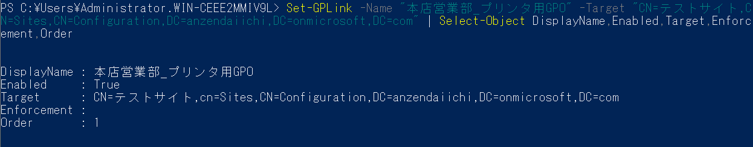  

(3)	サイトにリンクしたGPOを削除する。　
下記コマンドを実行する。
Remove-GPLink -Name グループポリシー名 -Target "CN=サイト,CN=Sites,CN=Configuration,DC=test,DC=local"

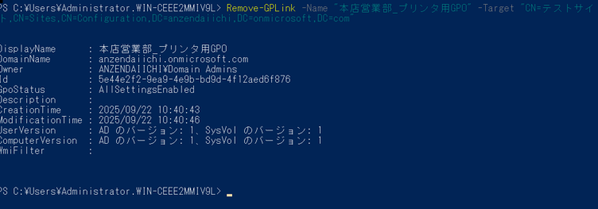  
