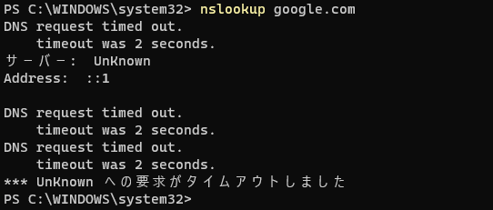
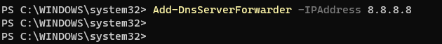
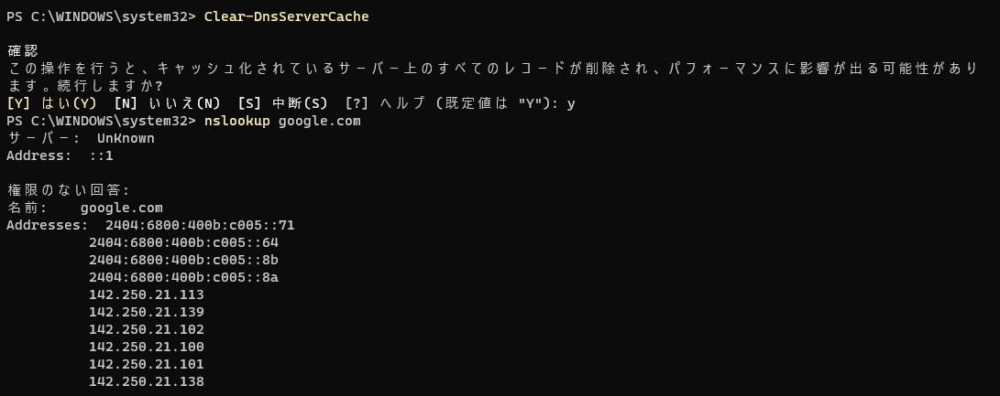
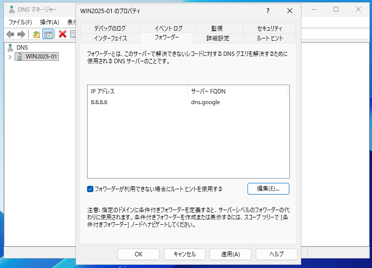

## DNSフォワーダー設定例

インターネットに出られないとき。外部ドメインの名前解決を行うため、DNSサーバーにDNSフォワーダーを設定する。

  

DNSフォワーダー設定を行う。※ping 8.8.8.8が応答する場合

Add-DnsServerForwarder -IPAddress xx.xx.xx.xx

  

DNSキャッシュをクリアし、名前解決が成功することを確認。

Clear-DnsServerCache

  

ツール上でも確認

  
